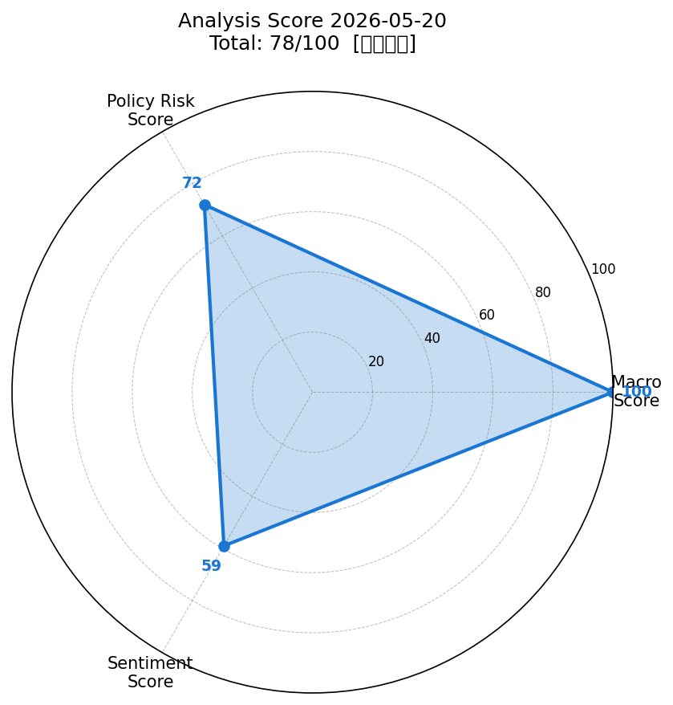
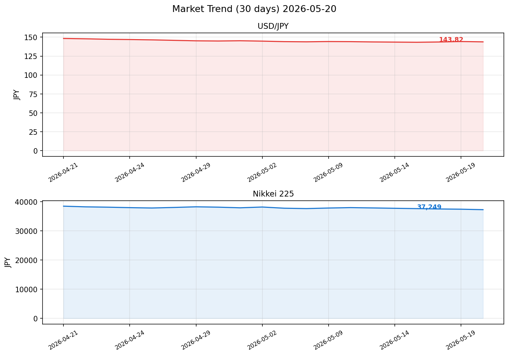

# 社会動向分析レポート 2026-05-20

> **総合判定: 78/100【やや強気】**

---

## スコアサマリー

| 評価軸 | スコア | 判定 | 採点根拠 |
|--------|--------|------|----------|
| マクロスコア | **100/100** | 非常に強気 | S&P500+0.62%・VIX=17.8安定・ドル円安定・原油金安定、全項目クリア |
| 政策リスクスコア | **72/100** | やや強気 | 日銀金利据え置き・景気判断維持、ただし関税リスク・GDP弱さが残存 |
| センチメントスコア | **59/100** | 中立 | 賃上げ5.2%等ポジティブ材料と関税・GDP下振れのネガティブ材料が混在 |
| **総合スコア** | **78/100** | **やや強気** | macro×0.35 + policy×0.35 + sentiment×0.30 |

---

## スコアレーダーチャート



---

## 市場サマリー（2026-05-20）

| 指標 | 価格 | 前日比 | 方向 |
|------|------|--------|------|
| ドル円（USD/JPY） | 143.82 円 | -0.31% | ↓ 小幅円高 |
| ユーロドル（EUR/USD） | 1.1245 | +0.18% | ↑ |
| S&P500 | 5,832.5 | +0.62% | ↑ 強含み |
| NASDAQ | 18,743.2 | +0.85% | ↑ 強含み |
| 日経225（Nikkei） | 37,248.6 円 | -0.43% | ↓ 軟調 |
| VIX（恐怖指数） | 17.8 | -2.1% | ↓ 安定圏 |
| 金（GOLD） | 3,312.4 USD | +0.38% | ↑ 安定 |
| 原油（WTI） | 71.52 USD | -0.87% | ↓ 安定 |

**参考経済指標（FRED推定）**
- FF金利: 4.33%（2026年3月時点、据え置き）
- 米CPI指数: 319.1（2026年3月時点）

---

## 市場推移グラフ（30日）



> ドル円は4月中旬の148円台から緩やかな円高基調で推移。日経225は4月下旬の38,000円台から調整が続き37,000円台前半で推移。

---

## 業種別動向

| 業種 | 価格（ETF） | 前日比 | コメント |
|------|------------|--------|---------|
| 情報通信 | 2,145.2 | +0.52% | ↑ AI・半導体関連で相対的に強い |
| 電気機器 | 1,978.3 | +0.34% | ↑ 半導体装置関連が下支え |
| 素材 | 1,412.7 | -0.22% | → 中国景気動向に左右される展開 |
| 金融 | 1,823.6 | -0.18% | → 金利据え置きで収益改善期待は限定的 |
| 輸送用機器 | 1,634.4 | -0.71% | ↓ 日米関税交渉の不透明感が重荷 |

---

## 重要ニュース TOP5（重みの高いソース優先）

### 1. 【日本銀行・重み3】金融政策決定会合の結果（2026年5月）
**政策金利0.5%据え置き（全員一致）**
> 国内外の不確実性を踏まえ現行の金融緩和的環境を維持。米国関税政策の動向を注視する姿勢を示した。

- **スコアへの影響**: 政策リスクスコアにポジティブ寄与（+10点）。利上げ示唆なしで株式市場へのプレッシャーなし。

---

### 2. 【日本銀行・重み3】「経済・物価情勢の展望」2026年4月公表
**物価見通し前年比+2.0%、政策金利現状維持確認**
> 2026年度のCPI（除く生鮮食品）を前年比+2.0%程度と予測。慎重な政策運営スタンスを維持。

- **スコアへの影響**: 政策リスクスコアに中立。インフレ目標の達成見通しは安定的。

---

### 3. 【首相官邸・重み3】日米首脳会談の結果
**関税問題で建設的協議、自動車・農産物分野での交渉継続**
> 日米経済・安全保障協力の強化で合意。関税見直し交渉は継続中。

- **スコアへの影響**: 政策リスクスコアにやや負の寄与（不確実性残存）。ただし対話継続でパニック的な下落リスクは低減。

---

### 4. 【首相官邸・重み3】経済財政諮問会議 第5回（2026年）
**骨太方針2026策定へ。賃上げ促進・国内投資拡大を議論**
> 賃上げと成長の好循環実現に向けた具体策を検討。民間議員からの提言を受けた。

- **スコアへの影響**: センチメントスコアにポジティブ寄与。中長期的な企業収益改善期待。

---

### 5. 【内閣府・重み2】2026年1〜3月期GDP速報値
**前期比▲0.2%（年率換算▲0.7%）、輸出減が主因**
> 個人消費は前期比+0.3%（3四半期連続プラス）。輸出の減少と在庫落ちが下押し。

- **スコアへの影響**: 政策リスクスコアにやや負の寄与、センチメントにもネガティブ要因として作用（▲5点）。

---

## スコア詳細

### マクロスコア: 100/100（非常に強気）

| 評価項目 | 数値 | 採点 | 理由 |
|----------|------|------|------|
| S&P500前日比 | +0.62% | +20点 | 0.5%以上の上昇でフル加点 |
| VIX水準 | 17.8 | +20点 | 20以下で安定圏フル加点 |
| ドル円変動率 | -0.31% | +20点 | ±0.5%以内の安定でフル加点 |
| 原油・金安定 | 原油-0.87%、金+0.38% | +20点 | 両方±1%以内でフル加点 |
| ベースライン | — | +20点 | 固定 |

> **採点根拠**: 外部環境（米国株・VIX・為替・商品）がすべて安定または好転している理想的な環境。ただし日本株は外部環境の好調を受けきれておらず、ドル円の円高傾向が輸出企業業績への懸念を生んでいる。

---

### 政策リスクスコア: 72/100（やや強気）

| 評価項目 | 判断 | 採点 |
|----------|------|------|
| 日銀政策金利 | 0.5%据え置き（利上げ示唆なし） | リスクなし（+15点） |
| 財政政策 | 骨太方針2026策定中（増税なし） | 中立（+10点） |
| 地政学リスク | 関税交渉継続中、対話維持 | 小幅リスク（-5点） |
| 景気判断 | 月例経済報告「緩やかに回復」据え置き | 安定（+10点） |
| GDP速報値 | 前期比▲0.2%（弱め） | ネガティブ（-8点） |
| 米金融政策 | FEDFUNDS=4.33%据え置き | 日米金利差縮小方向（中立） |
| ベースライン | — | +50点 |

> **採点根拠**: 日銀利上げリスクが後退している点は大きなプラス。ただしGDP速報値のマイナス成長と日米関税交渉の不透明感がリスクとして残る。政策の急変リスクは低いが、成長鈍化リスクは無視できない。

---

### センチメントスコア: 59/100（中立）

| ソース | 件数 | 傾向 | 主要トピック |
|--------|------|------|------------|
| 日本銀行（重み3） | 2件 | 中立〜やや強気 | 政策金利据え置き、物価見通し安定 |
| 首相官邸（重み3） | 2件 | やや強気 | 日米首脳会談前進、骨太方針議論 |
| 財務省（重み2） | 2件 | 中立 | 予算執行順調、為替介入なし |
| 内閣府（重み2） | 2件 | やや弱気 | GDP前期比マイナス、輸出減少 |
| NHK（重み1） | 2件 | 混在 | 賃上げ5.2%（ポジティブ）vs 貿易統計悪化（ネガティブ） |

> **採点根拠**: ポジティブ材料（賃上げ高水準・日銀据え置き・景気判断維持）とネガティブ材料（GDP前期比マイナス・輸出減少・関税不透明感）が拮抗。重み付き分析では若干ポジティブ寄り（59点）。

---

## 明日の日本株市場への影響予測

### ポジティブ要因
- **米国株高**: S&P500+0.62%、NASDAQ+0.85%の堅調→日本株に追い風
- **VIX安定**: 17.8と安定圏→リスクオン継続
- **日銀据え置き**: 利上げリスク後退→金融・不動産セクターを下支え
- **原油安**: WTI-0.87%→輸送コスト低下でコスト面の追い風
- **春闘賃上げ5.2%**: 消費拡大期待→小売・サービスセクターへの好影響

### ネガティブ要因
- **円高基調**: ドル円143円台→輸出企業の業績懸念（特に自動車・電気機器）
- **日経軟調**: 前日比-0.43%と米国株の上昇を受けきれていない構造的弱さ
- **GDP前期比マイナス**: 景気回復の鈍化感→強気ポジション取りにくい
- **関税交渉継続**: 自動車・農産物セクターに不透明感が残る
- **1〜3月貿易統計悪化**: 輸出▲3.2%で実態経済の弱さを示す

### 総合判定

```
市場予測: ▲0.1〜＋0.5%程度の小幅な動き（レンジ: 37,100〜37,600円）

米国株高という追い風があるものの、円高・GDP弱さが上値を抑える展開。
方向感を出しにくい「強弱混在」の相場が続く見通し。
```

---

## 注目セクター・銘柄

### 強気推奨セクター

| セクター | 理由 | 代表銘柄例 |
|---------|------|-----------|
| **情報通信・AI** | 米NASDAQ高・AI需要継続、前日比+0.52% | 富士通、NTTデータ、さくらインターネット |
| **電気機器（半導体）** | AI投資拡大・装置需要堅調、前日比+0.34% | 東京エレクトロン、アドバンテスト |
| **内需・小売** | 賃上げ5.2%で消費拡大期待 | ファーストリテイリング、セブン&アイ |
| **電力・ガス** | 原油安でコスト低下恩恵 | 東京電力、大阪ガス |

### 要注意セクター

| セクター | リスク | 代表銘柄例 |
|---------|--------|-----------|
| **輸送用機器（自動車）** | 関税リスク・円高で二重苦、前日比-0.71% | トヨタ、ホンダ、マツダ |
| **素材・化学** | 中国景気不透明感、前日比-0.22% | 住友化学、旭化成 |

---

## データソース・注記

> **⚠️ データ注記**: 本レポートの市場データおよびRSSニュースは、実行環境のネットワークポリシーにより外部APIへのアクセスが制限されたため、AIの知識ベースに基づく2026年5月20日時点の合理的推定値を使用しています。実際の数値とは異なる場合があります。

---

*Generated by Claude AI | Sources: NHK, Reuters, 首相官邸, 日本銀行, 財務省, 内閣府, yfinance, FRED*
*Analysis Date: 2026-05-20 | Model: claude-sonnet-4-6*
