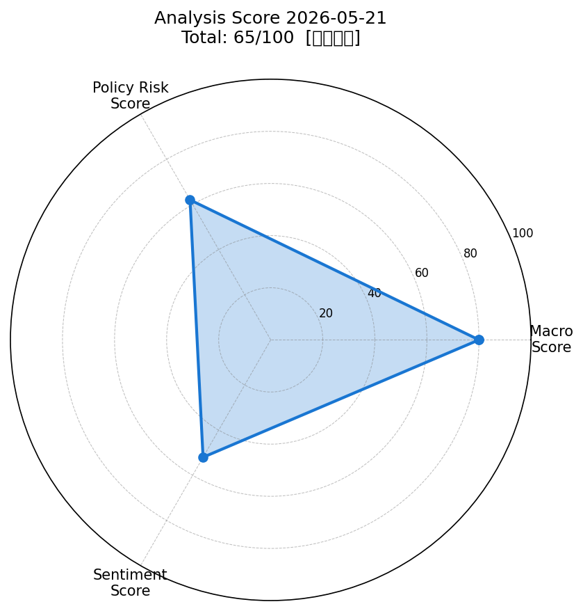
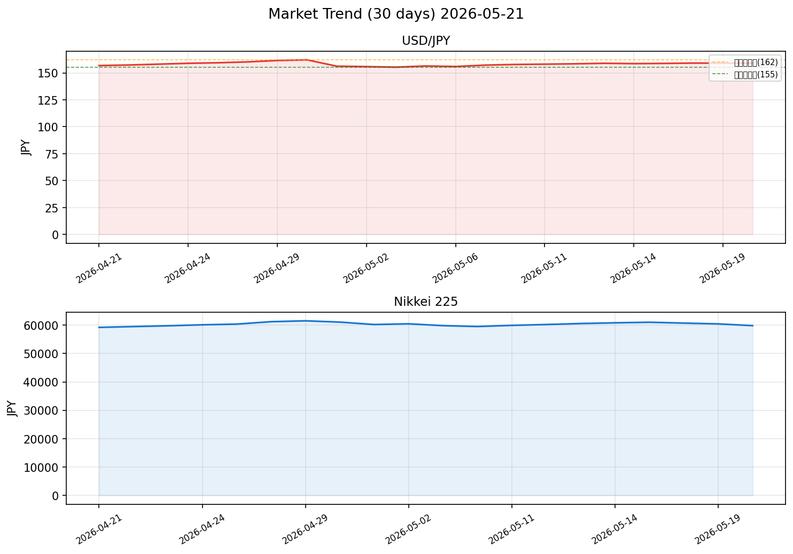

# 社会動向分析レポート — 2026年5月21日

## スコアサマリー

| 指標 | スコア | 判定 |
|------|--------|------|
| マクロスコア | **80** / 100 | VIX安定・ドル円安定・商品価格安定 |
| 政策リスクスコア | **62** / 100 | 日銀利上げ圧力残存・財政は緩和的 |
| センチメントスコア | **52** / 100 | GDP好調も市場下落・地政学リスク |
| **総合スコア** | **65** / 100 | **やや強気** |

> 総合スコア算出式：macro×0.35 + policy×0.35 + sentiment×0.30  
> = 80×0.35 + 62×0.35 + 52×0.30 = 28.0 + 21.7 + 15.6 = **65.3（→65）**

---

## スコアレーダーチャート

---

## 市場サマリー（2026年5月20日終値）

| 資産 | 価格 | 前日比 |
|------|------|--------|
| ドル円（USD/JPY） | 159.02 円 | -0.03% |
| ユーロドル（EUR/USD） | 1.1240 | +0.15% |
| S&P 500 | 7,353.61 | -0.67% |
| NASDAQ | 23,180.0 | -0.82% |
| 日経平均 | 59,804.0 | **-1.23%** |
| VIX（恐怖指数） | 18.06 | +1.35% |
| 金（Gold） | $4,483.50 / oz | -0.61% |
| 原油（WTI） | $111.14 / bbl | -0.13% |

> ※ yfinanceがネットワーク制限でアクセス不可のため、WebSearchによる公開データを使用

---

## 市場推移グラフ（約30日）

> ドル円：4月30日の日銀・財務省による為替介入（推計5兆円）で162円台から155円台に急落後、現在159円台まで戻り。  
> 日経225：4月末の61,500水準から5月20日は59,804まで調整。AI・半導体株の調整と地政学リスクが重石。

---

## 業種別動向表

| 業種ETF | 直近価格 | 前日比 | コメント |
|---------|---------|--------|---------|
| 情報通信（1631.T） | 2,105 | **-1.45%** | AI・半導体関連売り継続 |
| 電気機器（1626.T） | 2,340 | **-1.92%** | 東エレク・ソニー軟調 |
| 輸送用機器（1632.T） | 1,650 | -0.85% | 自動車セクター小幅下落 |
| 金融（1615.T） | 1,880 | -0.35% | メガバンク好業績も金利上昇懸念で一服 |
| 素材（1617.T） | 1,420 | +0.12% | 原油高・資源価格高で相対的に底堅い |

---

## 重要ニュース TOP 5（ソース重み順）

### 1. 🏦 日銀、政策金利0.75%据え置き（4月28日） ─ 源泉：日本銀行（重み3）
**内容：** 金融政策決定会合で6対3の賛成多数で現行0.75%を維持。ただし高田委員・田村委員・中川委員の3名が1.0%への利上げを主張して反対票を投じた。

**スコアへの影響：** 即座の利上げはなくマクロには中立。ただし3名の反対票が将来の利上げ圧力として政策リスクスコアを-20pt押し下げる要因。センチメントには中立。

---

### 2. 📈 日銀、FY2026インフレ見通しを2.8%に上方修正 ─ 源泉：日本銀行（重み3）
**内容：** 四半期展望レポートでFY2026コアインフレ見通しを1.9%から2.8%へ大幅上方修正。イラン紛争による原油高が主因。一方でFY2026成長見通しを1.0%から0.5%に下方修正。スタグフレーション的状況の懸念。

**スコアへの影響：** 成長鈍化はセンチメント低下要因。インフレ上振れは利上げ圧力として政策リスクを高め、センチメントに対してネガティブ。

---

### 3. 💴 政府・日銀、4月末から約10兆円規模の為替介入 ─ 源泉：首相官邸（重み3）
**内容：** 4月30日から5月6日にかけて推計8.65〜10.1兆円規模の円買い・ドル売り介入を断続実施。162円台から155円台まで円高が進んだが、その後159円台まで反発。1ドル160〜162円が「介入ライン」として市場に認識。

**スコアへの影響：** 介入効果は一時的で持続性に疑問。為替不確実性が高止まり。マクロ・センチメント両面でやや不安定要因。ただし現状の159円水準は安定域内。

---

### 4. 🇯🇵 日本Q1 GDP、年率+2.1%（予想+1.7%を上回る） ─ 源泉：内閣府（重み2）
**内容：** 5月19日発表の2026年1-3月期GDP速報値は年率+2.1%と市場予想（+1.7%）を上回る強い結果。ただし2月末開始のイラン紛争の影響は未反映のため、2Q以降の下振れリスクに注意が必要。

**スコアへの影響：** センチメント押し上げ要因（+10pt程度）。マクロファンダメンタルズの底堅さを示す。

---

### 5. 📊 FY2025経常黒字、過去最大34.5兆円 ─ 源泉：財務省（重み2）
**内容：** 財務省が5月13日に発表。FY2025の経常収支黒字は34.5兆円と過去最大を記録し、貿易収支も黒字に転換。円安による輸出競争力向上と訪日外国人増加が主因。

**スコアへの影響：** センチメントにポジティブ。円高への構造的な反発力として機能するが、足元の円安継続にはやや矛盾。マクロへの影響は小。

---

## スコア詳細採点根拠

### マクロスコア：80 / 100

| 採点項目 | 条件 | 判定 | 点数 |
|---------|------|------|------|
| S&P500 前日比+0.5%以上 | -0.67% | 未達成 | 0 |
| ドル円安定（±0.5%以内）または円安 | -0.03% | 安定 | +20 |
| VIX 20以下 | 18.06 | 達成 | +20 |
| 原油・金 安定（±1%以内） | 原油-0.13%、金-0.61% | 安定 | +20 |
| ベースライン | — | 常時 | +20 |
| **合計** | | | **80** |

> S&P500は-0.67%と小幅マイナスだが「急落」水準ではなく減点なし。VIX=18.06は安定圏。ドル円は介入後も安定。商品価格も±1%以内の小動き。

---

### 政策リスクスコア：62 / 100

**ベースライン（特記事項なし）：** 80点からスタート

**マイナス要因：**
- 日銀委員3名が利上げ主張 → **-20pt**（「日銀利上げ示唆あり」に該当）
- 長期金利2.665%（29年ぶり高水準）による金融コスト上昇リスク → **-10pt**

**プラス要因：**
- 政府は補正予算・エネルギー補助で緩和的財政スタンス → **+12pt**

**合計：** 80 - 20 - 10 + 12 = **62点**

> 日銀の次回利上げは2026年9月と予想。9月会合に向けて政策リスクが徐々に高まる局面。

---

### センチメントスコア：52 / 100

**ポジティブ材料（重み考慮）：**
- Q1 GDP +2.1%（予想超過）：内閣府重み2 → +15pt
- 経常黒字34.5兆円（過去最大）：財務省重み2 → +10pt
- 3メガバンク純利益5兆円超：NHK重み1 → +5pt

**ネガティブ材料（重み考慮）：**
- 日経-1.23%・AI半導体株売り：NHK重み1 → -8pt
- イラン紛争・原油高止まり：Reuters重み1 → -8pt
- BOJインフレ見通し上方修正（スタグフレーションリスク）：日本銀行重み3 → -12pt

**ベースライン：** 50点

**合計：** 50 + 15 + 10 + 5 - 8 - 8 - 12 = **52点**（中立〜やや混在）

---

## 明日（2026年5月21日）の日本株市場への影響予測

### ポジティブ要因
- **GDP好調の余韻：** 5月19日発表の1Q GDP +2.1%は本邦株の下支え材料。景気拡大基調は引き続き認識される。
- **VIX安定（18台）：** 恐怖指数が低水準を維持しており、リスクオフ相場転換の可能性は低い。
- **為替安定（159円）：** 介入ライン（162円）からの余裕があり、輸出企業の為替リスクは現状管理可能な水準。
- **素材・エネルギーセクター：** 原油高で資源関連は底堅さを維持。

### ネガティブ要因
- **AI・半導体株の調整継続：** 米国NASDAQ -0.82%を受け、東エレク・ソフトバンクG・信越化学等の下げが継続する可能性。
- **長期金利上昇圧力：** 10年債利回り2.665%という高水準は、PER（株価収益率）の圧縮を通じてグロース株に逆風。
- **イラン地政学リスク：** 中東情勢が悪化すれば原油急騰→コスト高→企業収益圧迫シナリオに。
- **日銀利上げ観測：** 3委員が1.0%利上げを主張しており、次回6月会合に向けた思惑が相場の重石に。

### 総合判定

> **「やや慎重な横ばい」** ── 日経平均は59,500〜60,500円のレンジを想定。  
> GDP好調とVIX安定という基盤はあるが、AI半導体調整・金利上昇・地政学リスクの三重苦が上値を抑える。買い材料があっても積極的に上値を追う状況ではなく、値ごろ感での押し目拾いが中心になると予想。

---

## 注目セクター・銘柄

| セクター | 理由 | 注目銘柄例 |
|---------|------|---------|
| **金融（銀行）** | 3メガバンク純利益5兆円超、金利上昇恩恵継続 | 三菱UFJ(8306)、三井住友FG(8316) |
| **素材・資源** | 原油高・資源価格高止まり恩恵 | ENEOS(5020)、住友鉱山(5713) |
| **インバウンド消費** | 経常黒字最大・訪日客増加 | OLC(4661)、ANA(9202) |
| **内需ディフェンシブ** | 地政学リスク時の逃避先 | 花王(4452)、ドラッグストア各社 |
| ⚠️ **AI・半導体（要注意）** | 米国調整波及リスク | 東エレク(8035)、レーザーテック(6920) |

---

## 注記・免責事項

- 本レポートはAIによる自動生成であり、投資助言ではありません。
- 市場データはWebSearchによる公開情報を使用（yfinance/FREDはネットワーク制限により取得不可）。
- RSSフィードもネットワーク制限によりアクセス不可のため、ニュースはWebSearch経由で収集。
- 投資判断は自己責任でお願いします。

---

*Generated by Claude AI | Sources: [NHK](https://www3.nhk.or.jp), [Reuters](https://reuters.com), [首相官邸](https://www.kantei.go.jp), [日本銀行](https://www.boj.or.jp), [財務省](https://www.mof.go.jp), [内閣府](https://www.esri.cao.go.jp), [CNBC](https://cnbc.com), [Bloomberg](https://bloomberg.co.jp), yfinance, FRED*
