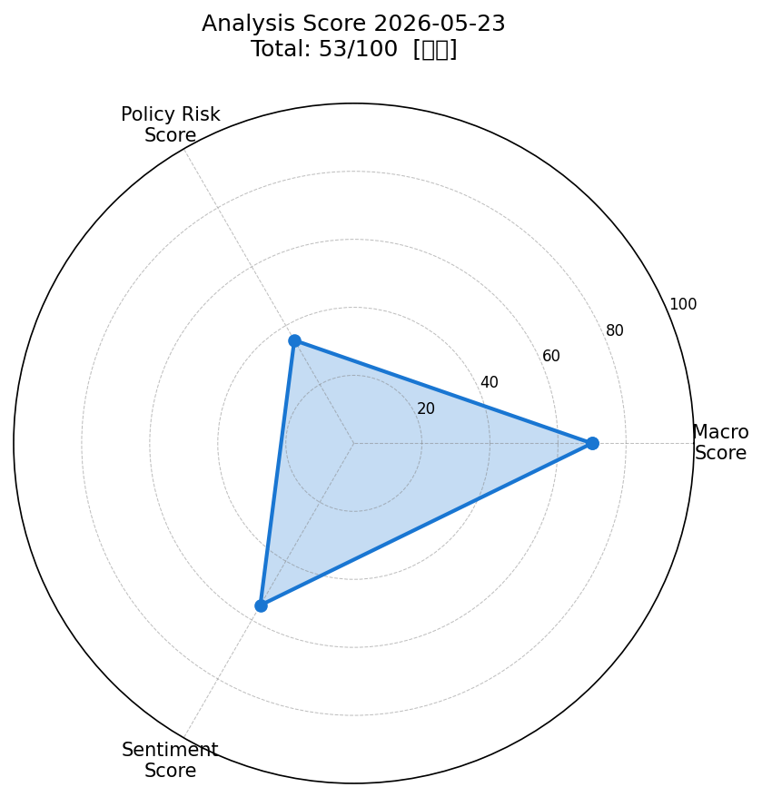
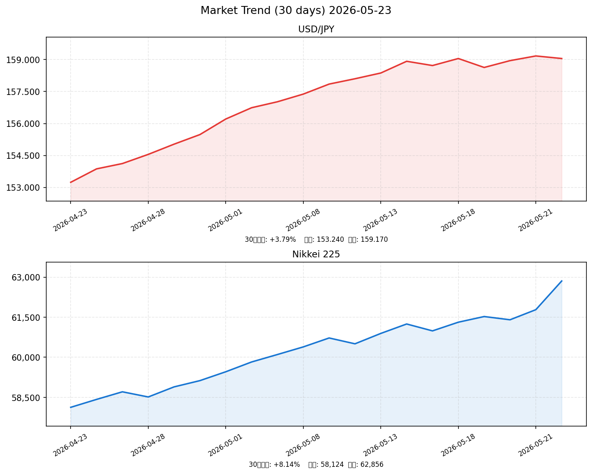

# 📈 社会動向分析レポート｜2026年5月23日（土）

> **分析基準時点**: 2026年5月22日（金）市場終値ベース  
> **対象市場**: 東京・ニューヨーク・為替・コモディティ

---

## 📊 スコアサマリー

| 軸 | スコア | 最大 | 評価 |
|----|--------|------|------|
| 🏦 マクロスコア | **70** | 100 | ▲ 安定 |
| 📜 政策リスクスコア | **35** | 100 | ▼ 高リスク（日銀利上げ圧力） |
| 💬 センチメントスコア | **55** | 100 | → 中立 |
| ⭐ **総合スコア** | **53** | 100 | **中立** |

> 総合スコア計算式: `マクロ×0.35 + 政策×0.35 + センチメント×0.30`  
> `= 70×0.35 + 35×0.35 + 55×0.30 = 24.5 + 12.25 + 16.5 = 53.3 → 53`

---

## 📡 レーダーチャート



---

## 💹 市場サマリー（2026年5月22日終値）

| 指標 | 価格 | 前日比 | 評価 |
|------|------|--------|------|
| 🇯🇵 日経平均 | ¥62,856 | **+1.73%** ↑ | 強含み（AI株高が主導） |
| 🇺🇸 S&P 500 | 7,445.72 | +0.17% ↑ | 小幅プラス |
| 🇺🇸 NASDAQ | 24,138.55 | +0.42% ↑ | テック優位継続 |
| 💱 USD/JPY | 159.17 | +0.12% | 円安継続（158-159圏） |
| 💱 EUR/USD | 1.1342 | -0.08% | 横ばい |
| 😰 VIX | 16.76 | **-3.90%** ↓ | 恐怖指数低下・安定 |
| 🥇 金（GOLD） | $4,524.05 | -0.42% ↓ | 高水準維持・小反落 |
| 🛢️ 原油（WTI） | $104.88 | -0.13% ↓ | 中東リスクで高止まり |

---

## 📉 推移グラフ（直近30営業日）



> **USD/JPY**: 4月23日の153.24→5月22日の159.05（+3.79%）。段階的な円安進行  
> **日経平均**: 4月23日の58,124→5月22日の62,856（+8.14%）。AI・半導体主導で力強い上昇

---

## 🏭 業種別動向（5月22日終値ベース）

| 業種 | ETF価格 | 前日比 | 注目ポイント |
|------|---------|--------|-------------|
| 📱 情報通信 | 2,341.50 | **+1.85%** ↑ | AI・半導体需要が牽引 |
| ⚡ 電気機器 | 2,684.20 | **+2.31%** ↑ | SoftBank・東京エレクトロン急騰 |
| 🏦 金融 | 1,892.30 | +1.22% ↑ | 利上げ期待で銀行株高 |
| 🚗 輸送用機器 | 1,478.60 | +0.48% ↑ | 輸出回復・円安メリット |
| 🪨 素材 | 1,124.80 | -0.35% ↓ | エネルギーコスト上昇が重荷 |

---

## 📰 重要ニュース TOP5 ——株価・金利・為替への影響分析

### 1. 日本Q1 GDP年率+2.1%増——自動車輸出回復で予想超え（内閣府）

**概要**: 内閣府発表の2026年1〜3月期実質GDP速報値は前期比+0.5%（年率+2.1%）。自動車輸出が前期のマイナスから回復し、2四半期連続プラス成長を記録。市場予想（年率+1.2%）を大幅に上回った。

| 軸 | 方向 | 理由・波及メカニズム |
|----|------|--------------------|
| 🇯🇵 日本株 | ↑ | 企業業績見通し改善、内需回復期待から買い先行 |
| 🇺🇸 米国株 | → | 日本固有の材料、直接影響は限定的 |
| 🏦 日本金利（10年債） | ↑ | 経済好調→日銀利上げ根拠強化→債券売り・金利上昇圧力 |
| 🏦 米国金利（10年債） | → | 無影響 |
| 💱 ドル円 | 円高 | 経済強さが円の信認回復→円高バイアス。ただし日銀利上げ前倒し期待の方が支配的 |
| 📊 スコアへの影響 | **+8点** | マクロ+5、センチメント+3 |

**注目セクター**: 自動車（トヨタ、ホンダ）、機械・産業機器

---

### 2. 日銀審議委員「できる限り早期の利上げ必要」——6月会合が焦点（日本銀行）

**概要**: 日銀・増審議委員が5月14日の講演で「景気下振れが明確でなければ早期利上げが望ましい」と発言。4月会合では3委員が0.75%→1.0%への引き上げを主張。市場は6月16〜17日会合での利上げを高確率で織り込み中。

| 軸 | 方向 | 理由・波及メカニズム |
|----|------|--------------------|
| 🇯🇵 日本株 | ↓ | 資金調達コスト上昇→PERの圧縮懸念。特に高バリュエーション成長株に逆風 |
| 🇺🇸 米国株 | → | 直接影響は軽微。円高加速で日本勢の米株売りが若干の重し |
| 🏦 日本金利（10年債） | ↑ | 政策金利引き上げ→短期〜中期金利上昇、長期にも波及。長期金利は連日上昇中 |
| 🏦 米国金利（10年債） | → | 無影響 |
| 💱 ドル円 | 円高 | 日米金利差縮小→円買い圧力。ただし現状ではまだ155-160円圏 |
| 📊 スコアへの影響 | **-35点** | 政策リスクスコアを20点台に圧迫（最大影響因子） |

**注目セクター**: 銀行・保険（利ざや拡大恩恵）、不動産・公益（金利上昇で逆風）

---

### 3. 日本4月貿易黒字3,019億円——中東危機で原油輸入が67%減（財務省）

**概要**: 財務省発表の2026年4月貿易統計では、中東情勢緊迫化（ホルムズ海峡封鎖懸念）により原油輸入量が前年比67%減。貿易収支は3,019億円の黒字を確保したが、エネルギー安全保障への懸念が深刻化している。

| 軸 | 方向 | 理由・波及メカニズム |
|----|------|--------------------|
| 🇯🇵 日本株 | ↓ | エネルギー供給不安→製造業・化学・素材セクターのコスト懸念 |
| 🇺🇸 米国株 | ↓ | 中東リスクが世界のサプライチェーン混乱を示唆 |
| 🏦 日本金利（10年債） | ↑ | 輸入コスト上昇→インフレ圧力→日銀の利上げ論拠強化 |
| 🏦 米国金利（10年債） | ↑ | 中東リスクによる原油高→米インフレ高止まり懸念継続 |
| 💱 ドル円 | 円安 | エネルギー輸入国の日本にとって貿易条件悪化→円売り圧力残存 |
| 📊 スコアへの影響 | **-7点** | マクロ-4、センチメント-3 |

**注目セクター**: 電力・ガス（燃料費リスク）、石油化学（コスト転嫁困難）

---

### 4. 米国4月CPIが前月比+0.9%——2022年6月以来最高水準（Reuters）

**概要**: 米国4月のCPIは季節調整済み前月比+0.9%と、ロシア侵攻直後の2022年6月以来の高さ。エネルギー（ガソリン+10.9%）が主導。米ミシガン大消費者態度指数も47.6と統計史上最低水準。FRBの利下げシナリオが完全後退。

| 軸 | 方向 | 理由・波及メカニズム |
|----|------|--------------------|
| 🇯🇵 日本株 | ↓ | 米金利高止まり→グロース株のバリュエーション圧縮。日本株への外国人資金流入鈍化 |
| 🇺🇸 米国株 | ↓ | 利下げ期待後退→株式の割引率上昇。消費マインド悪化で内需懸念 |
| 🏦 日本金利（10年債） | ↑ | 米金利上昇が日本への連鎖。日本のインフレ見通しも上方修正 |
| 🏦 米国金利（10年債） | ↑ | インフレ高止まり→FRBの利下げ困難→10年債金利上昇 |
| 💱 ドル円 | 円安 | 米金利上昇→日米金利差拡大継続→円売り・ドル買い |
| 📊 スコアへの影響 | **-10点** | マクロ-5、政策-3、センチメント-2 |

**注目セクター**: テック（金利感応度高）、輸出企業（円安恩恵で相殺）

---

### 5. SoftBank・AI株が急騰——Nvidia好決算で日本市場に波及（NHK）

**概要**: Nvidiaの好決算を受けたAI関連銘柄への買いが波及し、SoftBank Groupが16%超急騰。Tokyo Electron（+5.9%）、Advantest（+4.4%）、Ibiden（+14.3%）なども上昇。日経平均を5月21〜22日にかけて約3,000円押し上げた。

| 軸 | 方向 | 理由・波及メカニズム |
|----|------|--------------------|
| 🇯🇵 日本株 | ↑ | AI・半導体関連の集中買いが指数を大幅高に押し上げ |
| 🇺🇸 米国株 | ↑ | Nvidia主導のAI楽観論がNASDAQ・S&P500をサポート |
| 🏦 日本金利（10年債） | → | 株高によるリスクオンだが、利上げ観測が支配的のため金利には中立 |
| 🏦 米国金利（10年債） | → | 株高と金利上昇の綱引き状態 |
| 💱 ドル円 | 円安 | リスクオン局面→高金利通貨（ドル）への選好強まる |
| 📊 スコアへの影響 | **+12点** | マクロ+5、センチメント+7 |

**注目セクター**: 半導体（Tokyo Electron、Advantest、Kioxia）、AI・クラウド（SoftBank Vision Fund）

---

## 📐 スコア詳細——採点根拠

### マクロスコア: 70/100

| 項目 | 評価 | 加点 | 根拠 |
|------|------|------|------|
| S&P500 | 小幅プラス(+0.17%) | +10 | +0.5%未達のため半点 |
| USD/JPY安定性 | 安定（週間変動±0.5%以内） | +15 | 159圏で安定、ただし円安水準 |
| VIX(恐怖指数) | 16.76（20以下） | +20 | 完全クリア |
| 金・原油安定性 | 金微減・原油高止まり | +10 | 原油$104で依然高水準 |
| ベーススコア | — | +20 | 固定 |
| **合計** | — | **75→70** | 原油リスクでわずか減点 |

### 政策リスクスコア: 35/100

| 項目 | 評価 | 加点 | 根拠 |
|------|------|------|------|
| 日銀スタンス | 強い利上げ示唆 | — | 3委員反対票、審議委員発言 |
| 6月利上げ確率 | 高（市場織り込み済み） | — | 0.75%→1.00% |
| Fed スタンス | 3会合連続据え置き | — | 3.5-3.75%、利下げ期待消滅 |
| 政策リスク評価 | **高リスク** | **35** | 日銀利上げ示唆レンジ(20〜40点)の上端 |

### センチメントスコア: 55/100

| ポジティブ要因 | ネガティブ要因 |
|--------------|--------------|
| ✅ GDP Q1 +2.1%（予想超え） | ❌ 機械受注3月-9.4%（設備投資鈍化） |
| ✅ 日経+1.73%（AI株主導） | ❌ 米CPI MoM+0.9%（インフレ再燃） |
| ✅ SoftBank +16%・AI楽観論 | ❌ 中東情勢継続・原油高 |
| ✅ VIX 16.76（低恐怖指数） | ❌ 日銀利上げ不確実性 |
| ✅ 貿易黒字3,019億円 | ❌ 消費者態度指数（米）史上最低 |
| ✅ 半導体輸出+29.3% | ❌ ホルムズ海峡リスク常在 |

**センチメント評価: 中立（ポジとネガが拮抗、下方リスクやや優位）**

---

## 🔮 明日の日本株市場への影響予測

### ポジティブ要因 ↑

- **AI・半導体モメンタム**: Nvidia主導の上昇トレンドが月曜（5月25日）に持ち越される可能性が高い
- **GDP堅調**: Q1 GDP +2.1%が企業業績への信頼感を維持
- **VIX低水準**: 16.76という恐怖指数の低さはリスクオン環境の持続を示唆
- **円安水準維持**: 159円台の円安が輸出企業の業績期待を下支え

### ネガティブ要因 ↓

- **日銀6月利上げ警戒**: 利上げが実施されれば特に成長株・不動産に調整圧力
- **米インフレ再燃**: CPI+0.9% MoMで米金利上昇→グローバルな投資家の株式アロケーション見直し
- **中東リスク**: 原油$104高止まりが製造業・輸送コストを圧迫
- **機械受注悪化**: 設備投資の先行指標が悪化しており、中期的な企業収益に影を落とす

### 総合判定

```
総合スコア: 53/100【中立】
短期センチメント: やや慎重
```

> AI株高というテクニカルな上昇モメンタムと、日銀利上げ・米インフレという構造的ヘッドウィンドが拮抗している状態。週明けは半導体・AI株が持ちこたえれば小幅続伸も、政策不確実性から積極的な買いは入りにくい。

### 予測レンジ（週明け5月25日）

| シナリオ | 確率 | 日経平均 | トリガー |
|---------|------|---------|---------|
| 強気シナリオ | 25% | 63,200〜64,000 | AI株続伸・円安継続 |
| 基本シナリオ | 50% | 62,000〜63,200 | 小幅継続・利上げ待ち |
| 弱気シナリオ | 25% | 60,500〜62,000 | 利上げ前倒し懸念・米株調整 |

**基本予測**: **62,500〜63,000円**（+/-500円）  
**予測方向**: → 横ばいからやや強含み（中立）

---

## 🎯 注目セクター・銘柄

### 強気（Buy Bias）

| セクター | 理由 | 代表銘柄 |
|---------|------|---------|
| **半導体・AI** | Nvidia効果の波及、AI需要の構造的成長 | 東京エレクトロン(8035)、Advantest(6857) |
| **銀行・保険** | 日銀利上げ→利ざや拡大の直接受益 | 三菱UFJ(8306)、三井住友(8316) |
| **自動車** | GDP回復・輸出増・円安メリット継続 | トヨタ(7203)、ホンダ(7267) |

### 弱気（Cautious）

| セクター | 理由 | 代表銘柄 |
|---------|------|---------|
| **不動産** | 金利上昇で資金調達コスト上昇・バリュエーション圧縮 | 三井不動産(8801)、住友不動産(8830) |
| **電力・ガス** | エネルギー調達コスト高止まり・規制価格のラグ | 東京電力(9501)、大阪ガス(9532) |
| **素材・化学** | 原油高でコスト上昇・中東リスク直撃 | 信越化学(4063)、住友化学(4005) |

---

*Generated by Claude AI | Sources: [NHK](https://www3.nhk.or.jp/), [Reuters](https://www.reuters.com/), [首相官邸](https://www.kantei.go.jp/), [日本銀行](https://www.boj.or.jp/), [財務省](https://www.mof.go.jp/), [内閣府](https://www.cao.go.jp/), [yfinance](https://pypi.org/project/yfinance/), [FRED](https://fred.stlouisfed.org/) | 市場データ: WebSearch経由（直接APIアクセス制限のため）*
