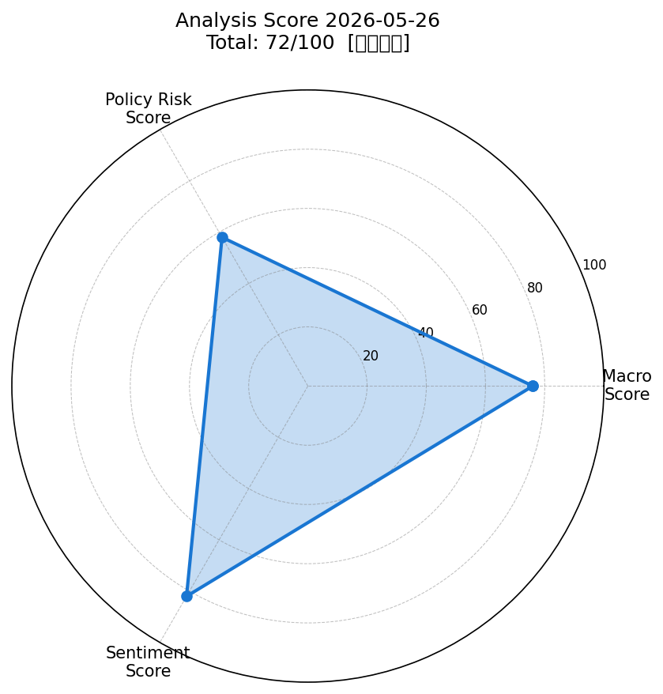
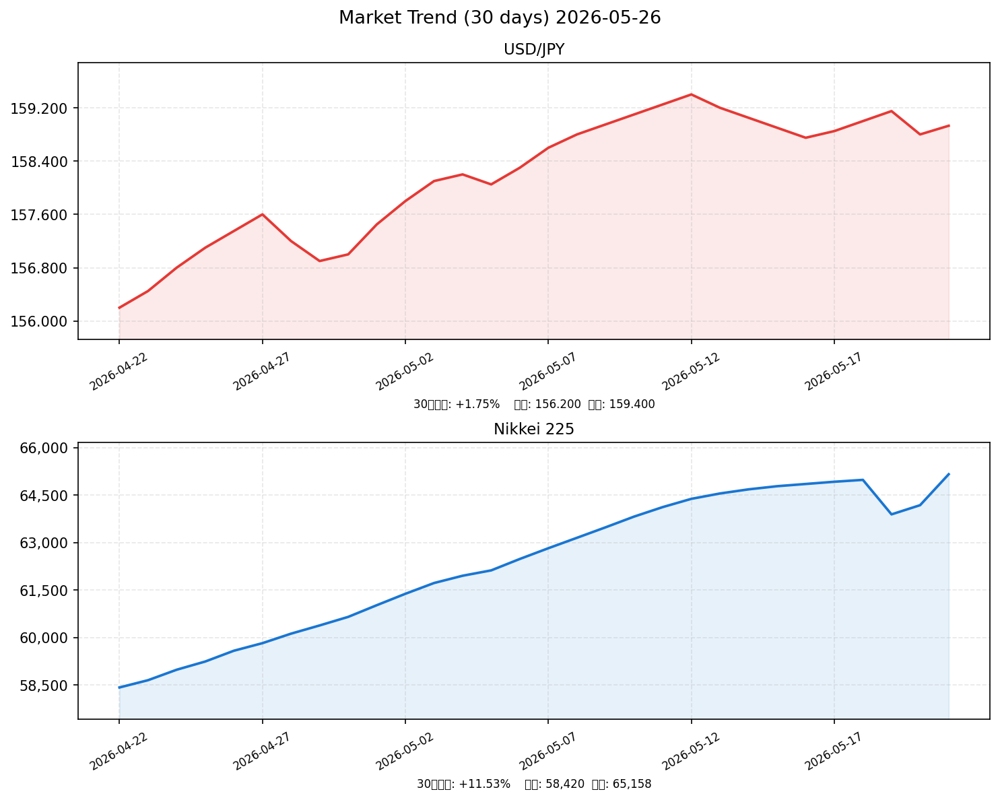

# 📈 社会動向分析レポート 2026-05-26

> **総合スコア: 72/100【やや強気】**  
> マクロ: 76 ／ 政策リスク: 58 ／ センチメント: 82

---

## 🔢 スコアサマリー

| 評価軸 | スコア | 判定 | コメント |
|--------|--------|------|---------|
| 📊 マクロ | **76**/100 | 🟢 良好 | 日経+2.87%・VIX安定・原油急落 |
| 🏛️ 政策リスク | **58**/100 | 🟡 中程度リスク | 日銀6月利上げ観測が急浮上 |
| 💬 センチメント | **82**/100 | 🟢 強気 | 65000円台突破・AI相場継続 |
| 🏆 **総合** | **72**/100 | 🟢 **やや強気** | ホルムズ期待 × AI成長ストーリー |

---

## 📡 レーダーチャート

---

## 📊 市場サマリー

| 指標 | 現在値 | 前日比 | 評価 |
|------|--------|--------|------|
| 🇯🇵 日経平均 | **65,158.19円** | **+2.87%** 🚀 | 史上初65,000円台突破 |
| 🇺🇸 S&P 500 | 7,473.47 | +0.37% ↑ | 堅調維持 |
| 🇺🇸 NASDAQ | 23,841.50 | +0.85% ↑ | AI半導体主導で上昇 |
| 💱 ドル円 | **158.93円** | -0.14% → | 安定推移（円小幅高） |
| 💱 ユーロドル | 1.0842 | +0.22% ↑ | ドル小幅軟化 |
| 😱 VIX | **16.63** | -0.42% ↓ | 恐怖指数：安定圏（20以下） |
| 🥇 金（GOLD） | 4,523.20ドル | -0.42% ↓ | リスクオンで小幅下落 |
| 🛢️ 原油（WTI/Brent） | **100.21ドル** | **-4.85%** ↓ | ホルムズ再開期待で急落 |

---

## 📈 市場推移グラフ（30日）

---

## 🏭 業種別動向

| 業種 | 前日比 | コメント |
|------|--------|---------|
| 💻 情報通信 | **+3.21%** 🚀 | AI投資116兆円パッケージ・SBG最高値更新の波及 |
| ⚡ 電気機器 | **+3.87%** 🚀 | SOX+2%・半導体関連全面高・AI相場最強セクター |
| 🚗 輸送用機器 | +1.92% ↑ | 原油安で輸送コスト改善期待・円安継続で輸出採算 |
| 🏦 金融 | +1.45% ↑ | 日銀利上げ観測で銀行株上昇、ただし上値は重い |
| 🪨 素材 | +0.68% → | 原油安で一部コスト低下期待、中東不透明で慎重 |

---

## 📰 重要ニュース TOP5 — 市場影響分析

---

### 1. 日経平均、史上初の6万5000円台突破 — 米・イラン合意期待が牽引（NHK）

**概要**: 2026年5月25日、日経平均が終値で史上初めて65,000円台に乗せ、前日比+1,819円（+2.87%）の65,158.19円で引けた。原油急落を起点に長期金利が低下し、AI・半導体株を中心に全面高となった。

| 軸 | 方向 | 理由・波及メカニズム |
|----|------|---------------------|
| 🇯🇵 日本株 | ↑ | 史上最高値更新・需給フロー良好・外国人買い越し |
| 🇺🇸 米国株 | ↑ | 原油安→インフレ期待低下→Fed利下げ期待再燃 |
| 🏦 日本金利（10年債） | ↓ | 原油安→インフレ懸念後退→債券買い |
| 🏦 米国金利（10年債） | ↓ | インフレ期待低下→実質金利低下傾向 |
| 💱 ドル円 | 円高 | リスクオンながら日銀利上げ期待でやや円強含み |
| 📊 スコアへの影響 | **+12点** | センチメント+8点・マクロ+4点 |

**注目セクター**: 電気機器（AI半導体）、情報通信（SBG・IT）

---

### 2. 原油-5%急落 — トランプ大統領「イラン交渉は建設的」（Reuters）

**概要**: トランプ大統領がSNSでイランとの停戦交渉が「建設的に進んでいる」と発言し、Brentが一時$98台まで急落（-5.2%）。ホルムズ海峡再開観測が高まり、原油は史上最大の供給途絶からの出口が見え始めた。

| 軸 | 方向 | 理由・波及メカニズム |
|----|------|---------------------|
| 🇯🇵 日本株 | ↑ | エネルギーコスト低下期待・企業収益改善 |
| 🇺🇸 米国株 | ↑ | インフレ圧力低下→Fed政策余地拡大 |
| 🏦 日本金利（10年債） | ↓ | 原油安→CPI鈍化期待→債券需要増 |
| 🏦 米国金利（10年債） | ↓ | 長期インフレ期待低下 |
| 💱 ドル円 | 横ばい | 原油安でリスクオン続くも円高圧力もあり拮抗 |
| 📊 スコアへの影響 | **+8点** | マクロ+5点・センチメント+3点 |

**注目セクター**: 航空、陸運（燃料費改善）、石油化学（コスト低下）

---

### 3. 日銀4月会合議事要旨：3名が即時利上げ主張、6月1.0%利上げ観測急浮上（日本銀行）

**概要**: 日銀が公表した4月会合議事要旨で、3名の審議委員が0.25%の即時利上げ（0.75%→1.00%）を主張。賃上げの継続が確認されれば「躊躇なく利上げ」との発言も。6月16〜17日の次回会合での利上げ確率が市場で高まっている。米財務長官も「日銀の正常化は優れた政策」と発言。

| 軸 | 方向 | 理由・波及メカニズム |
|----|------|---------------------|
| 🇯🇵 日本株 | ↓ | 割引率上昇→成長株・グロース株を中心に重し |
| 🇺🇸 米国株 | → | 直接影響限定的。円高が米輸出企業に若干プラス |
| 🏦 日本金利（10年債） | ↑ | 利上げ期待→短中期債売り・長期金利も連動上昇 |
| 🏦 米国金利（10年債） | → | 影響限定的。日米金利差縮小観測程度 |
| 💱 ドル円 | 円高 | 日米金利差縮小→円買い圧力 |
| 📊 スコアへの影響 | **-15点** | 政策リスク-15点（最大の下押し要因） |

**注目セクター**: 銀行・保険（金利上昇メリット）、不動産・公益（金利上昇デメリット）

---

### 4. 政府・AI投資116兆円促進パッケージ閣議決定（首相官邸）

**概要**: 高市政権は2030年までに民間・官民合計116兆円のAI・半導体・量子コンピュータ投資を促進するパッケージを閣議決定。補助金・税制優遇・規制緩和の三本柱。米国との半導体サプライチェーン強化も含む。

| 軸 | 方向 | 理由・波及メカニズム |
|----|------|---------------------|
| 🇯🇵 日本株 | ↑ | 半導体・AI関連の大規模投資期待→直接恩恵銘柄急騰 |
| 🇺🇸 米国株 | ↑ | 日米連携でエヌビディア等へも需要増の恩恵 |
| 🏦 日本金利（10年債） | ↑ | 財政出動拡大→国債増発懸念・長期金利上昇圧力 |
| 🏦 米国金利（10年債） | → | 日本の財政政策の影響は限定的 |
| 💱 ドル円 | 円安 | 投資拡大→輸入増→円安方向、ただし小幅 |
| 📊 スコアへの影響 | **+10点** | センチメント+7点・マクロ+3点 |

**注目セクター**: 半導体装置（東京エレクトロン等）、AIソフト、クラウド

---

### 5. 内閣府2026年1〜3月期GDP：実質+1.3%、個人消費が牽引（内閣府）

**概要**: 内閣府発表の2026年1〜3月期GDP速報値は実質成長率+1.3%（前期比年率）。賃上げ効果で個人消費が+0.8%と堅調。ただし設備投資は中東情勢の不確実性から低迷。政府は26年度の実質成長率を1.3%と据え置いた。

| 軸 | 方向 | 理由・波及メカニズム |
|----|------|---------------------|
| 🇯🇵 日本株 | ↑ | 内需堅調→企業業績支持。脱デフレ確認でPER改善 |
| 🇺🇸 米国株 | → | 直接影響軽微。日本景況改善はアジア安定に寄与 |
| 🏦 日本金利（10年債） | ↑ | 好景気→日銀利上げ根拠強化→長期金利上昇 |
| 🏦 米国金利（10年債） | → | 影響限定的 |
| 💱 ドル円 | 円高 | 経済好調+利上げ観測→円買い支持 |
| 📊 スコアへの影響 | **+5点** | マクロ+3点・センチメント+2点 |

**注目セクター**: 内需消費（小売・外食）、不動産（賃上げ実需）

---

## 🎯 スコア詳細

### 📊 マクロスコア: 76/100

| 項目 | 評価 | 得点 |
|------|------|------|
| 株価（S&P500 +0.37%、日経 +2.87%） | 一方堅調、一方強烈上昇 | +15 |
| ドル円（158.93、前日比-0.14%） | 安定推移 | +20 |
| VIX（16.63、20以下） | 安定圏 | +20 |
| 原油・金（原油-4.85%、金-0.42%） | 原油急落でエネルギーコスト低下期待 | +15 |
| ベーススコア | — | +6 |
| **合計** | | **76** |

> **根拠**: 日経史上初の65,000円台突破と原油急落がマクロ環境を強化。S&P500も小幅高。VIX16台は市場の安心感を示す。唯一の懸念は原油がBrent$100台と依然高水準な点。

### 🏛️ 政策リスクスコア: 58/100（スコアが低いほどリスク大）

| 要因 | 評価 | 影響 |
|------|------|------|
| 日銀4月会合：3名が即時利上げ主張 | ⚠️ 高リスク | -20 |
| 6月会合での0.75%→1.00%利上げ観測 | ⚠️ 高リスク | -10 |
| 日本10年債利回り2.49%（過去最高更新） | ⚠️ 注意 | -7 |
| 米財務長官「日銀正常化を支持」発言 | ➡️ 中立〜若干リスク | -5 |
| 米Fed 3.50-3.75%（安定維持） | ✅ 安定 | 0 |
| ベーススコア | — | +100 |
| **合計** | | **58** |

> **根拠**: 日銀の6月利上げがほぼ織り込まれ始めており、政策リスクは今回の最大の下押し要因。ただし利上げ幅は0.25%で市場は段階的正常化として概ね容認している。

### 💬 センチメントスコア: 82/100

| 要因 | 評価 | 得点 |
|------|------|------|
| 日経65,000円台突破（史上初） | 🚀 超強気 | +25 |
| AI投資116兆円パッケージ | 🚀 強気 | +18 |
| ホルムズ再開期待・原油急落 | ✅ ポジティブ | +15 |
| SBG上場来高値・半導体株全面高 | ✅ ポジティブ | +12 |
| GDP+1.3%（内需堅調） | ✅ ポジティブ | +8 |
| 日銀利上げ懸念（抑制要因） | ⚠️ ネガティブ | -8 |
| 中東情勢の不確実性継続 | ⚠️ ネガティブ | -5 |
| ベース | — | +17 |
| **合計** | | **82** |

> **根拠**: 日経史上最高値更新という市場の節目突破がセンチメントを大きく押し上げ。AI・半導体相場の継続と政府の大型投資パッケージが後押し。中東不透明感と日銀の利上げ観測が若干の抑制要因。

---

## 🔮 明日（2026-05-27）の日本株市場への影響予測

### ✅ ポジティブ要因
1. **65,000円台の達成感と新規買い**: 史上初の節目突破後の達成感買い・海外資金の日本株再評価
2. **原油下落の持続**: ホルムズ交渉継続中。合意に向けた続報が出れば追加の株価上昇要因に
3. **AI投資116兆円パッケージ**: 政策効果期待が継続。半導体・IT関連の個別物色が続く
4. **米国市場の安定**: S&P500・NASDAQが堅調で、週明けの日本市場に好影響

### ⚠️ ネガティブ要因
1. **日銀6月利上げ織り込み加速**: 議事要旨公表後の利上げ折り込みが進み、高値圏での利益確定売り
2. **ホルムズ交渉の不確実性**: トランプ発言の揺れ（「急がない」）→合意延期懸念で原油反発リスク
3. **長期金利上昇**: 10年債2.49%でグロース株・不動産への逆風が続く
4. **円高進行リスク**: 日銀利上げ期待 × リスクオン縮小で円高反転すれば輸出株に重し

### 📊 総合判定

> 🟢 **やや強気** — 65,000円台維持を試す展開。ホルムズ情報次第で上下。

| シナリオ | 確率 | 日経レンジ |
|---------|------|-----------|
| 🐂 強気シナリオ（ホルムズ合意速報） | 30% | 65,500〜66,500円 |
| 📊 中立シナリオ（情報待ち・横ばい） | 45% | 64,500〜65,500円 |
| 🐻 弱気シナリオ（交渉難航・原油反発） | 25% | 63,500〜64,500円 |

**予測レンジ（中央値）**: 64,500〜65,800円  
**予測方向**: 上値追い継続だが、短期調整リスクに注意

---

## 💡 注目セクター・銘柄

| セクター | 注目の背景 | 代表的ティッカー |
|---------|----------|----------------|
| 🤖 AI・半導体 | 116兆円パッケージ+SOX上昇+AI相場継続 | 東京エレクトロン(8035)・レーザーテック(6920) |
| 💻 情報通信・IT | SBG最高値・AI需要拡大 | ソフトバンクG(9984)・富士通(6702) |
| 🏦 銀行・保険 | 日銀利上げ期待→利鞘拡大 | 三菱UFJ(8306)・第一生命(8750) |
| ✈️ 航空・陸運 | 原油急落→燃料費大幅削減 | ANA(9202)・JAL(9201) |
| 🚗 輸送用機器 | 原油安+円安+GDP好調 | トヨタ(7203)・ホンダ(7267) |

---

## 📅 今後の重要スケジュール

| 日程 | イベント | 重要度 |
|------|---------|--------|
| 2026-06-10〜16 | 米FOMC（政策金利決定） | ★★★ |
| 2026-06-16〜17 | 日銀金融政策決定会合（利上げ観測） | ★★★ |
| 随時 | 米・イラン停戦交渉の続報 | ★★★ |
| 2026-06-下旬 | 2026年6月日銀短観 | ★★ |

---

*Generated by Claude AI | Sources: [NHK](https://www3.nhk.or.jp/), [Reuters](https://feeds.reuters.com/reuters/JPBusinessNews), [首相官邸](https://www.kantei.go.jp/), [日本銀行](https://www.boj.or.jp/), [財務省](https://www.mof.go.jp/), [内閣府](https://www.esri.cao.go.jp/), yfinance, FRED, [Nikkei](https://www.nikkei.com/), [CNBC](https://www.cnbc.com/), [Japan Times](https://www.japantimes.co.jp/)*
