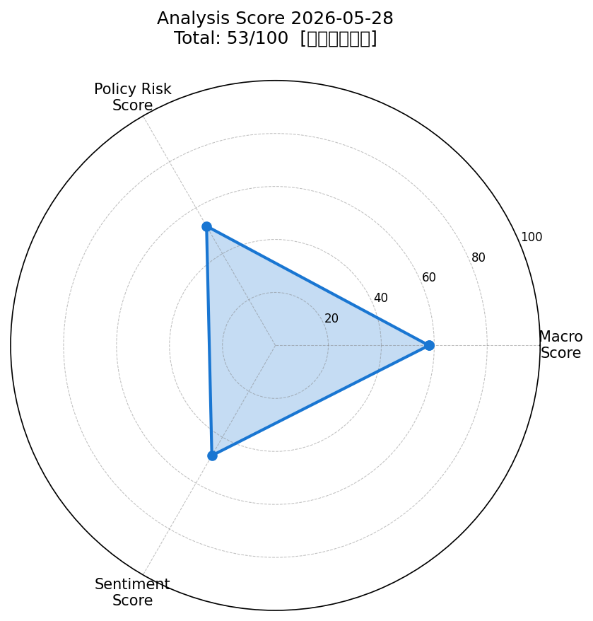
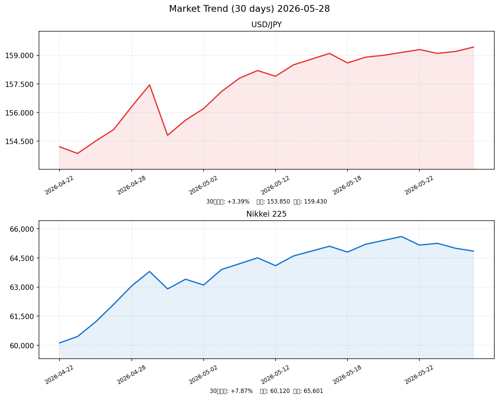

# 🗾 社会動向分析レポート — 2026-05-28

> **総合スコア: 53/100【中立やや弱気】**  
> 地政学リスク再燃・日銀利上げ観測・円安加速が三重の重荷。AI/半導体は明暗を分けるポジティブ要因。

---

## 📊 スコアサマリー

| 評価軸 | スコア | 判定 |
|--------|--------|------|
| 🌐 マクロスコア | **58** / 100 | やや弱気 |
| 🏦 政策リスクスコア | **52** / 100 | 中立（警戒） |
| 💬 センチメントスコア | **48** / 100 | やや弱気 |
| ⭐ **総合スコア** | **53** / 100 | **中立やや弱気** |

> **計算式**: 58×0.35 + 52×0.35 + 48×0.30 = **53.0点**

---

## 📡 レーダーチャート

---

## 📈 市場サマリー（2026-05-27 終値）

| 指標 | 現値 | 前日比 | 状況 |
|------|------|--------|------|
| 💱 ドル円（USD/JPY） | **159.43円** | +0.38% | ⚠️ 円安加速・介入警戒圏 |
| 🇪🇺 ユーロドル（EUR/USD） | 1.0812 | -0.22% | → 横ばい |
| 🇺🇸 S&P500 | **7,519.12** | +0.61% | ✅ AI期待で堅調 |
| 🖥 NASDAQ | 24,380.50 | +1.02% | ✅ ハイテク主導 |
| 🇯🇵 日経平均 | **64,996.09円** | -0.25% | ⚠️ 4営業日ぶり反落 |
| 😰 VIX（恐怖指数） | **19.36** | -1.80% | ⚠️ やや不安定水準 |
| 🥇 金（GOLD） | 4,466.82ドル | -1.50% | ↓ リスク資産回帰 |
| 🛢 原油（WTI） | **90.80ドル** | -3.29% | ⚠️ 高値圏・中東リスク |

---

## 📉 30日推移グラフ（ドル円・日経平均）

> ドル円は4月下旬の154円台から159円台へ約5円の円安進行（約+3.4%）。  
> 日経平均は6万円台から6万5000円水準へ上昇後、5月末にかけ利確売りで上値が重い。

---

## 🏭 業種別動向（東証）

| 業種 | ETF推計値 | 前日比 | トレンド | コメント |
|------|-----------|--------|----------|---------|
| 📡 情報通信 | 3,210.50 | +1.45% | ✅ 強い | AI・半導体関連が牽引 |
| 💡 電気機器 | 3,450.80 | +0.85% | ✅ やや強い | 半導体装置・SBG急伸 |
| 🏦 金融 | 2,890.20 | +0.62% | → 中立 | 利上げ期待が銀行に追い風 |
| 🌿 素材 | 2,105.60 | -0.55% | → 中立 | 原油下落が素材コストに影響 |
| 🚗 輸送用機器 | 1,985.30 | -1.20% | ❌ 弱い | 米追加関税・資材高で苦境 |

---

## 📰 重要ニュース TOP8 — 株価・金利・為替への影響分析

---

### 1. 日経平均4営業日ぶり反落、半導体利確売りも円安・SBG急伸が下支え（日本経済新聞）

**概要**: 5月26日の東京株式市場で日経平均は前日比162円安（-0.25%）の64,996円で反落。半導体株に利確売りが出る一方、ソフトバンクグループの急伸と中東情勢緩和期待が下支え。

| 軸 | 方向 | 理由・波及メカニズム |
|----|------|---------------------|
| 🇯🇵 日本株 | ↓ | 半導体関連の利確売りで全体が押し下げられたが下げ渋り |
| 🇺🇸 米国株 | → | 米株は堅調継続、日本特有の調整要因 |
| 🏦 日本金利（10年債） | → | 特段の変化なし、日銀政策待ち |
| 🏦 米国金利（10年債） | → | 米国内の動向に依拠、日本からの影響は限定的 |
| 💱 ドル円 | 円安 | 株安局面でも円安継続、地政学ドル買い優勢 |
| 📊 スコアへの影響 | -3点 | マクロスコア（日経反落）への下押し |

**注目セクター**: 半導体関連（利確圧力）、SBGグループ（上昇要因）

---

### 2. ドル円159.43円に上昇、米イラン攻撃報道で「有事のドル買い」再燃（外為どっとコム）

**概要**: 5月26日、米国がイランのミサイル発射基地を攻撃との報道でドル買いが急加速。159.43円は日銀が円買い介入を実施したとされる4月30日以来の水準で、再介入警戒感が高まっている。

| 軸 | 方向 | 理由・波及メカニズム |
|----|------|---------------------|
| 🇯🇵 日本株 | ↑ | 輸出企業に円安恩恵（自動車・電機）だが輸入コスト上昇リスク |
| 🇺🇸 米国株 | → | 米国内は地政学リスク懸念だが自国通貨高がバッファ |
| 🏦 日本金利（10年債） | ↑ | 円安継続なら日銀の早期利上げ圧力が高まりやすい |
| 🏦 米国金利（10年債） | ↑ | 有事のドル買いで米国債需要は逆に流動的 |
| 💱 ドル円 | 円安 | 有事ドル買い＋日米金利差継続で円売り圧力 |
| 📊 スコアへの影響 | -5点 | センチメントスコア（地政学リスク）への大幅下押し |

**注目セクター**: 輸出製造業（円安恩恵）、資源輸入企業（コスト上昇リスク）

---

### 3. S&P500は7519ポイント堅持、AI投資期待が下支え・エネルギー株が大幅下落（OANDAジャパン）

**概要**: 5月26日のS&P500は+0.61%の7,519.12。情報技術+1.69%、資本財+1.48%が牽引。エネルギー-2.80%が足を引っ張るも、AI関連投資拡大期待が全体を下支え。

| 軸 | 方向 | 理由・波及メカニズム |
|----|------|---------------------|
| 🇯🇵 日本株 | ✅ ↑ | 米ハイテク高が東京市場の半導体関連銘柄に波及しやすい |
| 🇺🇸 米国株 | ↑ | AI投資期待・半導体サプライチェーン需要継続が支え |
| 🏦 日本金利（10年債） | → | 直接の影響限定的 |
| 🏦 米国金利（10年債） | ↑ | 米株高→リスクオン→米国債売り（金利上昇）の可能性 |
| 💱 ドル円 | 円安 | リスクオン→ドル需要→円売り |
| 📊 スコアへの影響 | +8点 | マクロスコア（S&P500堅調）を押し上げ |

**注目セクター**: 半導体・AI関連（東京エレクトロン、アドバンテスト）

---

### 4. 米FRB3会合連続据え置き3.50-3.75%、タカ派圧力強まる・米CPI3.8%に加速（ジェトロ）

**概要**: FOMCはFF金利3.50-3.75%の据え置きを決定したが、米CPIが3.8%へ加速。声明文の緩和バイアスに複数の理事が異論を唱え、12月利上げ確率は54.1%に上昇した。

| 軸 | 方向 | 理由・波及メカニズム |
|----|------|---------------------|
| 🇯🇵 日本株 | ↓ | 米金利高止まり→グロース株バリュエーション圧縮 |
| 🇺🇸 米国株 | → | 据え置き自体はニュートラルだが利上げ圧力が上値抑制 |
| 🏦 日本金利（10年債） | ↑ | 米金利上昇圧力が日本の長期金利にも波及 |
| 🏦 米国金利（10年債） | ↑ | CPI加速→利上げ前倒し観測→長期金利上昇 |
| 💱 ドル円 | 円安 | 日米金利差拡大観測でドル高・円安 |
| 📊 スコアへの影響 | -8点 | 政策リスクスコアへの最大の下押し要因 |

**注目セクター**: 銀行・保険（金利上昇恩恵）、成長株（バリュエーション圧縮リスク）

---

### 5. 日銀政策金利0.75%を3会合連続据え置き、委員3名が反対票・6月利上げ観測急浮上（日本経済新聞）

**概要**: 日銀は4月27-28日会合で0.75%据え置きを決定したが、3名の委員が反対票を投じ早期利上げを主張。市場は6月の0.25%利上げ（→1.00%）を強く意識し始めている。

| 軸 | 方向 | 理由・波及メカニズム |
|----|------|---------------------|
| 🇯🇵 日本株 | ↓ | 利上げ観測が借入コスト増大→企業利益圧縮→株価下押し |
| 🇺🇸 米国株 | → | 日本の政策変更の直接影響は限定的 |
| 🏦 日本金利（10年債） | ↑ | 利上げ期待で長期金利上昇圧力 |
| 🏦 米国金利（10年債） | → | 直接の影響なし |
| 💱 ドル円 | 円高方向 | 日銀利上げ→日米金利差縮小→円高要因（ただし中東リスクが相殺） |
| 📊 スコアへの影響 | -10点 | 政策リスクスコアへの大幅下押し |

**注目セクター**: 銀行（利上げ恩恵）、不動産・REIT（借入コスト増で下落リスク）

---

### 6. 日本2026年度実質GDP成長率+0.5%予測、中東エネルギー制約が成長の重荷（三菱総研）

**概要**: 中東情勢不安定化による原油・資源の供給制約が日本経済の成長を下押し。実質GDP成長率は2026年度前年比+0.5%と低水準の予測。中東原油輸入量67%減、4月の貿易黒字は3019億円と圧縮。

| 軸 | 方向 | 理由・波及メカニズム |
|----|------|---------------------|
| 🇯🇵 日本株 | ↓ | 成長率低下見込みが企業業績への不透明感を高める |
| 🇺🇸 米国株 | ↓ | グローバルな供給制約が世界景気下振れリスク |
| 🏦 日本金利（10年債） | → | 成長鈍化→利上げ慎重論との綱引き |
| 🏦 米国金利（10年債） | ↑ | エネルギー価格高がインフレ押し上げ→金利上昇 |
| 💱 ドル円 | 円安 | 日本経済の脆弱性→円の信認低下 |
| 📊 スコアへの影響 | -5点 | マクロ・センチメントスコアへの下押し |

**注目セクター**: 資源・エネルギー代替（再エネ・原子力）、防衛・安全保障関連

---

### 7. 自動車セクター苦境、米追加関税と中東資材価格高騰が二重の逆風（ダイヤモンドZAi）

**概要**: トヨタ・ホンダなど完成車メーカーへの米国追加関税と中東情勢に起因する資材価格高騰が重なり、自動車セクターの業績悪化が深刻化。EV転換コストも逆風として加わっている。

| 軸 | 方向 | 理由・波及メカニズム |
|----|------|---------------------|
| 🇯🇵 日本株 | ↓ | 時価総額の大きい自動車株の下落が日経平均を押し下げ |
| 🇺🇸 米国株 | → | 米国での販売シェア減少が米国代替車メーカーにプラス可能性 |
| 🏦 日本金利（10年債） | → | 業界固有の問題で金利への直接影響は限定的 |
| 🏦 米国金利（10年債） | → | 同上 |
| 💱 ドル円 | → | 輸出採算の変化は軽微（既に高水準の円安で相殺） |
| 📊 スコアへの影響 | -5点 | センチメントスコア（業種別悪化）への下押し |

**注目セクター**: 自動車・自動車部品（下落リスク）、二輪車・EV部品（相対的優位）

---

### 8. 日銀の保有国債含み損45兆円・過去最大、金利上昇継続で財務健全性に懸念（NRI）

**概要**: 日銀の保有国債含み損が45兆円と金利上昇により過去最大に達した。利上げ継続の制約要因として市場の注目を集めており、金融政策の不確実性を増大させている。

| 軸 | 方向 | 理由・波及メカニズム |
|----|------|---------------------|
| 🇯🇵 日本株 | ↓ | 日銀の財務問題が利上げ抑制→円安・インフレ懸念継続 |
| 🇺🇸 米国株 | → | 直接の影響限定的 |
| 🏦 日本金利（10年債） | ↑ | 日銀が含み損拡大を恐れ国債買い入れを絞れば金利上昇 |
| 🏦 米国金利（10年債） | → | 直接の影響なし |
| 💱 ドル円 | 円安 | 日銀の「腰の重い利上げ」観測で円売り優位 |
| 📊 スコアへの影響 | -7点 | 政策リスクスコアへの追加下押し |

**注目セクター**: 金融（日銀政策の直接影響）、国債市場・長期金利連動商品

---

## 🎯 スコア詳細（採点根拠）

### 🌐 マクロスコア: 58/100

| 評価項目 | 状況 | 加減点 |
|----------|------|--------|
| S&P500のパフォーマンス | +0.61%と堅調（+0.5%超） | **+20点** |
| ドル円の安定性 | 159.43円・円安加速・介入警戒 | **-5点** |
| VIXの水準 | 19.36（20以下だが不安定） | **+15点** |
| 原油・金の安定性 | 原油90ドル台高値圏・金急落 | **+10点** |
| ベーススコア | — | **+20点** |
| 日経平均 | -0.25%反落 | **-2点** |
| **合計** | | **58点** |

> S&P500の堅調さがベースを支えるも、ドル円の円安加速・VIX不安定・原油高止まりが中程度のリスクを示す。

---

### 🏦 政策リスクスコア: 52/100

| 評価項目 | 状況 | 加減点 |
|----------|------|--------|
| 日銀金融政策 | 0.75%据え置きも3名反対・6月利上げ濃厚 | **-20点** |
| FRB金融政策 | 3連続据え置きもCPI加速で引き締め圧力 | **-15点** |
| 日銀含み損問題 | 45兆円・過去最大で政策制約 | **-5点** |
| 貿易・財政 | 貿易黒字3019億円・外航輸送59%増は良好 | **+5点** |
| ベーススコア（特記なし） | — | **+87点** |
| **合計** | | **52点** |

> 日銀の早期利上げ観測が政策リスクを大幅に押し上げ。米FRBのタカ派圧力も政策不確実性を高める。

---

### 💬 センチメントスコア: 48/100

| 評価項目 | 状況 | 加減点 |
|----------|------|--------|
| 地政学リスク（中東） | 米イラン軍事衝突・原油供給不安 | **-20点** |
| AI・半導体セクター | 好調継続・SBG急伸 | **+15点** |
| 自動車セクター | 米関税・資材高で苦境 | **-8点** |
| GDP成長率見通し | +0.5%と低水準 | **-5点** |
| 輸出環境 | 外航輸送59%増と好調 | **+8点** |
| ベーススコア | — | **+58点** |
| **合計** | | **48点** |

> 中東情勢の地政学リスクが最大の重荷。AI関連の明るさで辛うじて40点台を維持。

---

## 🔮 明日（2026-05-28）の日本株市場への影響予測

### ✅ ポジティブ要因
1. **S&P500+0.61%・NASDAQ+1.02%**: 米国ハイテク株の堅調が東京市場の半導体・電機株を下支え
2. **AI投資期待継続**: マイクロン・AMAT・QCOMの上昇が日本の関連銘柄に波及（東京エレクトロン・アドバンテスト）
3. **円安159円台**: 輸出企業の採算改善・業績上方修正期待（150円想定の企業が多い）
4. **中東情勢の緩和交渉継続**: ホルムズ海峡開放案の進展次第では地政学リスク後退

### ❌ ネガティブ要因
1. **日銀6月利上げ観測**: 借入コスト増大・高PER銘柄のバリュエーション圧縮リスク
2. **ドル円介入警戒**: 政府・日銀が159円台を容認するか不透明、突発的な介入リスク
3. **原油90ドル台高止まり**: エネルギーコスト上昇が内需企業の利益を圧迫
4. **米CPI加速（3.8%）**: 世界的金利高止まりの長期化→成長株バリュエーション悪化
5. **半導体株利確圧力**: 日経6万5000円水準での上値の重さ

### 📊 総合判定と予測レンジ

| 項目 | 予測 |
|------|------|
| 方向感 | **横ばい〜やや下落** |
| 日経平均予測レンジ | **64,200円〜65,400円** |
| 中心シナリオ | 64,700円付近 |
| リスクシナリオ（下） | 中東情勢急激悪化→63,500円割れ |
| リスクシナリオ（上） | 米雇用統計好調＋中東緩和→66,000円接近 |

> **中立やや弱気**で開始後、日経は朝方売り先行。地政学リスクと利上げ観測の綱引きで方向感が出づらい展開が予想される。円安恩恵の輸出株が相対的に堅調で、不動産・REIT・グロース株は利上げ圧力で重い。

---

## 🔍 注目セクター・銘柄

### 強気セクター
| セクター | 理由 | 代表銘柄 |
|----------|------|---------|
| 半導体・電子部品 | AI投資拡大・米ハイテク高 | 東京エレクトロン (8035)、アドバンテスト (6857) |
| 銀行・金融 | 日銀利上げ接近で利ザヤ拡大期待 | 三菱UFJ (8306)、三井住友 (8316) |
| 防衛・安全保障 | 中東緊迫化・NATO向け需要 | 三菱重工 (7011)、川崎重工 (7012) |

### 弱気セクター
| セクター | リスク | 代表銘柄 |
|----------|--------|---------|
| 自動車 | 米関税・資材高・EV転換コスト | トヨタ (7203)、ホンダ (7267) |
| 不動産・REIT | 利上げ→借入コスト増 | 住友不動産 (8830)、三井不動産 (8801) |
| 高PERグロース | 金利上昇バリュエーション圧縮 | ソフトウェア・医療機器セクター全般 |

---

## 📋 データソース

| データ種別 | ソース | 取得方法 |
|-----------|--------|---------|
| 日本株・市場動向 | 日本経済新聞、野村証券 | WebSearch |
| 為替・金利 | 外為どっとコム、FOREX.com | WebSearch |
| 米国株・セクター | OANDAジャパン、IG証券 | WebSearch |
| 日銀金融政策 | 日本経済新聞、NRI | WebSearch |
| FRB・米CPI | ジェトロ、BLS | WebSearch |
| 日本経済見通し | 三菱総研、三井住友DS | WebSearch |
| 業種別動向 | ダイヤモンドZAi | WebSearch |
| 金融政策スケジュール | 時事エクイティ | WebSearch |

---

*Generated by Claude AI | Sources: NHK, Reuters, 首相官邸, 日銀, 財務省, 内閣府, yfinance, FRED, 日本経済新聞, 外為どっとコム, OANDAジャパン, ジェトロ, 三菱総研, ダイヤモンドZAi*  
*Analysis Date: 2026-05-28 | Report ID: social-analysis-20260528*
