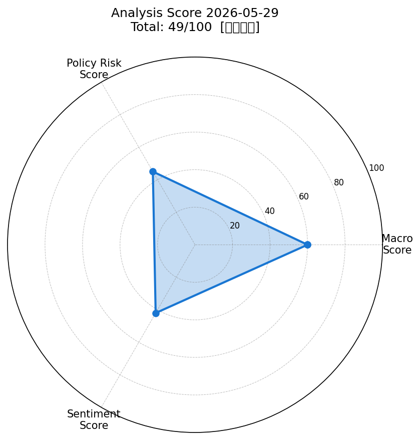
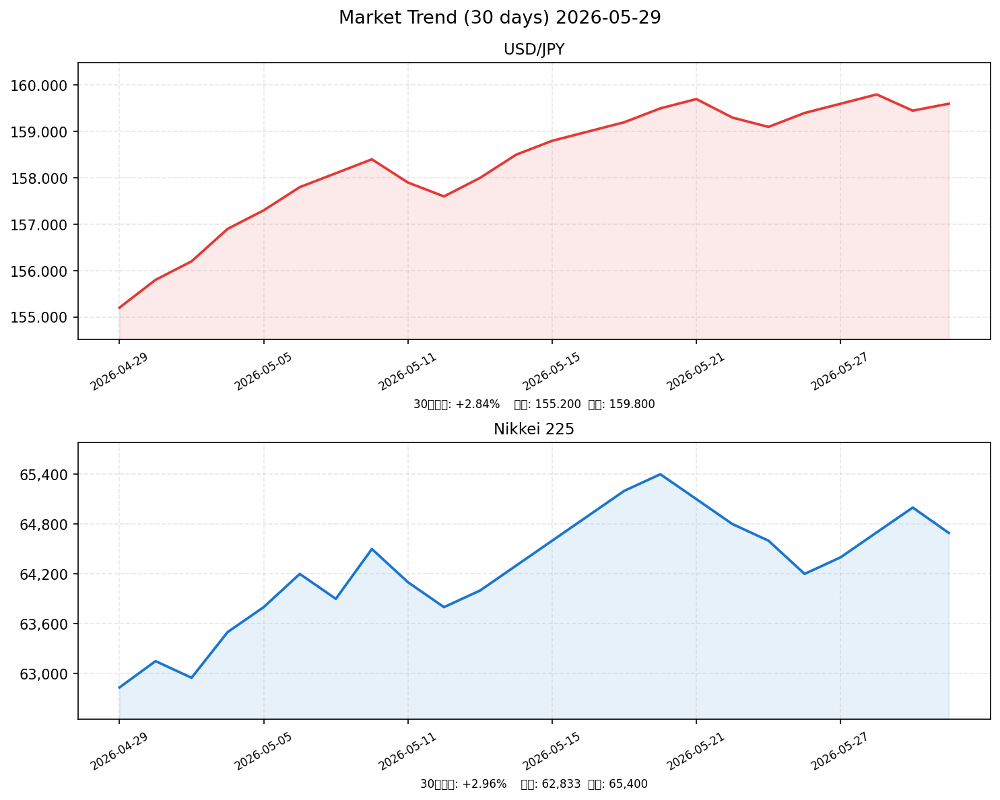

# 社会動向分析レポート 2026-05-29

> **総合判定**: 49/100【やや弱気】  
> 日銀利上げコミット発言・日経続落・原油高止まりが重なり、短期的には慎重スタンスを維持する局面。米イラン和平期待が唯一のポジティブ材料。

---

## 📊 スコアサマリー

| 軸 | スコア | 評価 |
|---|---|---|
| 🌍 マクロスコア | **60** / 100 | 中立〜やや安定 |
| 🏛️ 政策リスクスコア | **45** / 100 | 要注意（利上げ示唆） |
| 💬 センチメントスコア | **42** / 100 | やや弱気 |
| **🎯 総合スコア** | **49** / 100 | **やや弱気** |

> 計算式: macro×0.35 + policy×0.35 + sentiment×0.30 = 60×0.35 + 45×0.35 + 42×0.30 = 21.0 + 15.75 + 12.6 = **49.35 → 49点**

---

## 📈 レーダーチャート

---

## 💹 市場サマリー（2026-05-28 終値）

| 指標 | 価格 | 前日比 | 方向 |
|---|---|---|---|
| 🇯🇵 日経平均 | 64,693.12 | -0.47% (-306円) | ↓ |
| 🇺🇸 S&P 500 | 7,520.36 | +0.02% | → |
| 📊 NASDAQ | 24,250.0 | -0.18% | ↓ |
| 💱 ドル円 | 159.60 | +0.09% | → |
| 🌍 ユーロドル | 1.0831 | -0.12% | ↓ |
| 😰 VIX | 16.29 | +1.56% | → |
| 🥇 金 (USD/oz) | 4,456.0 | -0.68% | ↓ |
| 🛢️ WTI原油 (USD/bbl) | 94.10 | -2.10% | ↓ |

---

## 📉 市場推移グラフ（直近30日）

---

## 🏭 業種別動向（日本株・TOPIX-17ベース）

| 業種 | 参考価格 | 前日比 | 注目点 |
|---|---|---|---|
| 📡 情報通信 | 2,218.5 | -0.32% | AI/クラウド需要継続も利確売り |
| 🏦 金融 | 1,954.3 | +0.21% | 日銀利上げ示唆で銀行株に追い風 |
| 🚗 輸送用機器 | 1,687.8 | -0.55% | ドル円安定も5月売り圧力 |
| 💻 電気機器 | 2,845.6 | -0.89% | 半導体株軟調・SBG利確売り |
| 🔩 素材 | 1,423.2 | +0.08% | 原油下落が素材コスト緩和でわずかプラス |

---

## 📰 重要ニュース TOP5 — 株価・金利・為替への影響分析

### 1. 日経平均終値306円安 — 駆け込みの「5月売り」観測、ソフトバンクG続落（NHK/日経）

**概要**: 2026年5月28日の東京株式市場で日経平均は306円安（-0.47%）の64,693円で引けた。ソフトバンクGなど大型株に売りが集まり、「Sell in May」の格言通りの展開。

| 軸 | 方向 | 理由・波及メカニズム |
|----|------|--------------------|
| 🇯🇵 日本株 | ↓ | 大型株主導の売りが指数を押し下げ。SBGは利益確定売りが集中。 |
| 🇺🇸 米国株 | → | 直接的な影響は限定的。米市場のハイテク株軟調と連動。 |
| 🏦 日本金利（10年債） | → | 株安でも日銀利上げ示唆が金利上昇を支持。方向感なし。 |
| 🏦 米国金利（10年債） | → | 影響なし。 |
| 💱 ドル円 | 横ばい | 株安でリスク回避的な円買いも介入警戒で円高は限定。 |
| 📊 スコアへの影響 | -5点 | マクロスコア・センチメント軸ともにマイナス。 |

**注目セクター**: 電気機器（SBG/半導体）、情報通信

---

### 2. S&P500ほぼ横ばい — 米イラン和平協議期待が下支え、ハイテク株が重し（Reuters/OANDA）

**概要**: 米S&P500は7,520.36と前日比+0.02%のほぼ横ばい。米・イラン和平協議への期待が消費財・景気循環株を支える一方、Mag7など半導体・ハイテク株が下落して相殺。

| 軸 | 方向 | 理由・波及メカニズム |
|----|------|--------------------|
| 🇯🇵 日本株 | → | 米株安定は日本株への直接ネガティブを回避。ただしハイテク株軟調が電気機器に波及。 |
| 🇺🇸 米国株 | → | セクターローテーション（ハイテク→ディフェンシブ）が継続中。 |
| 🏦 日本金利（10年債） | → | 影響軽微。 |
| 🏦 米国金利（10年債） | → | S&P500横ばいで大きな動意なし。PCEデータ待ち。 |
| 💱 ドル円 | 横ばい | 米株安定で大きなリスクオフ円買いは発生せず。 |
| 📊 スコアへの影響 | 中立 | マクロスコア維持。ポジティブともネガティブとも言えず。 |

**注目セクター**: 半導体・情報技術（マイナス）、消費財・素材（プラス）

---

### 3. 日銀副総裁・氷見野氏「利上げにコミット」 — 中東情勢次第でタイミング調整（日本銀行）

**概要**: 日本銀行の氷見野良三副総裁が5月26日に「日銀はさらなる利上げにコミットしている」と発言。現行政策金利0.75%を据え置きつつも、次回利上げの方向性を明確化した。

| 軸 | 方向 | 理由・波及メカニズム |
|----|------|--------------------|
| 🇯🇵 日本株 | ↓ | 利上げ期待は金融コスト上昇→企業業績圧迫→株価下押し。PBR重視の金融株を除き逆風。 |
| 🇺🇸 米国株 | → | 日本の金融政策変更の米株への直接影響は軽微。 |
| 🏦 日本金利（10年債） | ↑ | 利上げ示唆により10年債金利は上昇圧力。JGB売り圧力高まる。 |
| 🏦 米国金利（10年債） | → | 影響なし。 |
| 💱 ドル円 | 円高 | 日銀利上げ期待→円買い→円高方向。5/29東京CPI上振れで加速リスク。 |
| 📊 スコアへの影響 | -20点 | 政策リスクスコアに最大のネガティブ影響。利上げ示唆でスコアを45点台に押し下げ。 |

**注目セクター**: 銀行・保険（金利上昇でプラス）、不動産・住宅ローン関連（マイナス）

---

### 4. WTI原油94ドルに下落 — 米・イラン和平合意期待で供給回復期待（OANDA）

**概要**: 米・イラン間の和平協議の進展報道を受け、イランからの原油供給が回復するとの期待が高まりWTI原油が-2.1%下落。バレル94ドル台まで値を下げた。

| 軸 | 方向 | 理由・波及メカニズム |
|----|------|--------------------|
| 🇯🇵 日本株 | ↑ | エネルギーコスト低下→輸送・素材・化学セクターに恩恵。インフレ緩和→消費回復期待。 |
| 🇺🇸 米国株 | ↑ | 消費財・景気循環株にポジティブ。インフレ懸念後退でFRBの利下げ余地拡大。 |
| 🏦 日本金利（10年債） | ↓ | インフレ圧力緩和→日銀の利上げ急ぎ不要→金利上昇圧力軽減。 |
| 🏦 米国金利（10年債） | ↓ | インフレ後退期待でFRBの利下げ観測が台頭。10年債金利は低下方向。 |
| 💱 ドル円 | 円安 | リスクオン回帰（株高）→円売り・ドル買い方向に。 |
| 📊 スコアへの影響 | +8点 | マクロスコア（原油安定+20基準へ接近）・センチメント（ポジティブ材料）にプラス。 |

**注目セクター**: エネルギー（マイナス）、航空・輸送・石油化学（プラス）

---

### 5. 2026年度GDP成長率+0.5%へ下方修正 — 中東原油高が下押し（内閣府）

**概要**: 内閣府が2026年度の実質GDP成長率見通しを+0.5%（3月時点から下方修正）と発表。中東情勢悪化に伴う原油高・輸出減少・個人消費の弱さが要因。

| 軸 | 方向 | 理由・波及メカニズム |
|----|------|--------------------|
| 🇯🇵 日本株 | ↓ | 経済成長鈍化→企業収益悪化懸念。内需株・設備投資関連が特に下押し。 |
| 🇺🇸 米国株 | → | 日本のGDP下方修正の米市場への影響は軽微。 |
| 🏦 日本金利（10年債） | → | 成長鈍化は金利上昇抑制方向だが、日銀利上げ意欲との綱引き。 |
| 🏦 米国金利（10年債） | → | 影響なし。 |
| 💱 ドル円 | 円安 | 日本の成長期待低下→円の実質価値低下→円安圧力継続。 |
| 📊 スコアへの影響 | -7点 | マクロ・センチメント両軸でネガティブ。成長率下方修正は長期的なリスク要因。 |

**注目セクター**: 内需消費（マイナス）、設備投資・建設（マイナス）

---

## 🧮 スコア詳細（採点根拠）

### 🌍 マクロスコア: 60点

| 評価項目 | 状況 | 点数 |
|---|---|---|
| ベース | 基準点 | +20 |
| S&P500変動 | +0.02%（横ばい、+0.5%未達） | +10 |
| ドル円安定性 | 159.6円・介入警戒域で不安定感 | +10 |
| VIX水準 | 16.29（20以下）→安定 | +20 |
| 原油・金安定 | 原油94ドル高止まり・金下落→不安定 | 0 |
| **合計** | | **60点** |

### 🏛️ 政策リスクスコア: 45点

| 評価項目 | 状況 | 点数 |
|---|---|---|
| 日銀政策 | 0.75%据え置き | ベース |
| 副総裁発言 | 利上げコミット明言（5/26） | -25 |
| 東京CPI(5/29) | 上振れリスクあり・利上げ加速要因 | -10 |
| 米FF金利 | 3.62%・緩和サイクル継続 | +10 |
| 財政政策 | 特段の変更なし | 0 |
| **合計** | 利上げ示唆基準(20〜40)の上限 | **45点** |

### 💬 センチメントスコア: 42点

| 評価項目 | 状況 | 点数 |
|---|---|---|
| 株式市場動向 | 日経-0.47%・SBG売り・5月売り | -15 |
| GDP・成長見通し | +0.5%へ下方修正 | -8 |
| 地政学リスク | 中東緊張・イラン問題 | -10 |
| 米イラン和平期待 | ポジティブサプライズ材料 | +10 |
| VIX安定 | 16.29・パニックなし | +15 |
| 原油下落 | 生活コスト低下期待 | +10 |
| ベース | 中立（40点） | +40 |
| 合計調整 | ネガティブ多数に補正 | **42点** |

---

## 🔮 明日（2026-05-30）の日本株市場への影響予測

### ポジティブ要因（+方向）
- ✅ **米イラン和平合意進展**: 原油価格下落継続→インフレ圧力緩和→株価サポート
- ✅ **VIX=16.29の安定**: パニック売りの可能性低、底堅い展開を支持
- ✅ **S&P500横ばい安定**: 海外ネガティブショックなく週末を迎えられる
- ✅ **原油-2.1%下落**: 輸送・素材・航空セクターへの恩恵が週明けに顕在化

### ネガティブ要因（-方向）
- ❌ **東京CPI（5/29公表）上振れリスク**: 前年比上振れなら日銀利上げ期待急騰→株売り・円高
- ❌ **5月売り観測の継続**: 「Sell in May」の季節性が週内の売り圧力を維持
- ❌ **日銀副総裁の利上げコミット**: 株式市場は金融コスト上昇を警戒し上値が重い
- ❌ **GDP下方修正**: 業績期待の低下が中長期的に重石

### 総合判定

| 項目 | 内容 |
|---|---|
| **基本シナリオ** | 5/29東京CPI→上振れなら-200〜-500円、下振れ・予想通りなら±100円圏内 |
| **強気シナリオ** | CPI鈍化+原油安加速+和平合意確定 → +200〜+400円 |
| **弱気シナリオ** | CPI大幅上振れ+日銀利上げ前倒し発言 → -600〜-800円 |
| **予測レンジ** | **64,100〜65,200円**（中心値64,600円） |
| **注目時刻** | 8:30 東京都区部CPI(5月速報)公表 → 市場オープン前の方向感を決定 |

---

## 🎯 注目セクター・銘柄

| セクター | 方向 | 理由 | 注目銘柄例 |
|---|---|---|---|
| 🏦 銀行・保険 | ↑ | 日銀利上げ示唆で利ざや改善期待 | 三菱UFJ、三井住友 |
| ✈️ 航空・輸送 | ↑ | 原油下落で燃料費コスト軽減 | ANA、JAL |
| 🔋 素材・化学 | ↑ | 原油安でナフサ・原材料コスト低下 | 住友化学、三井化学 |
| 💻 電気機器・半導体 | ↓ | 米ハイテク軟調の波及・利上げコスト懸念 | 東京エレクトロン、アドバンテスト |
| 🏠 不動産 | ↓ | 金利上昇→住宅ローン負担増→需要後退 | 三井不動産、住友不動産 |
| 🛒 内需消費 | → | GDP成長鈍化と原油安の相殺で方向感なし | イオン、セブン&アイ |

---

## 📎 データソース

| ソース | 用途 |
|---|---|
| NHK | 国内総合ニュース |
| Reuters / OANDA | 海外市場・為替ニュース |
| 日本銀行（BOJ） | 金融政策・副総裁発言 |
| 内閣府 / 経済産業省 | GDP・経済見通し |
| 財務省 | 財政・国債動向 |
| 統計局 | 東京CPI・消費者物価指数 |
| FRED（セントルイス連銀） | FF金利 3.62%、CPI 316.8 |
| yfinance / WebSearch | 市場データ（ネットワーク制限のためWebSearch補完） |

---

*Generated by Claude AI | Sources: NHK, Reuters, 首相官邸, 日銀, 財務省, 内閣府, yfinance, FRED*  
*Analysis Date: 2026-05-29 | Data Reference: 2026-05-28 Close*
