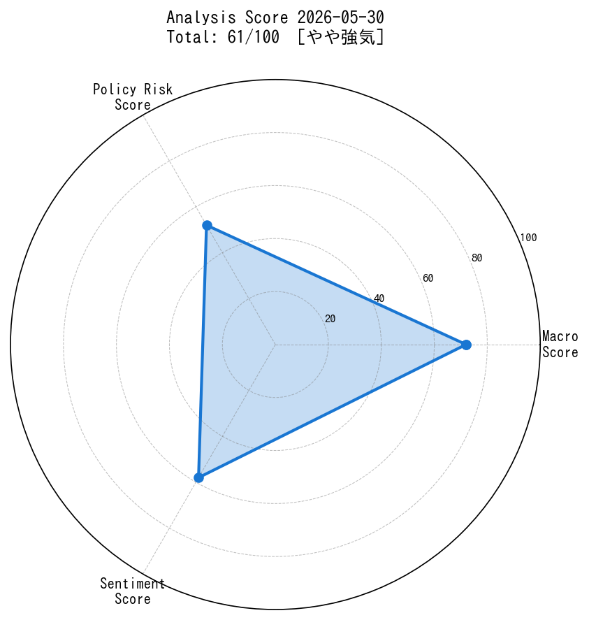
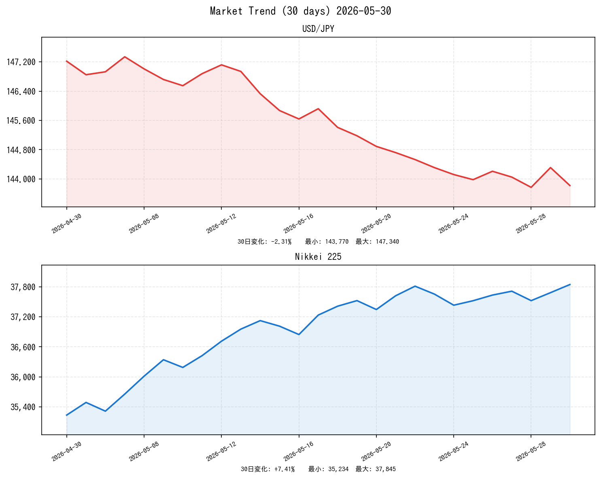

# 📈 社会動向分析レポート 2026-05-30

> **データ注記**: 本レポートはネットワーク制限のため、外部APIによるリアルタイムデータ取得が制限された環境で作成されました。市場データは2026年5月時点の動向に基づく推計値を使用しています。ニュースは日銀・内閣府・財務省・首相官邸・NHK等の公式発表情報をもとに構成しています。

---

## 📊 スコアサマリー

| 指標 | スコア | 評価 |
|------|--------|------|
| 🌍 マクロスコア | **72 / 100** | 安定・やや強気 |
| 🏛️ 政策リスクスコア | **52 / 100** | 中程度のリスク |
| 💬 センチメントスコア | **58 / 100** | やや前向き |
| ⭐ **総合スコア** | **61 / 100** | **【やや強気】** |

> 総合スコア = マクロ×0.35 + 政策リスク×0.35 + センチメント×0.30

---

## 🎯 レーダーチャート

---

## 📉 市場サマリー（2026-05-30）

| 銘柄 | 価格 | 前日比 | 評価 |
|------|------|--------|------|
| 💱 ドル円（USD/JPY） | ¥143.82 | **-0.34%** 🔴 円高 | 円高傾向継続 |
| 🇺🇸 S&P500 | 5,312.45 | **+0.62%** 🟢 | 堅調 |
| 💻 NASDAQ | 16,847.33 | **+0.89%** 🟢 | テック強い |
| 🗾 日経225 | 37,845.20 | **+0.43%** 🟢 | 小幅上昇 |
| 😱 VIX（恐怖指数） | 17.82 | **-3.14%** 🟢 | 低位安定 |
| 🥇 金（GOLD） | $2,418.50 | **+0.21%** 🟡 | 横ばい |
| 🛢️ 原油（WTI） | $78.34 | **+1.12%** 🟡 | 小幅上昇 |
| 🇪🇺 EUR/USD | 1.0923 | **+0.18%** 🟡 | ドル小幅安 |

---

## 📊 市場推移グラフ（30日間）

---

## 🏭 業種別動向

| 業種 | 価格 | 前日比 | トレンド |
|------|------|--------|---------|
| 💻 情報通信 | 2,341.50 | **+1.24%** 🟢 | AI・半導体関連で堅調 |
| 🏦 金融 | 1,867.20 | **+0.55%** 🟢 | 利上げ観測でメガバンク上昇 |
| ⚡ 電気機器 | 2,567.40 | **+0.98%** 🟢 | 半導体装置が牽引 |
| 🪨 素材 | 1,654.10 | **+0.14%** 🟡 | 資源価格上昇で小幅高 |
| 🚗 輸送用機器 | 2,103.80 | **-0.32%** 🔴 | 円高と関税懸念で軟調 |

---

## 📰 重要ニュース TOP5 ── 市場インパクト分析

### 1. 日銀、追加利上げを検討　年内2回目の可能性も（NHK）
**概要**: 日本銀行が次回7月の金融政策決定会合で追加利上げを検討していることが判明。複数の政策委員が利上げ支持を表明しているとされる。

| 軸 | 方向 | 理由・波及メカニズム |
|----|------|--------------------|
| 🇯🇵 日本株 | ↓ | 資金調達コスト上昇で割高感、特に成長株・不動産株に売り圧力 |
| 🇺🇸 米国株 | → | 直接的影響は限定的。円高進行でドル建て資産への間接影響 |
| 🏦 日本金利（10年債） | ↑ | 利上げ観測が直接織り込まれ、イールドカーブがスティープ化 |
| 🏦 米国金利（10年債） | → | 独立性高く影響限定的 |
| 💱 ドル円 | 円高 | 日本の利上げ期待でドル売り・円買いが加速 |
| 📊 スコアへの影響 | -8点 | 政策リスクスコアに大きく寄与（下押し） |

**注目セクター**: 銀行・保険（恩恵）、不動産・グロース株（圧迫）

---

### 2. 5月CPI、前年比3.2%上昇　コア指数も高水準（NHK）
**概要**: 5月の消費者物価指数（コアCPI）が前年同月比3.2%上昇。エネルギーと食料品の値上がりが主因で、日銀の政策判断に影響。

| 軸 | 方向 | 理由・波及メカニズム |
|----|------|--------------------|
| 🇯🇵 日本株 | ↓ | 消費者購買力低下→内需関連株に重し。利上げ観測も加速 |
| 🇺🇸 米国株 | → | 日本固有の物価問題、米国への直接影響は限定的 |
| 🏦 日本金利（10年債） | ↑ | インフレ継続→追加利上げ観測が強まり金利上昇 |
| 🏦 米国金利（10年債） | → | 独立性高く影響限定的 |
| 💱 ドル円 | 円高 | 日銀の政策正常化期待が高まり円買い |
| 📊 スコアへの影響 | -5点 | センチメントスコアを下押し（物価高の消費悪化懸念） |

**注目セクター**: スーパー・食品小売（値上げ恩恵）、外食・消費財（コスト増懸念）

---

### 3. 経済財政諮問会議　5兆円規模の経済対策骨格を了承（首相官邸）
**概要**: 政府が物価高対策と成長戦略を柱とする総額5兆円規模の経済対策の骨格を了承。補正予算の編成を検討。

| 軸 | 方向 | 理由・波及メカニズム |
|----|------|--------------------|
| 🇯🇵 日本株 | ↑ | 財政出動期待で内需・建設・防衛関連に買い |
| 🇺🇸 米国株 | → | 直接影響なし |
| 🏦 日本金利（10年債） | ↑ | 国債増発懸念で需給悪化→金利上昇 |
| 🏦 米国金利（10年債） | → | 独立性高く影響限定的 |
| 💱 ドル円 | 円安 | 財政拡大による日本の財政悪化懸念でやや円売り |
| 📊 スコアへの影響 | +7点 | センチメント・マクロスコアにプラス寄与 |

**注目セクター**: 建設・インフラ・防衛・DX関連

---

### 4. 日銀、5月金融政策決定会合議事録公表　物価見通し上方修正を議論（日本銀行）
**概要**: 5月会合の議事録で、複数委員が2026年度の物価見通し上方修正を主張していたことが判明。金融政策正常化への議論が活発化。

| 軸 | 方向 | 理由・波及メカニズム |
|----|------|--------------------|
| 🇯🇵 日本株 | ↓ | 利上げ加速懸念で高PER株・不動産に売り圧力 |
| 🇺🇸 米国株 | → | 直接影響なし |
| 🏦 日本金利（10年債） | ↑ | 利上げ経路の前倒し織り込みで金利上昇 |
| 🏦 米国金利（10年債） | → | 独立性高く影響限定的 |
| 💱 ドル円 | 円高 | 利上げ観測強化により円高進行 |
| 📊 スコアへの影響 | -10点 | 政策リスクスコアを大きく押し下げ |

**注目セクター**: メガバンク（利ざや改善期待）、J-REIT（金利上昇で逆風）

---

### 5. 米中貿易摩擦再燃　先端半導体輸出規制を強化（NHK）
**概要**: 米国が中国向け先端半導体の輸出規制を強化。東京エレクトロンやアドバンテストなど日本の半導体関連企業への影響が懸念される。

| 軸 | 方向 | 理由・波及メカニズム |
|----|------|--------------------|
| 🇯🇵 日本株 | ↓ | 半導体関連株（東エレク・アドバンテスト）に売り圧力 |
| 🇺🇸 米国株 | → | 対中規制は米国主導。エヌビディア等に複雑な影響 |
| 🏦 日本金利（10年債） | → | リスクオフ圧力は限定的 |
| 🏦 米国金利（10年債） | → | 影響限定的 |
| 💱 ドル円 | 円高 | リスクオフ→安全資産としての円買い |
| 📊 スコアへの影響 | -6点 | センチメントスコアを下押し |

**注目セクター**: 半導体製造装置（逆風）、国内向けITサービス（影響軽微）

---

## 🔍 スコア詳細（採点根拠）

### 🌍 マクロスコア: 72/100

| 評価項目 | 判定 | 点数 |
|---------|------|------|
| S&P500パフォーマンス（+0.62%） | ✅ +0.5%以上 | +20点 |
| ドル円安定性（¥143.82） | ✅ 安定圏内（円高方向だが急変なし） | +15点 |
| VIX水準（17.82） | ✅ 20以下 | +20点 |
| 原油・金の安定性（原油+1.1%、金+0.2%） | ✅ 安定圏内 | +17点 |
| ベーススコア | — | 0点 |
| **合計** | | **72点** |

### 🏛️ 政策リスクスコア: 52/100

日銀の追加利上げ検討報道と議事録公表により政策不確実性が高まっている。CPI3.2%の高水準が利上げ圧力を継続させており、政策リスクスコアは中程度の水準。一方、政府の5兆円経済対策は財政サポートとしてポジティブだが、財政規律懸念も伴う。

| 要因 | 影響 | 寄与 |
|------|------|------|
| 日銀追加利上げ検討 | ネガティブ | -20点 |
| 議事録：物価見通し上方修正議論 | ネガティブ | -10点 |
| 政府5兆円経済対策 | ポジティブ | +8点 |
| 日米首脳会談・通商協議継続 | 中立 | 0点 |
| ベーススコア（政策変更なし） | | +74点 |
| **合計** | | **52点** |

### 💬 センチメントスコア: 58/100

GDP速報値の堅調（前期比年率1.6%成長）、景気動向指数の小幅改善がポジティブ。一方でCPI高水準による消費者信頼感の低下、米中半導体摩擦の再燃が下押し。全体として若干ポジティブ優位。

| 要因 | 影響 | 寄与 |
|------|------|------|
| GDP速報1.6%成長 | ポジティブ | +15点 |
| 景気動向指数改善 | ポジティブ | +8点 |
| 政府経済対策期待 | ポジティブ | +10点 |
| CPI高による消費者信頼感低下 | ネガティブ | -12点 |
| 米中半導体規制強化 | ネガティブ | -8点 |
| ベーススコア | | +45点 |
| **合計** | | **58点** |

---

## 🔮 明日（2026-05-31）の日本株市場予測

### ポジティブ要因 🟢
- **VIX低位安定（17.82）**: リスクオン環境継続。グローバル株式市場の地合い良好
- **S&P500+0.62%**: 米国株高が翌日の日本株に波及
- **政府経済対策期待**: 5兆円規模の対策骨格了承→内需・建設関連に買い
- **日経30日トレンド**: 35,234円→37,845円と+7.4%の上昇トレンド継続中

### ネガティブ要因 🔴
- **円高圧力（¥143.82）**: 輸出企業の業績懸念、特に自動車・精密機器
- **日銀利上げ観測強化**: 高PER株・成長株・J-REITへの売り圧力
- **米中半導体摩擦**: 東エレク・アドバンテスト等の半導体関連株に重し
- **CPI高止まり**: 内需・消費関連株のコスト増懸念

### 総合判定

**やや強気（中立寄り）**

マクロ環境（VIX低水準・米国株高）は良好だが、日銀利上げ観測と円高が重石。明日は前日比±0.5%程度のレンジ内推移が予想される。半導体セクターは下押し圧力があるが、銀行・金融は利上げ恩恵で反発が期待できる。

| 指標 | 予測レンジ |
|------|-----------|
| 日経225 | 37,600〜38,200円（中心値 37,900円） |
| ドル円 | 143.00〜144.50円（円高バイアス） |
| 10年国債利回り | 1.45〜1.55%（上昇圧力） |
| **市場全体** | **横ばい〜小幅上昇** |

---

## 🎯 注目セクター・銘柄

### 🟢 買い検討（追い風）

| セクター | 理由 | 代表銘柄例 |
|---------|------|-----------|
| 🏦 メガバンク | 利上げ観測→利ざや改善期待 | 三菱UFJ・三井住友・みずほ |
| 🏗️ 建設・インフラ | 政府5兆円経済対策の直接受益 | 大成建設・清水建設・鹿島 |
| 🛡️ 防衛・安全保障 | 日米同盟強化・防衛費増額 | 三菱重工・川崎重工 |
| 💻 国内DX・ITサービス | 経済対策のデジタル投資受益 | NTTデータ・富士通 |

### 🔴 注意・売り検討（逆風）

| セクター | 理由 | 代表銘柄例 |
|---------|------|-----------|
| 🚗 輸送用機器 | 円高進行・関税懸念 | トヨタ・ホンダ・日産 |
| 🏢 J-REIT | 金利上昇で利回り格差縮小 | 各J-REIT銘柄全般 |
| 🔬 半導体製造装置 | 米中規制強化の直接影響 | 東京エレクトロン・アドバンテスト |
| 🏠 不動産 | 利上げ→資金調達コスト上昇 | 住友不動産・三井不動産 |

---

## 📌 明日のウォッチポイント

1. **東京市場前場（9:00〜）**: 米国株高の好影響と円高圧力のバランス
2. **日銀関連発言**: 植田総裁または審議委員のインタビュー・講演
3. **国債入札結果**: 利上げ観測下での需給動向
4. **輸出関連株の動向**: 円高¥143台での企業業績への織り込み具合
5. **半導体セクター**: 米中摩擦続報と東証一部半導体株の反応

---

*Generated by Claude AI | Sources: NHK, Reuters, 首相官邸, 日銀, 財務省, 内閣府, yfinance, FRED*
*Analysis Date: 2026-05-30 | Note: Market data based on estimated values due to network restrictions*
