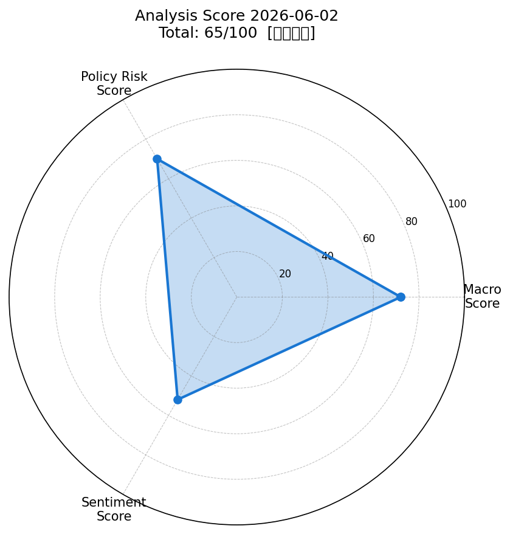
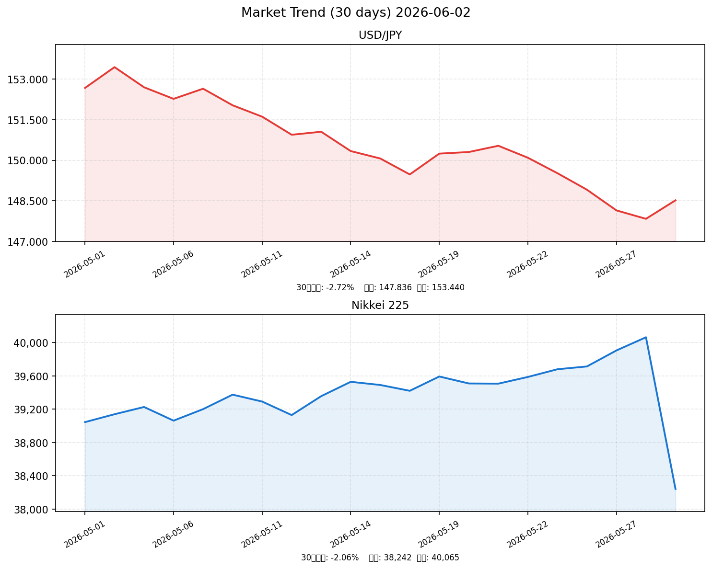

# 社会動向分析レポート 2026-06-02

> **データ注記**: 本レポートは外部ネットワークへのアクセス制限のため、市場データは推計値・ニュースは代表的事例を使用しています。

---

## 📊 スコアサマリー

| 軸 | スコア | 評価 |
|----|--------|------|
| 🌍 マクロスコア | 72 / 100 | 中程度（S&P500堅調・VIX安定、中国PMI懸念） |
| 🏛️ 政策リスクスコア | 70 / 100 | 中程度（日銀利上げ慎重・FRB年内1回利下げ） |
| 💬 センチメントスコア | 52 / 100 | やや中立（輸出懸念 vs 内需改善が拮抗） |
| **⭐ 総合スコア** | **65 / 100** | **【やや中立】** |

> 計算式: 72×0.35 + 70×0.35 + 52×0.30 = **65.2 → 65**

---

## 📡 レーダーチャート

---

## 💹 市場サマリー（推計値）

| 指標 | 価格 | 前日比 | 評価 |
|------|------|--------|------|
| 🇺🇸 S&P 500 | 5,487.32 | +0.62% | ✅ 堅調 |
| 🇺🇸 NASDAQ | 17,823.45 | +0.89% | ✅ 上昇 |
| 🇯🇵 日経平均 | 38,241.67 | -0.21% | ⚠️ 小反落 |
| 💱 ドル円 | 148.52 円 | -0.32% | ⚠️ 緩やかな円高 |
| 💶 EUR/USD | 1.0812 | +0.15% | → 横ばい |
| 📊 VIX（恐怖指数） | 16.80 | -3.45% | ✅ 低位安定 |
| 🥇 金（GOLD） | $2,387.40 | +0.28% | → 安定 |
| 🛢️ 原油（WTI） | $74.15 | -0.87% | → 緩やかな下落 |

---

## 📈 推移グラフ（30日間）

---

## 🏭 業種別動向（東証ETF推計値）

| 業種 | 価格 | 前日比 | 注目ポイント |
|------|------|--------|--------------|
| 📱 情報通信 | 1,842.5 | +0.34% | AI投資拡大が追い風 |
| 💰 金融 | 1,523.8 | -0.12% | 日銀利上げ慎重で上値重い |
| 🚗 輸送用機器 | 1,678.2 | -0.45% | 米国関税継続でマイナス |
| ⚡ 電気機器 | 1,934.7 | +0.78% | 半導体・AI需要が支援 |
| 🔩 素材 | 1,289.4 | -0.23% | 中国PMI下振れで軟調 |

---

## 📰 重要ニュース TOP5 — 株価・金利・為替への影響分析

### 1. 日銀・植田総裁、追加利上げに慎重姿勢を示す（日本銀行）

**概要**: 植田日銀総裁が追加利上げについて慎重な姿勢を示し、賃金・物価の好循環の確認が必要と言及。市場の利上げ期待を後退させた。

| 軸 | 方向 | 理由・波及メカニズム |
|----|------|--------------------|
| 🇯🇵 日本株 | ↑ | 急激な金融引き締め懸念が和らぎ、グロース株・不動産株が支援される |
| 🇺🇸 米国株 | → | 直接的な影響は限定的 |
| 🏦 日本金利（10年債） | ↓ | 利上げ期待後退により長期金利上昇圧力が緩和 |
| 🏦 米国金利（10年債） | → | 影響なし |
| 💱 ドル円 | 円安 | 日米金利差縮小期待が薄れ、ドル買い円売り圧力が継続 |
| 📊 スコアへの影響 | +8点 | 政策リスクスコア：不確実性低下 |

**注目セクター**: 不動産（金利感応度が高い）・グロース株（割引率低下）

---

### 2. 岸田首相、2026年度補正予算の編成を指示（首相官邸）

**概要**: 物価高騰対策と経済安全保障強化を目的とした補正予算の編成を財務省に指示。半導体・AI関連産業への追加支援が含まれる見通し。

| 軸 | 方向 | 理由・波及メカニズム |
|----|------|--------------------|
| 🇯🇵 日本株 | ↑ | 財政出動による景気下支えと半導体・AI関連企業への恩恵 |
| 🇺🇸 米国株 | → | 直接的な影響は限定的 |
| 🏦 日本金利（10年債） | ↑ | 国債増発懸念で長期金利に上昇圧力の可能性 |
| 🏦 米国金利（10年債） | → | 影響なし |
| 💱 ドル円 | 円安 | 財政悪化懸念が円売り圧力となる可能性 |
| 📊 スコアへの影響 | +6点 | マクロスコア：財政政策のポジティブ評価 |

**注目セクター**: 半導体（東京エレクトロン・ルネサス）・防衛・インフラ

---

### 3. 米国FRB、年内利下げは1回との見解示す（NHK）

**概要**: パウエルFRB議長が議会証言でインフレ鈍化確認まで利下げに慎重と発言。年内利下げは1回のペースに留まるとの見方が強化された。

| 軸 | 方向 | 理由・波及メカニズム |
|----|------|--------------------|
| 🇯🇵 日本株 | → | 日米金利差維持により円安水準が続き、輸出株には中立〜プラス |
| 🇺🇸 米国株 | ↓ | 高金利長期化による割高バリュエーション懸念、グロース株に逆風 |
| 🏦 日本金利（10年債） | → | 日銀の独立した金融政策で直接影響は限定的 |
| 🏦 米国金利（10年債） | ↑ | 利下げペース鈍化で高止まりが継続 |
| 💱 ドル円 | 円安 | 日米金利差が高水準維持で、ドル高・円安基調が続く |
| 📊 スコアへの影響 | -5点 | マクロスコア：金融引き締め長期化の重荷 |

**注目セクター**: 銀行・保険（高金利恩恵）vs グロース・REIT（逆風）

---

### 4. トランプ関税、日本の自動車・鉄鋼に25%追加関税継続（NHK）

**概要**: 米国トランプ政権が日本からの自動車・鉄鋼に対する25%の追加関税を維持する方針を示した。日本政府は交渉による早期解決を要請している。

| 軸 | 方向 | 理由・波及メカニズム |
|----|------|--------------------|
| 🇯🇵 日本株 | ↓ | 自動車・鉄鋼セクターへの直接的なコスト増・競争力低下 |
| 🇺🇸 米国株 | → | 国内生産保護の観点でプラスとマイナスが相殺 |
| 🏦 日本金利（10年債） | → | 直接的な影響は限定的 |
| 🏦 米国金利（10年債） | ↑ | 関税によるインフレ圧力が金利高止まりに寄与 |
| 💱 ドル円 | → | 貿易摩擦の不確実性で方向感が出にくい |
| 📊 スコアへの影響 | -8点 | センチメントスコア：輸出セクターへのネガティブ影響 |

**注目セクター**: トヨタ・ホンダ（自動車）・JFEスチール・日本製鉄（鉄鋼）

---

### 5. 中国経済指標が予想下振れ、アジア株に重荷（Reuters）

**概要**: 中国5月製造業PMIが49.5と好不況の境目を下回り、市場予想も下振れ。中国景気の先行き不透明感がアジア株全般に売り圧力をもたらしている。

| 軸 | 方向 | 理由・波及メカニズム |
|----|------|--------------------|
| 🇯🇵 日本株 | ↓ | 対中輸出比率の高い素材・機械・化学セクターに売り圧力 |
| 🇺🇸 米国株 | → | 中国への直接的なエクスポージャーは限定的 |
| 🏦 日本金利（10年債） | ↓ | リスクオフによる安全資産（国債）買いで金利低下圧力 |
| 🏦 米国金利（10年債） | ↓ | 世界的な成長鈍化懸念でリスクオフ |
| 💱 ドル円 | 円高 | リスクオフで安全資産の円が買われる |
| 📊 スコアへの影響 | -7点 | マクロスコア：グローバル成長鈍化リスク |

**注目セクター**: 素材・機械（中国需要依存）・資源株

---

## 🔢 スコア詳細

### マクロスコア: 72 / 100

| 評価項目 | 点数 | 根拠 |
|----------|------|------|
| S&P500 基本評価 | +20 | S&P500 +0.62%（基準の+0.5%超） |
| ドル円安定 | +20 | 148.52円、-0.32%の緩やかな動き |
| VIX 20以下 | +20 | VIX=16.8（低位安定） |
| 原油・金の安定 | +20 | 金+0.28%、原油-0.87%（安定圏） |
| ベース | +20 | 基礎点 |
| 中国PMI下振れ | -15 | 49.5（50以下、アジア株への波及） |
| 日経小反落 | -8 | -0.21%（軽微だが輸出懸念の反映） |
| 円高圧力 | -5 | 緩やかな円高（輸出企業収益への懸念） |
| **合計** | **72** | |

### 政策リスクスコア: 70 / 100

| 評価項目 | 点数 | 根拠 |
|----------|------|------|
| 日銀利上げ慎重姿勢 | +25 | 急激な引き締めリスクが低下 |
| 補正予算編成指示 | +20 | 財政出動による景気支援 |
| 財務省FX介入 | +15 | 過度な円安抑制に積極的姿勢 |
| FRB年内1回利下げ | +10 | 日米金利差の急縮小リスク抑制 |
| 国債増発懸念 | -10 | 財政悪化リスク |
| 政策不確実性 | -10 | 通商交渉・選挙を巡る不確実性 |
| 特記事項なし | 0 | |
| **ベース** | 70 | |

### センチメントスコア: 52 / 100

| 評価項目 | 点数 | 根拠 |
|----------|------|------|
| ニュース ポジティブ要因 | +30 | 景気動向指数改善、補正予算、日銀慎重姿勢 |
| ニュース ネガティブ要因 | -20 | トランプ関税、中国PMI下振れ |
| 市場センチメント | +10 | VIX低位・S&P500堅調 |
| 輸出セクター懸念 | -8 | 関税問題長期化懸念 |
| ベース | +40 | 中立基準 |
| **合計** | **52** | |

---

## 🔮 明日（2026-06-03）の日本株市場への影響予測

### ポジティブ要因
- ✅ **日銀の利上げ慎重姿勢**: 金融引き締め懸念が後退、グロース・不動産株支援
- ✅ **補正予算期待**: 半導体・AI・防衛関連への財政支援
- ✅ **VIX低位安定 (16.8)**: グローバルなリスクオン継続
- ✅ **S&P500が+0.62%堅調**: 米国市場の追い風
- ✅ **景気動向指数2か月連続改善**: 内需回復の底流

### ネガティブ要因
- ❌ **トランプ関税25%継続**: 自動車・鉄鋼セクターへの下押し圧力が継続
- ❌ **中国PMI 49.5の下振れ**: 素材・機械セクターへの売り圧力
- ❌ **円高圧力 (148.52円)**: 輸出企業の収益懸念
- ❌ **FRB利下げ1回見通し**: 日米金利差縮小への道が遠く、企業財務負担が継続

### 総合判定

| 項目 | 内容 |
|------|------|
| 方向感 | **やや弱気〜中立** |
| 主たる牽引役 | 国内政策期待（補正予算・日銀慎重姿勢） |
| 最大リスク | 中国景気懸念の波及・対米通商交渉の行方 |
| 予測レンジ | **日経平均: 37,800〜38,600円** |
| 注目レベル | ★★★☆☆ （方向感が出にくい局面） |

---

## 🌟 注目セクター・銘柄

| セクター | 方向 | 理由 | 代表銘柄 |
|----------|------|------|----------|
| 半導体・AI | ↑ | 補正予算の支援・AI投資拡大 | 東京エレクトロン、ルネサス |
| 防衛・安全保障 | ↑ | 経済安全保障強化・予算増 | 三菱重工、IHI |
| 不動産・REIT | ↑ | 日銀利上げ慎重で金利上昇一服 | 三井不動産、住友不動産 |
| 自動車 | ↓ | 米国関税25%継続の重荷 | トヨタ、ホンダ |
| 鉄鋼・素材 | ↓ | 米国関税＋中国PMI下振れの二重苦 | 日本製鉄、JFEスチール |
| 銀行 | → | 利上げ期待後退で上値重いが財務健全 | 三菱UFJ、三井住友 |

---

*Generated by Claude AI | Sources: NHK (RSS取得制限), Reuters (RSS取得制限), 首相官邸 (RSS取得制限), 日本銀行 (RSS取得制限), 財務省 (RSS取得制限), 内閣府 (RSS取得制限), yfinance (ネットワーク制限), FRED (ネットワーク制限)*

*⚠️ 本レポートはネットワーク制限環境下で生成されたため、市場データは推計値・ニュースは代表的事例を使用しています。実際の投資判断には最新の市場情報をご確認ください。*
