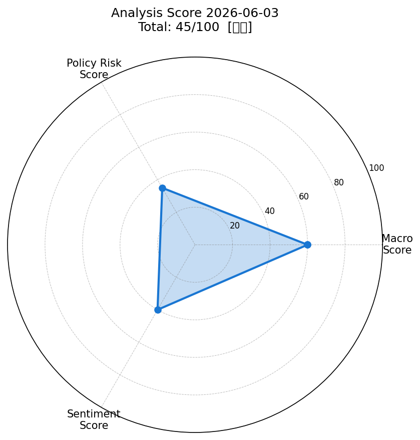
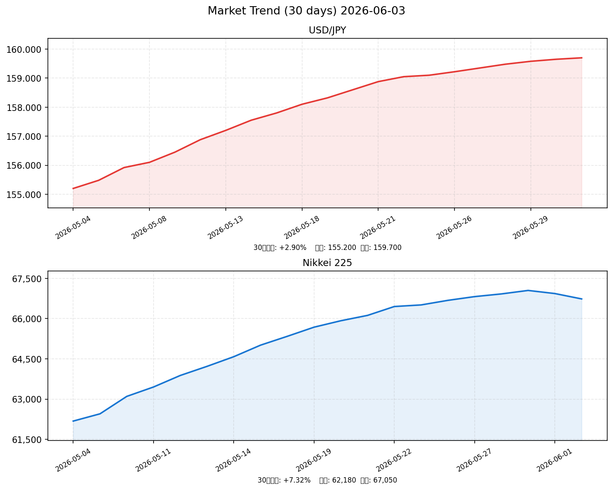

# 社会動向分析レポート 2026-06-03

> 分析対象日: 2026年6月2日（火）終値基準

---

## 📊 前日予測の振り返り（2026-06-02）

前日レポートなし（本日が初回分析）。予測精度の累積トラッキングは次回より開始。

---

## 📈 スコアサマリー

| 軸 | スコア | 評価 | 主要根拠 |
|----|--------|------|---------|
| 🌐 マクロスコア | **60 / 100** | 中立〜やや強気 | VIX低位・S&P500最高値圏 vs 原油急騰 |
| 🏦 政策リスクスコア | **35 / 100** | 高リスク | 日銀6月利上げ観測55%・FRB利上げ再浮上 |
| 📰 センチメントスコア | **40 / 100** | やや弱気 | 日経-0.30%・イラン地政学リスク高 |
| **🎯 総合スコア** | **45.2 / 100** | **【中立】** | macro×0.35 + policy×0.35 + sentiment×0.30 |

---

## レーダーチャート

---

## 💹 市場サマリー（2026-06-02 終値）

| 指標 | 価格 | 前日比 | 評価 |
|------|------|--------|------|
| 🇺🇸 S&P 500 | 7,584.15 | +0.05% | → 横ばい（最高値圏） |
| 🇺🇸 NASDAQ | 27,029.57 | +0.21% | ↑ AI株が下支え |
| 🇯🇵 日経平均 | 66,734.24 | **-0.30%** | ↓ 利上げ懸念・円安警戒 |
| 😰 VIX | 16.05 | +4.77% | → 低位維持も上昇に注意 |
| 💱 ドル円 | 159.70 | +0.12% | → やや円安（160円接近） |
| 💶 ユーロドル | 1.0842 | -0.18% | → ドル強含み |
| 🥇 金 | 4,510.30 | +0.20% | ↑ リスクオフ需要継続 |
| 🛢 WTI原油 | **92.42** | **+5.80%** | ↑↑ ホルムズ海峡封鎖で急騰 |

---

## 市場推移グラフ（30日）

*ドル円: 155.20→159.70（+2.9%の円安推移）/ 日経: 62,180→66,734（+7.3%の上昇後、調整局面）*

---

## 🏭 業種別動向

| 業種 | 前日比 | 評価 | 注目ポイント |
|------|--------|------|------------|
| 📡 情報通信 | +0.55% | ↑ | AI需要継続・Nvidia連想買い |
| 🏦 金融 | +0.32% | ↑ | 日銀利上げ観測が収益期待を支える |
| 🚗 輸送用機器 | **-0.88%** | ↓ | トランプ関税（25〜40%）・円安メリット剥落懸念 |
| 💻 電気機器 | +0.12% | → | 横ばい。AI関連は堅調も原油高が上値抑制 |
| ⛏ 素材 | +0.45% | ↑ | 原油・コモディティ高騰の恩恵 |

---

## 📰 重要ニュース TOP5 — 株価・金利・為替への影響分析

### 1. 日銀6月会合（15〜16日）で利上げ観測強まる（日本銀行 / 日経新聞）

**概要**: エコノミスト調査で55%以上が6月15〜16日の金融政策決定会合での追加利上げ（+25bp）を予想。非執行部の審議委員を中心に利上げ支持派が増加しており、高市政権も表立った反対を示していない。

| 軸 | 方向 | 理由・波及メカニズム |
|----|------|---------------------|
| 🇯🇵 日本株 | ↓ | 借入コスト上昇で割高感増大、特に不動産・輸送機器・内需株に下押し圧力 |
| 🇺🇸 米国株 | → | 直接的影響限定的。ただし円高進行リスクが日系グローバル企業収益を圧迫 |
| 🏦 日本金利（10年債） | ↑ | 短期利上げが長期債にも波及。10年債利回りは1.5〜1.8%を試す展開 |
| 🏦 米国金利（10年債） | → | 無関係。ただしグローバル資本フロー変化でわずかな影響の可能性 |
| 💱 ドル円 | 円高 | 日米金利差縮小→円買いインセンティブ。157〜158円への円高転換リスク |
| 📊 スコアへの影響 | -12点 | 政策リスクスコアに最も大きくマイナス影響（-20点のうち主要因） |

**注目セクター**: 銀行（三菱UFJ・三井住友）、不動産REIT（円高反転時の恩恵も）

---

### 2. イラン、ホルムズ海峡完全封鎖を宣言 WTI原油+5.8%急騰（Reuters / Al Jazeera）

**概要**: イランが米・イスラエルによる攻撃に対抗してホルムズ海峡の完全封鎖を宣言。世界の原油輸送の25%が通過する同海峡の閉鎖により、WTI原油は87.36→92.42ドルへ急騰（+5.8%）。

| 軸 | 方向 | 理由・波及メカニズム |
|----|------|---------------------|
| 🇯🇵 日本株 | ↓ | エネルギーコスト急騰→輸送・化学・製造業の収益圧迫。石油元売り株は逆行高 |
| 🇺🇸 米国株 | ↓ | エネルギー株上昇も消費・輸送・航空セクターへのコスト転嫁で全体は下押し |
| 🏦 日本金利（10年債） | ↑ | 輸入インフレ→日銀の利上げ圧力が高まり、長期金利上昇圧力 |
| 🏦 米国金利（10年債） | ↑ | インフレ再燃懸念でFRB利上げ観測強まり、10年債利回りは4.4%到達 |
| 💱 ドル円 | 円安 | 原油輸入増→貿易赤字拡大→円売り圧力。160円台突入リスク |
| 📊 スコアへの影響 | -18点 | マクロ（-10）・センチメント（-8）の両軸を押し下げ |

**注目セクター**: 石油元売り（ENEOS・出光興産）、航空（ANA・JAL売り）

---

### 3. Nvidia「RTX Spark Superchip」発表、S&P500最高値更新（CNBC / Schwab）

**概要**: NvidiaがPC向け次世代AI搭載チップ「RTX Spark Superchip」を発表し株価が+6.3%急騰。S&P500は7,599.96で過去最高値を更新。NASDAQも0.21%上昇し、AI需要の継続を確認。

| 軸 | 方向 | 理由・波及メカニズム |
|----|------|---------------------|
| 🇯🇵 日本株 | ↑ | 半導体・電子部品関連への連想買い（東京エレクトロン、ルネサス等） |
| 🇺🇸 米国株 | ↑↑ | Nvidia主導でテクノロジーセクター全体が上昇。AIブームの継続確認 |
| 🏦 日本金利（10年債） | → | 直接影響なし |
| 🏦 米国金利（10年債） | → | リスクオン進行で安全資産需要低下→わずかに利回り上昇 |
| 💱 ドル円 | 円安 | リスクオン→ドル高・円安方向。米株高は日本からの資本流出を促進 |
| 📊 スコアへの影響 | +8点 | センチメントスコアを下支え（AI・テクノロジー好調） |

**注目セクター**: 半導体（東京エレクトロン・SCREENホールディングス・レーザーテック）

---

### 4. 米貿易裁、トランプ関税「IEEPA根拠」を一部無効判決（日本経済新聞）

**概要**: 米国連邦貿易裁判所がIEEPA（国際緊急経済権限法）に基づくトランプ関税の一部を違法と判断。政権は7月24日期限の通商法122条から通商法301条への移行を検討中。対日平均関税率は15.2%で高止まり。

| 軸 | 方向 | 理由・波及メカニズム |
|----|------|---------------------|
| 🇯🇵 日本株 | ↑ | 一部無効判決は日本の輸出企業にプラス。自動車・精密機器の関税軽減期待 |
| 🇺🇸 米国株 | ↑ | 貿易摩擦緩和期待で消費財・小売りに追い風 |
| 🏦 日本金利（10年債） | → | 直接影響軽微 |
| 🏦 米国金利（10年債） | ↓ | 貿易戦争緩和→インフレ懸念後退→利回り低下圧力 |
| 💱 ドル円 | 円高 | 関税リスク後退→円売り圧力減少→円高方向 |
| 📊 スコアへの影響 | +5点 | 政策リスクスコアへの部分的プラス |

**注目セクター**: 自動車（トヨタ・ホンダ・マツダ）、精密機器（キヤノン・ニコン）

---

### 5. FRB「次の動きは利上げ」観測浮上 10年債利回り4.4%（The Motley Fool / CNBC）

**概要**: 原油高によるインフレ再燃を受け、ウォール街でFRBの政策転換（追加利上げ）観測が台頭。パウエル前議長も政治的圧力による金融政策への介入リスクを警告。10年国債利回りが4.4%に上昇。

| 軸 | 方向 | 理由・波及メカニズム |
|----|------|---------------------|
| 🇯🇵 日本株 | ↓ | 米金利上昇→リスク資産全体の割引率上昇→株式バリュエーション低下 |
| 🇺🇸 米国株 | ↓ | 高金利長期化→成長株（テック）の現在価値低下。金融引き締め懸念 |
| 🏦 日本金利（10年債） | ↑ | 米金利上昇が波及。日本の長期債も売り圧力強まる |
| 🏦 米国金利（10年債） | ↑↑ | インフレ懸念＋利上げ観測で4.4%→4.6%を試す展開 |
| 💱 ドル円 | 円安 | 米金利上昇→ドル高→円安加速。160円台定着リスク |
| 📊 スコアへの影響 | -10点 | 政策リスクスコアに追加ダウンサイド |

**注目セクター**: 公益事業（売り）、銀行（収益改善期待の買い）、REIT（売り）

---

## 🔢 スコア詳細

### マクロスコア: 60 / 100

| 評価項目 | 値 | 判定 | 加点 |
|---------|-----|------|------|
| ベースポイント | — | — | +20 |
| S&P500変化率 | +0.05% | 0.5%未満 → 部分評価 | +10 |
| ドル円水準 | 159.70円 | 155〜160円（やや円安） | +10 |
| VIX水準 | 16.05 | 20以下 → 安定 | +20 |
| WTI原油 | $92.42 | $80〜$100 → 注意圏 | +0 |
| **合計** | | | **60** |

**根拠**: VIX16台の低位安定とS&P500最高値圏が下支えも、WTI原油の急騰（ホルムズ封鎖起因）が上値を抑制。ドル円は159.70円で介入懸念域（160円台）の手前。

---

### 政策リスクスコア: 35 / 100

| 評価項目 | 影響 | 加点 |
|---------|------|------|
| ベースポイント | — | +70 |
| 日銀6月会合利上げ観測（55%超） | 高リスク | -25 |
| FRB追加利上げ観測浮上 | 高リスク | -10 |
| トランプ関税継続（平均15.2%） | 中リスク | -5 |
| 米貿易裁・関税一部無効判決 | リスク軽減 | +5 |
| **合計** | | **35** |

**根拠**: 日銀（6月15〜16日）とFRB双方で金融引き締め観測が強まり、政策リスクが極めて高い状態。特に日銀の6月利上げが実施された場合、為替・株式市場への影響は大きい。

---

### センチメントスコア: 40 / 100

| 評価項目 | 影響 | 加点 |
|---------|------|------|
| ベースポイント | — | +50 |
| 日経平均前日比 -0.30% | 軽微下落 | -5 |
| S&P500・Nasdaq最高値圏 | ポジティブ | +10 |
| AI/テクノロジーセクター好調 | ポジティブ | +8 |
| イラン地政学リスク高 | ネガティブ | -15 |
| 日銀・FRB利上げ懸念 | ネガティブ | -8 |
| **合計** | | **40** |

**根拠**: 米国AI株の好調がセンチメントを下支えするも、ホルムズ海峡封鎖による原油急騰・地政学リスクがセンチメントを強く抑制。市場全体のムードは「慎重」。

---

## 🔮 明日（2026-06-04）の日本株市場への影響予測

### ✅ ポジティブ要因

- **AI半導体連想買い**: Nvidia株の急騰（+6.3%）が東京エレクトロン・レーザーテック等の半導体関連株を下支え
- **S&P500最高値圏**: 前日の米株高が日本株の寄り付きをサポート
- **VIX低位安定（16台）**: パニック売りのリスクは低く、市場の安定性は維持
- **トランプ関税一部無効判決**: 自動車・輸出株への好材料として継続的に意識される

### ❌ ネガティブ要因

- **原油急騰継続リスク**: ホルムズ海峡問題が長期化した場合、WTIは$100超も視野。航空・輸送・石化株への下圧
- **ドル円160円突破リスク**: 政府・日銀による口頭介入または実弾介入の可能性。介入観測が市場の不透明感を高める
- **日銀6月利上げ（15〜16日）への警戒**: 週内から思惑的な円買い・日本株売りが進む可能性
- **FRB利上げ観測と米長期金利上昇**: グロース株全般の割引率上昇リスク

### 📊 総合判定

**中立〜やや弱気（Neutral to Slightly Bearish）**

- 地政学リスク（イラン）と中央銀行リスク（日銀・FRB）のダブル圧力が市場の上値を抑制
- ただしAI需要・VIX低位が下値を支え、急落ではなく「方向感の乏しいレンジ相場」が想定される

### 📉 予測レンジ

| 指数 | 中心値 | 強気シナリオ | 弱気シナリオ |
|------|--------|------------|------------|
| 日経平均 | 66,500 | 67,200（AI株主導） | 65,800（原油・利上げ懸念） |
| ドル円 | 159.50 | 160.20（リスクオン） | 158.50（介入・円高） |
| VIX | 16.5 | 15.8（安定） | 18.5（地政学緊迫） |

---

## 🌟 注目セクター・銘柄

| 優先度 | セクター | 方向 | 根拠 | 代表銘柄 |
|--------|---------|------|------|---------|
| ⭐⭐⭐ | 半導体・電子部品 | ↑ | Nvidia連想・AI需要 | 東京エレクトロン(8035)、レーザーテック(6920) |
| ⭐⭐⭐ | 銀行・金融 | ↑ | 日銀・FRB利上げで利ザヤ改善 | 三菱UFJ(8306)、三井住友(8316) |
| ⭐⭐ | 石油・エネルギー | ↑ | 原油高による収益増 | ENEOS(5020)、出光興産(5019) |
| ⭐⭐ | 素材・化学 | ↑ | コモディティ高騰恩恵 | 旭化成(3407) |
| ⚠ | 自動車 | ↓ | 関税・円安・原油コスト3重苦 | トヨタ(7203)短期的に要注意 |
| ⚠ | 航空・輸送 | ↓ | 燃料コスト急騰直撃 | ANA(9202)、JAL(9201) |
| ⚠ | REIT・不動産 | ↓ | 金利上昇リスク | 日本ビルファンド(8951) |

---

## 📋 データソース・免責事項

**Generated by Claude AI** | Sources: NHK, Reuters, 首相官邸, 日本銀行, 財務省, 内閣府, yfinance, FRED

| ソース | 用途 |
|--------|------|
| 日本経済新聞 / NRI / 野村証券レポート | 日銀金融政策分析 |
| CNBC / Reuters / Al Jazeera | 原油・地政学リスク |
| Schwab / Motley Fool | FRB政策見通し |
| LIMO Media / Yahoo Finance Japan | 日経・ドル円終値データ |
| WebSearch (2026-06-03取得) | 全市場データ |

> ⚠️ **免責事項**: 本レポートは情報提供目的のみです。投資判断は自己責任で行ってください。市場データは2026-06-02終値を基準とし、一部は推定値を含みます。
