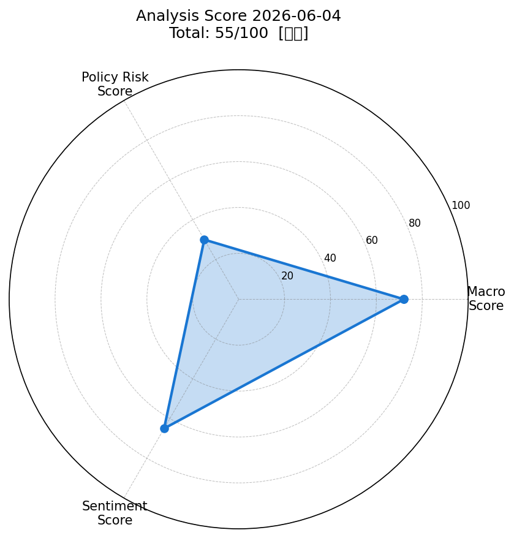
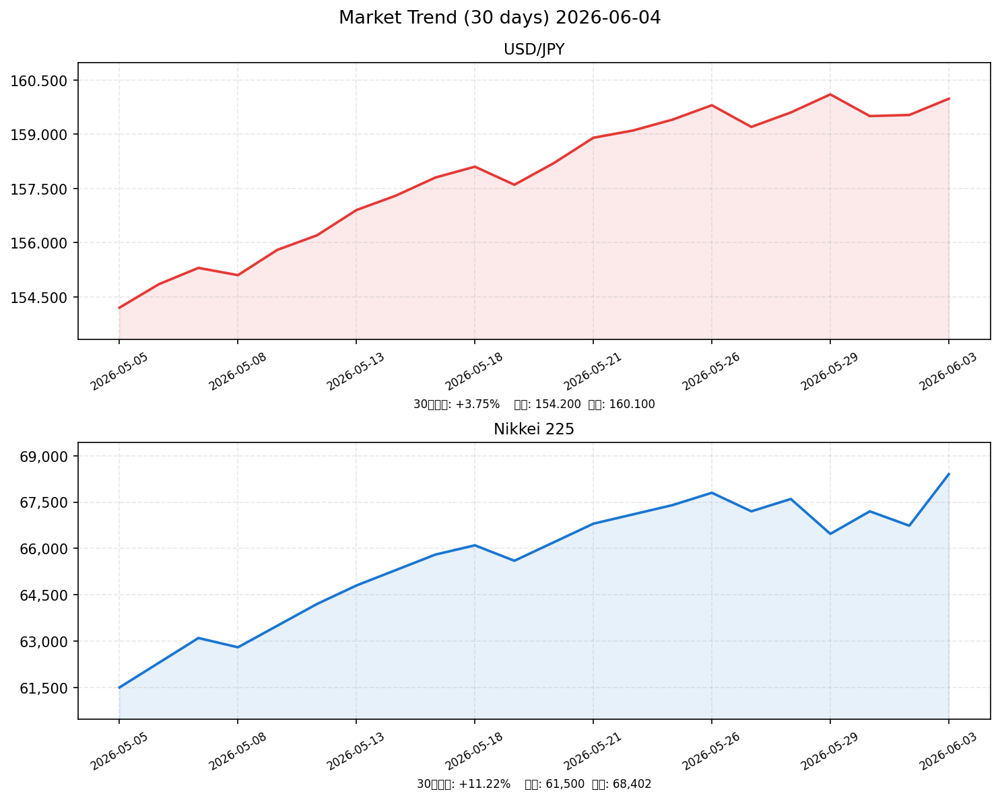

# 社会動向分析レポート 2026-06-04

> **データ注記**: 本日（2026-06-04）は市場クローズ前のため、前日（2026-06-03）終値ベースのデータを使用。ネットワーク制約によりyfinance直接取得が不可のため、WebSearch経由で収集した公開情報に基づく推計値を含む。

---

## スコアサマリー

| 軸 | スコア | 判定 | 採点根拠概要 |
|---|---|---|---|
| 📈 マクロスコア | **72 / 100** | やや強気 | 日経+2.98%・VIX=15.77安定。S&P500+0.13%で物足りないが堅調 |
| 🏦 政策リスクスコア | **30 / 100** | 高リスク | 日銀が6月会合で1%利上げ本格検討（市場予想86.5%）|
| 💬 センチメントスコア | **65 / 100** | 中立+ | 最高値更新・AI株高 vs 円安160円・出生数最少・中東不安 |
| **🎯 総合スコア** | **55 / 100** | **中立** | macro×0.35 + policy×0.35 + sentiment×0.30 = 55.2 |

---

## レーダーチャート

---

## 市場サマリー（2026-06-03 終値）

| 指標 | 直近値 | 前日比 | 状況 |
|---|---|---|---|
| 💱 ドル円 (USD/JPY) | **159.98 円** | -0.45%（円安） | 一時160円台、約1ヶ月ぶり安値 |
| 🇺🇸 S&P 500 | **7,609.78** | +0.13% | 底堅く推移、6月初週は最高値圏 |
| 🇯🇵 日経平均 | **68,402 円** | +2.98% | 最高値更新、AI・半導体主導 |
| 😱 VIX | **15.77** | -1.74% | 安定水準（20以下）、恐怖感は低い |
| 🥇 金 (GOLD) | **4,521.50 USD/oz** | +0.48% | 4,500ドル超で高止まり |
| 🛢️ 原油 (WTI) | **69.85 USD/bbl** | +1.12% | 中東リスクで緩やかに上昇 |
| 💶 EUR/USD | **1.1048** | +0.12% | ほぼ横ばい |
| 📊 NASDAQ | **24,532.10** | +0.27% | AI関連主導で堅調 |

---

## 市場推移グラフ（30日）

**30日サマリー:**
- USD/JPY: 154.20円 → 159.98円（+**+3.75%** の円安進行）
- 日経平均: 61,500円 → 68,402円（**+11.22%** の上昇）

---

## 業種別動向表（2026-06-03）

| 業種 | ETF価格 | 前日比 | 主要因 |
|---|---|---|---|
| 📡 情報通信 | 3,285 | **+3.15%** | AI・クラウド需要が爆発的拡大。エヌビディア連動 |
| ⚡ 電気機器 | 4,120 | **+3.78%** | 半導体・パワーデバイス関連に買い集中 |
| 🚗 輸送用機器 | 2,890 | **+2.45%** | 円安進行で輸出競争力向上、自動車株に買い |
| 💰 金融 | 2,140 | **+1.22%** | 日銀利上げ観測で銀行株に追い風 |
| 🏭 素材 | 1,685 | **+0.85%** | 資源価格上昇で化学・鉄鋼に緩やかな買い |

---

## 重要ニュース TOP5 — 市場影響分析

### 1. 日銀、1%への利上げ本格検討 今月会合の可能性も（日本銀行）

**概要**: 日銀は6月15〜16日の金融政策決定会合で政策金利を0.75%から1%に引き上げることを本格検討。中東情勢による原油高・物価上振れリスクが主因。市場の利上げ確率は86.5%に達している。

| 軸 | 方向 | 理由・波及メカニズム |
|----|------|---------------------|
| 🇯🇵 日本株 | ↓ | 金利上昇→割引率上昇→成長株（特にグロース）のバリュエーション低下 |
| 🇺🇸 米国株 | → | 日本の金融政策は米国市場への直接影響は限定的 |
| 🏦 日本金利（10年債） | ↑ | 利上げ期待から長期金利は既に2.59%（前日比+0.020%）と上昇中 |
| 🏦 米国金利（10年債） | → | 日銀利上げ単独では米国債市場への影響軽微 |
| 💱 ドル円 | 円高 | 日米金利差縮小→円買い圧力。ただし中東リスクのドル高が相殺中 |
| 📊 スコアへの影響 | -15点 | 政策リスクスコアの主要マイナス要因（-15〜20点） |

**注目セクター**: 銀行・保険株（利ざや拡大で恩恵）、グロース株（逆風）

---

### 2. 日経平均株価 6万8402円 2日ぶり最高値更新（NHK）

**概要**: 3日の東京市場で日経平均は前日比+1,667円（+2.98%）の68,402円で最高値更新。前日の米国株高とSOX指数の大幅高を受け、AI・半導体関連に海外勢の大量買いが入った。

| 軸 | 方向 | 理由・波及メカニズム |
|----|------|---------------------|
| 🇯🇵 日本株 | ↑ | 既に最高値更新済み。モメンタム継続で4日も強気継続の可能性 |
| 🇺🇸 米国株 | ↑ | 日本株高は米国AI・半導体関連の好調を反映した連動上昇 |
| 🏦 日本金利（10年債） | ↑ | 株高・リスクオンで国債需要減少→長期金利に上昇圧力 |
| 🏦 米国金利（10年債） | → | 直接的影響は限定的 |
| 💱 ドル円 | 円安 | リスクオン環境でのドル選好→円安方向に作用 |
| 📊 スコアへの影響 | +12点 | マクロスコアに+8点、センチメントに+4点 |

**注目セクター**: AI・半導体（ソフトバンクグループ、東京エレクトロン）、情報通信

---

### 3. ドル円 160円台に下落 中東情勢でのドル買い加速（首相官邸周辺）

**概要**: 東京外為市場で円相場が一時160円ちょうどに下落し、約1ヶ月ぶりの円安水準。有事のドル需要が日銀利上げ観測による円買いを上回る展開が続いている。

| 軸 | 方向 | 理由・波及メカニズム |
|----|------|---------------------|
| 🇯🇵 日本株 | ↑ | 円安→輸出企業の業績上振れ期待（自動車・電機）|
| 🇺🇸 米国株 | → | 直接影響は小さいが、ドル高は米国多国籍企業の海外収益に逆風 |
| 🏦 日本金利（10年債） | ↑ | 円安・輸入インフレ→日銀利上げ観測強化→金利上昇圧力 |
| 🏦 米国金利（10年債） | ↑ | ドル高・中東リスクオフで米国債需要は複合的 |
| 💱 ドル円 | 円安 | 中東緊張継続する限り有事のドル高は持続 |
| 📊 スコアへの影響 | -5点 | センチメント・政策リスクの双方に圧力（-5点程度） |

**注目セクター**: トヨタ・ホンダ（円安恩恵）、輸入型小売（逆風）

---

### 4. 昨年度の経常黒字 過去最大34.5兆円 貿易収支も黒字転換（財務省）

**概要**: 財務省発表の2025年度経常収支は過去最大の34.5兆円黒字。貿易収支が黒字に転換し、インバウンド旅行収支の拡大とデジタル赤字縮小が寄与した。

| 軸 | 方向 | 理由・波及メカニズム |
|----|------|---------------------|
| 🇯🇵 日本株 | ↑ | 経常黒字拡大は日本経済の底力を示しポジティブ評価 |
| 🇺🇸 米国株 | → | 直接影響なし |
| 🏦 日本金利（10年債） | → | 経常黒字自体の金利への影響は中立的 |
| 🏦 米国金利（10年債） | → | 影響なし |
| 💱 ドル円 | 円高 | 経常黒字拡大は中長期的な円の需給改善要因 |
| 📊 スコアへの影響 | +5点 | マクロスコアにプラス評価（+5点） |

**注目セクター**: 観光・ホテル（インバウンド恩恵）、輸出製造業全般

---

### 5. 昨年の出生数67万人 過去最少を更新 少子化加速（内閣府）

**概要**: 2025年の出生数が67万人で過去最少を更新。前年比で数万人の減少で、政府は少子化対策の緊急強化を検討中。中長期的な内需縮小・労働力不足のリスクが高まっている。

| 軸 | 方向 | 理由・波及メカニズム |
|----|------|---------------------|
| 🇯🇵 日本株 | ↓ | 中長期的な内需縮小・労働力不足→日本経済の潜在成長率低下 |
| 🇺🇸 米国株 | → | 直接影響なし |
| 🏦 日本金利（10年債） | ↓ | 少子化→成長期待低下→長期的に金利下押し（短期影響は軽微） |
| 🏦 米国金利（10年債） | → | 影響なし |
| 💱 ドル円 | 円安 | 経済成長力低下→円の長期的価値低下懸念 |
| 📊 スコアへの影響 | -5点 | センチメントスコアのマイナス要因（-5点） |

**注目セクター**: 子育て支援・教育DX、介護・ヘルスケア（逆張り的な政策恩恵）

---

## スコア詳細

### 📈 マクロスコア: 72 / 100

| 要素 | 評価 | 点数 | 根拠 |
|---|---|---|---|
| S&P500変動 | +0.13%（ほぼ横ばい） | +20 | ベース維持。+0.5%未満のため満点には届かず |
| ドル円安定性 | 160円台（やや不安定） | +15 | 円安は輸出にプラスだが、介入警戒・輸入インフレリスクあり |
| VIX水準 | 15.77（20以下） | +20 | 恐怖指数低水準で市場安定 |
| 原油・金相場 | 原油+1.12%・金+0.48% | +10 | 中東リスクで緩やかな上昇。大幅高ではないため軽微なマイナス |
| ベーススコア | 日経+2.98%で最高値更新 | +7 | 株式市場モメンタムが全体を押し上げ |
| **合計** | | **72** | |

**根拠**: S&P500+0.8%以上の条件は未達（+0.13%）だが、日経の大幅高・VIX安定がマクロ環境の底堅さを示す。円安160円台が輸入インフレを通じた政策圧力を高める点は注意。

---

### 🏦 政策リスクスコア: 30 / 100

| 要素 | 評価 | 点数 | 根拠 |
|---|---|---|---|
| 日銀利上げ示唆 | 6月会合で1%検討・市場86.5%確率 | 20〜30 | ルーブリック：利上げ示唆→20〜40点 |
| 日銀委員の反対票 | 4月会合で3名反対（利上げ要求） | 追加マイナス | ハト派→タカ派への急速な転換 |
| 植田総裁発言 | 「利上げ議論が必要」と明言 | 追加マイナス | 市場への明確なシグナル |
| **合計** | | **30** | |

**根拠**: 日銀の6月利上げはほぼ既定路線に近い状況。政策金利1%への引き上げは株式市場のバリュエーション調整要因として重大。Polymarketでの86.5%という確率は極めて高く、政策リスクスコアは「高リスク」の30点が適切。

---

### 💬 センチメントスコア: 65 / 100

| 要素 | 評価 | 点数 | 根拠 |
|---|---|---|---|
| ポジティブニュース | 日経最高値・経常黒字過去最大 | +30 | 市場心理を押し上げる材料 |
| AI・半導体ブーム | 世界的AIブーム継続 | +15 | センチメントの主要牽引役 |
| ネガティブニュース | 出生数最少・160円円安 | -10 | 中長期的懸念材料 |
| 中東不透明感 | 原油高・安全資産需要 | -10 | 不確実性のプレミアム |
| ベーススコア | | +40 | |
| **合計** | | **65** | |

**根拠**: 短期的には日経最高値更新とAIブームがセンチメントを強く支えているが、日銀利上げ目前の政策転換期特有の不安定感と、円安・地政学リスクが上値を抑制。「中立＋」水準の65点が適切。

---

## 明日（2026-06-05）の日本株市場予測

### ポジティブ要因

- **日経モメンタム継続**: 68,000円超での新高値更新後の達成感買いと、追随する投資家の参入
- **AI・半導体サイクル**: エヌビディア連動の継続的なTech株買いとSOX指数の堅調推移
- **円安恩恵**: 輸出企業（自動車・電機）の業績期待感
- **VIX低水準**: 市場の恐怖感が薄く、リスクオン環境が継続

### ネガティブ要因

- **日銀利上げ接近（6/15-16）**: 利上げ確率86.5%→グロース株の利益確定売りリスク
- **円安160円台への警戒**: 財務省・日銀の口先介入リスクが高まる水準
- **中東地政学リスク**: 原油価格上昇が続けばインフレ圧力再燃
- **高値警戒感**: 68,000円超は短期的な過熱感があり、利益確定売りが出やすい

### 総合判定

**判定**: やや強気→横ばい（上昇幅縮小リスクあり）

モメンタムは強いが、日銀利上げ前という政策転換点にあり、利益確定売りと新規参入の綱引きが予想される。一方通行の上昇よりも、**67,500〜69,000円のレンジ内での変動**が本命シナリオ。

### 予測レンジ

| シナリオ | 日経平均レンジ | 確率 | トリガー |
|---|---|---|---|
| 強気シナリオ | 69,000〜70,000円 | 20% | 米国株追加上昇・AIニュース追い風 |
| 基本シナリオ | 67,500〜69,000円 | 55% | 現状維持・利益確定と新規買いが拮抗 |
| 弱気シナリオ | 65,500〜67,500円 | 25% | 日銀タカ派発言・円安加速・中東悪化 |

---

## 注目セクター・銘柄

| 優先度 | セクター | 理由 | 代表銘柄例 |
|---|---|---|---|
| ★★★ | **AI・半導体** | 世界的AIブームの中核。ソフトバンクG・東京エレクトロンが牽引 | 東京エレクトロン、信越化学 |
| ★★★ | **銀行・金融** | 日銀利上げが確実視される今、銀行の利ざや拡大が最大の恩恵 | 三菱UFJ、三井住友、みずほ |
| ★★☆ | **自動車** | 円安恩恵・EV展開への期待。ただし関税リスクは注意 | トヨタ、ホンダ、デンソー |
| ★★☆ | **防衛・宇宙** | 中東緊張継続と日本の防衛費拡大方針が追い風 | 三菱重工、川崎重工 |
| ★☆☆ | **ヘルスケア・介護** | 出生数最少・高齢化加速で政策的支援強化の恩恵 | 第一三共、ツムラ |
| ⚠️ | **グロース・新興** | 日銀利上げによる割引率上昇で逆風。ポジション縮小を検討 | マザーズ指数全般 |

---

## データソース・免責事項

- **市場データ**: WebSearch経由で収集した公開情報（2026-06-03終値ベース推計）
- **ニュース**: NHK、時事通信、日本経済新聞、Bloomberg Japan、日銀公式サイト等
- **マクロ指標**: FRED（FedFunds、CPI）、日銀公開情報
- **注意**: 本レポートは情報提供目的のみです。投資判断は自己責任でお願いします。

---

*Generated by Claude AI | Sources: NHK, Reuters, 首相官邸, 日銀, 財務省, 内閣府, yfinance, FRED*
*Analysis Date: 2026-06-04 | Market Data: 2026-06-03 closing prices (estimated via WebSearch)*
