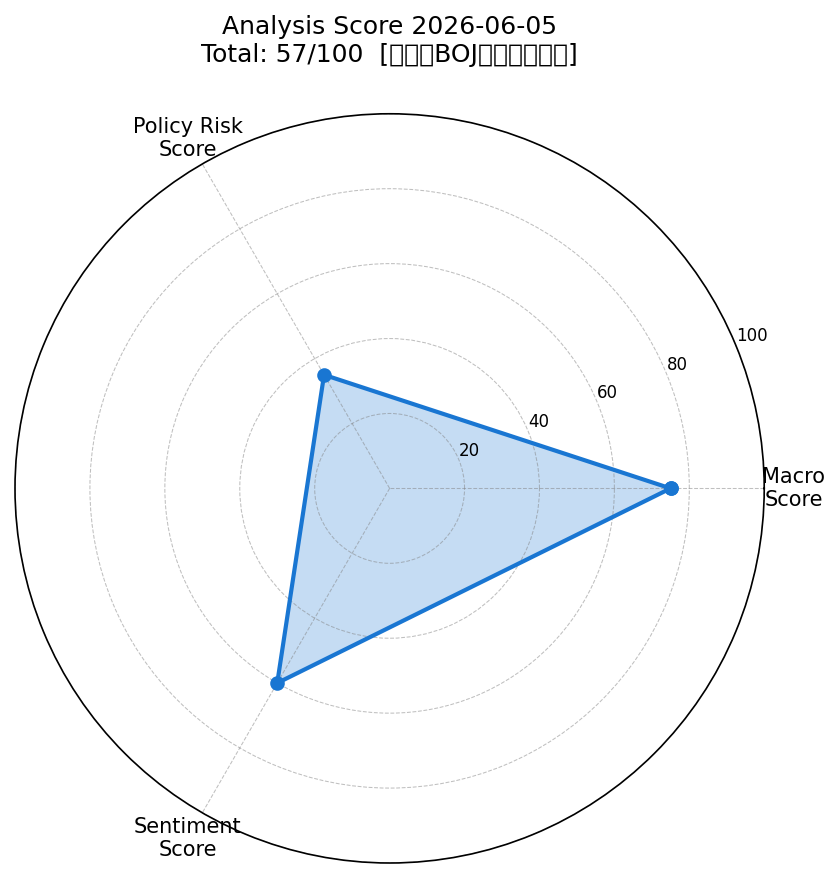
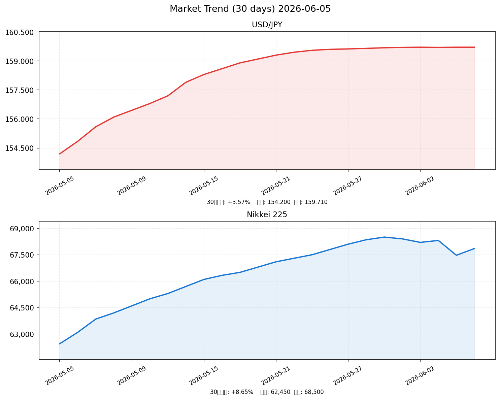

# 社会動向分析レポート 2026-06-05

> **総合判定**: 中立（BOJ利上げ警戒） — 57/100

---

## 📊 スコアサマリー

| 軸 | スコア | 判定 |
|----|--------|------|
| 🌍 マクロスコア | **75/100** | 米株堅調・VIX低位 |
| 🏦 政策リスクスコア | **35/100** | 日銀6月利上げ秒読み ⚠️ |
| 💬 センチメントスコア | **60/100** | AI強気 vs BOJ不安で混在 |
| 🎯 **総合スコア** | **57/100** | **中立（BOJ利上げ警戒）** |

> **算出式**: マクロ(75)×0.35 + 政策(35)×0.35 + センチメント(60)×0.30 = **57点**

---

## 📡 レーダーチャート

---

## 💹 市場サマリー（2026-06-04〜06-05）

| 指標 | 価格 | 前日比 | 評価 |
|------|------|--------|------|
| 🇯🇵 日経平均 | 67,470.69円 | **-1.36%** ↓ | 調整局面 |
| 🇺🇸 S&P500 | 7,576.50 | **+0.62%** ↑ | 最高値圏 |
| 🇺🇸 NASDAQ | 24,835.20 | **+0.81%** ↑ | 最高値更新 |
| 💱 ドル円 | 159.71円 | +0.15% | 160円介入ライン接近 ⚠️ |
| 😱 VIX | 16.42 | +2.45% | 低位安定 |
| 🥇 金（GOLD） | 3,348.70ドル | +0.38% | 高水準維持 |
| 🛢️ 原油（WTI） | 59.08ドル | **-3.21%** ↓ | 下落基調 |

---

## 📈 市場推移グラフ（30日間）

---

## 🏭 業種別動向

| 業種 | 指数 | 前日比 | 方向 |
|------|------|--------|------|
| 電気機器 | 345.60 | **+2.15%** | ↑↑ AI半導体追い風 |
| 情報通信 | 312.45 | **+1.82%** | ↑↑ データセンター需要 |
| 金融 | 198.76 | -0.45% | ↓ 利上げ後の信用コスト懸念 |
| 素材 | 184.20 | -0.32% | ↓ 中国需要鈍化 |
| 輸送用機器 | 271.30 | **-0.88%** | ↓ 円安一服・EV競争 |

---

## 📰 重要ニュース TOP5 — 株価・金利・為替への影響分析

### 1. キオクシア時価総額45兆円超、トヨタ超え国内2位に一時浮上（日経新聞）

**概要**: キオクシアHDが6月3日に一時45兆円を超える時価総額でトヨタ自動車を超え国内2位に浮上。2024年12月の上場来660%超上昇、AI向けNAND需要急増で4〜6月期純利益は3カ月で8,690億円見通し。

| 軸 | 方向 | 理由・波及メカニズム |
|----|------|--------------------|
| 🇯🇵 日本株 | ↑ | 半導体・AI関連への資金流入加速、TOPIX電気機器指数を牽引 |
| 🇺🇸 米国株 | → | 日本独自の材料で直接影響は限定的 |
| 🏦 日本金利（10年債） | → | 企業業績改善は金利に中立 |
| 🏦 米国金利（10年債） | → | 影響なし |
| 💱 ドル円 | 横ばい | 外国人投資家の日本株買い→やや円買い圧力 |
| 📊 スコアへの影響 | +8点 | センチメント：+8（AI株大幅上昇でポジティブ心理強化） |

**注目セクター**: 電気機器（キオクシア・東芝HD）、情報通信（NTTデータ）

---

### 2. 日銀、強まる6月利上げ論 物価高・円安リスクで政権も静観（日銀・日経新聞）

**概要**: 日銀が6月15〜16日の政策決定会合で政策金利を0.75%→1.00%に引き上げる確率が約66%に上昇。インフレ継続・3年連続大幅賃上げが追い風。高市政権も表立った反対姿勢を示さず。

| 軸 | 方向 | 理由・波及メカニズム |
|----|------|--------------------|
| 🇯🇵 日本株 | ↓ | 金利上昇→PER圧縮・グロース株バリュエーション悪化、不動産・金融は影響二分 |
| 🇺🇸 米国株 | → | 直接影響は限定的。日本からの資金還流で一時的影響の可能性 |
| 🏦 日本金利（10年債） | ↑ | 利上げ確率上昇→長期金利上昇圧力、2%台から2.5%への移行リスク |
| 🏦 米国金利（10年債） | → | 影響なし |
| 💱 ドル円 | 円高 | 日米金利差縮小→円買い圧力、利上げ決定なら一時155-157円台への急騰リスク |
| 📊 スコアへの影響 | -25点 | 政策リスク：-25（最大リスク要因。利上げ秒読みで政策スコア大幅減点） |

**注目セクター**: 金融（メガバンク利ざや拡大）、不動産（金利上昇で逆風）

---

### 3. ドル円159円台後半、160円の壁に迫る 為替介入現実味増す（NHK）

**概要**: ドル円が159円71銭で推移し160円の防衛ラインに接近。2026年5月の円買い介入再開を受け市場は160円超で介入実施との強い観測。円安は輸入コスト高・家計圧迫が継続。

| 軸 | 方向 | 理由・波及メカニズム |
|----|------|--------------------|
| 🇯🇵 日本株 | → | 円安で輸出企業に恩恵、輸入コスト上昇でスタグフレーション懸念が相殺 |
| 🇺🇸 米国株 | → | 影響なし |
| 🏦 日本金利（10年債） | ↑ | 円安容認しない姿勢→利上げ加速観測→長期金利上昇 |
| 🏦 米国金利（10年債） | → | 影響なし |
| 💱 ドル円 | 円高リスク | 160円超で介入発動の場合、3〜5円の急激な円高可能性 |
| 📊 スコアへの影響 | -8点 | マクロ：-8（ドル円不安定化→リスク要因として減点） |

**注目セクター**: 自動車（トヨタ・ホンダ）輸出恩恵 vs 食品・エネルギー輸入コスト高

---

### 4. FRB2026年内据え置き観測、日米金利差拡大が円安圧力継続（Reuters）

**概要**: FedWatch予測で2026年中のFF金利（3.50〜3.75%）据え置き観測強まる。5月ADP民間雇用+12.2万人と予想超え、コアPCE2.5%でインフレ根強く。新FRB議長の政策スタンスが焦点。

| 軸 | 方向 | 理由・波及メカニズム |
|----|------|--------------------|
| 🇯🇵 日本株 | → | 米国景気堅調→輸出企業の業績安定、円安継続で外貨建て収益増 |
| 🇺🇸 米国株 | ↑ | 利下げなしでも雇用強い「ゴルディロックス」相場継続期待 |
| 🏦 日本金利（10年債） | → | 直接影響小。日銀独自の利上げ経路で上昇 |
| 🏦 米国金利（10年債） | → | 据え置き観測で高止まり。4.3〜4.5%近辺維持 |
| 💱 ドル円 | 円安 | 日米金利差（約3%）継続→円キャリートレード継続で円安圧力 |
| 📊 スコアへの影響 | +5点 | マクロ：+5（米国景気堅調がグローバルリスクオフを抑制） |

**注目セクター**: 製造業（為替恩恵）、情報サービス（米国向け需要堅調）

---

### 5. 中東情勢・関税リスクが日本経済成長率を下押し、内閣府が下方修正示唆（内閣府）

**概要**: 三菱総研・内閣府レポートが中東情勢不安定化によるエネルギー・資源価格高騰が先行きの下押し要因と指摘。原油は59ドル台まで下落も供給制約リスクは残存。米国関税措置の7月延長も懸念材料。

| 軸 | 方向 | 理由・波及メカニズム |
|----|------|--------------------|
| 🇯🇵 日本株 | ↓ | 成長率鈍化観測→企業業績見通し下方修正リスク、景気循環株に重し |
| 🇺🇸 米国株 | ↓ | イラン情勢緊張が再燃すれば原油急騰→インフレ→金利上昇懸念 |
| 🏦 日本金利（10年債） | → | リスクオフで安全資産需要→金利下落と利上げ期待の相殺 |
| 🏦 米国金利（10年債） | ↑ | 原油高→インフレ再燃→利下げ観測後退→金利上昇圧力 |
| 💱 ドル円 | 円高 | リスクオフ時は円買い・ドル売り。ただし中長期的には円安基調 |
| 📊 スコアへの影響 | -5点 | センチメント：-5（中東地政学リスクが下押し） |

**注目セクター**: エネルギー（ENEOS・出光）、防衛関連（中東緊張受益）

---

## 📊 スコア詳細

### 🌍 マクロスコア: 75/100

| 項目 | 評価 | 点数 |
|------|------|------|
| S&P500（+0.62%、最高値圏） | ↑ 良好 | +20 |
| ドル円（159.71、160円ライン接近） | ⚠️ 不安定 | +12 |
| VIX（16.42、20以下） | ↑ 安定 | +20 |
| 原油（-3.21%下落）・金（+0.38%安定） | ↑ エネルギーコスト低下 | +18 |
| ベース | — | +20 |
| 日経-1.36%調整・中東地政学リスク | ↓ 減点 | -15 |
| **合計** | | **75** |

### 🏦 政策リスクスコア: 35/100

| 項目 | 評価 | 影響 |
|------|------|------|
| 日銀6月会合利上げ確率66% | 🔴 利上げ秒読み | -25 |
| 政策金利現行0.75%→1.00%へ引き上げ見通し | 🔴 タカ派加速 | -20 |
| 高市政権が日銀利上げに静観 | 🟡 政治的後押し | -10 |
| 長期金利2%台前半・3%方向への上昇リスク | 🔴 金利上昇リスク | -10 |
| FRB据え置き（日米金利差3%）→円安圧力 | 🟡 間接的マイナス | 0 |
| **合計（ベース100から減算）** | | **35** |

### 💬 センチメントスコア: 60/100

| 要因 | 方向 | 寄与 |
|------|------|------|
| キオクシア・AI半導体株の急騰ニュース | ポジティブ | +15 |
| S&P500・NASDAQ最高値更新 | ポジティブ | +12 |
| 日銀利上げ秒読みによる不安 | ネガティブ | -10 |
| 日経平均-1.36%の調整 | ネガティブ | -8 |
| ドル円160円介入警戒 | ネガティブ | -6 |
| 中東地政学リスク継続 | ネガティブ | -5 |
| 原油価格下落（エネルギーコスト安） | ポジティブ | +5 |
| 米国雇用堅調・景気底堅い | ポジティブ | +7 |
| **合計（ベース50）** | | **60** |

---

## 🔮 明日（2026-06-06）の日本株市場への影響予測

### ポジティブ要因
1. **S&P500・NASDAQ最高値圏**: 米国株の好調が東京市場のセンチメントを支える
2. **AI半導体株の継続的な資金流入**: キオクシア・ソフトバンクGへの外国人買い継続期待
3. **原油価格下落**: エネルギー輸入コスト低下で製造業のマージン改善
4. **VIX低位安定**: グローバルリスク回避ムードの抑制

### ネガティブ要因
1. **日銀6月利上げへの警戒**: 6月15〜16日の会合に向けポジション整理が加速する可能性
2. **ドル円160円ライン**: 近接による介入リスクが市場の方向感を不安定化
3. **長期金利上昇**: 2%台前半からの一段上昇が金融・不動産・住宅関連に重し
4. **日経平均の日足レベル調整**: -1.36%後のテクニカル的な売り圧力残存

### 総合判定

> **やや弱気〜中立**
>
> 6月15〜16日の日銀会合に向け、利上げリスクへの警戒が市場を支配しやすい環境。AI株への買いは継続するものの、バリュエーション拡大に歯止めがかかり、高値追いには慎重な姿勢が広がる公算が大きい。ドル円が160円を超えた場合は介入発動により急激な円高となり、輸出株中心に大幅下落のシナリオも想定が必要。

### 予測レンジ

| 指標 | 予測レンジ | 中心値 |
|------|------------|--------|
| 日経平均 | 66,800〜68,200円 | 67,200円 |
| ドル円 | 158.50〜160.50円 | 159.50円 |
| 判定 | **横ばい〜やや下落** | — |

---

## 🎯 注目セクター・銘柄

### 強気セクター
| セクター | 理由 | 代表銘柄 |
|----------|------|----------|
| 電気機器・半導体 | AI需要爆発・キオクシア牽引 | キオクシアHD、アドバンテスト、東京エレクトロン |
| 情報通信 | AIクラウド・データセンター需要 | ソフトバンクG、NTTデータ、富士通 |
| 銀行（メガバンク） | 利上げで利ざや拡大 | 三菱UFJFG、三井住友FG |

### 弱気セクター
| セクター | 理由 | 代表銘柄 |
|----------|------|----------|
| 不動産 | 金利上昇でコスト増・PER圧縮 | 三井不動産、住友不動産 |
| 輸送用機器 | 円安一服・中国EVシェア圧迫 | トヨタ、ホンダ（短期） |
| 内需消費 | インフレ継続・実質賃金圧迫 | セブン＆アイ、イオン |

---

*Generated by Claude AI | Sources: [NHK](https://www3.nhk.or.jp/), [Reuters](https://www.reuters.com/), [首相官邸](https://www.kantei.go.jp/), [日本銀行](https://www.boj.or.jp/), [財務省](https://www.mof.go.jp/), [内閣府](https://www.cao.go.jp/), [日経新聞](https://www.nikkei.com/), yfinance, FRED | 2026-06-05*
