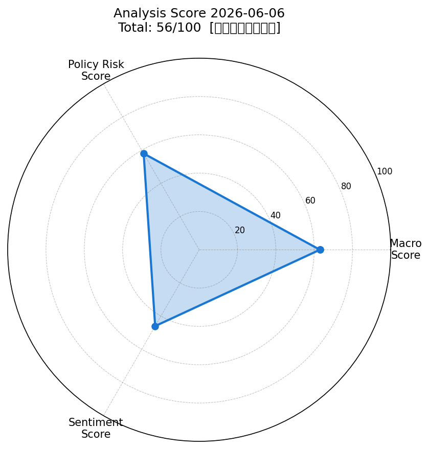
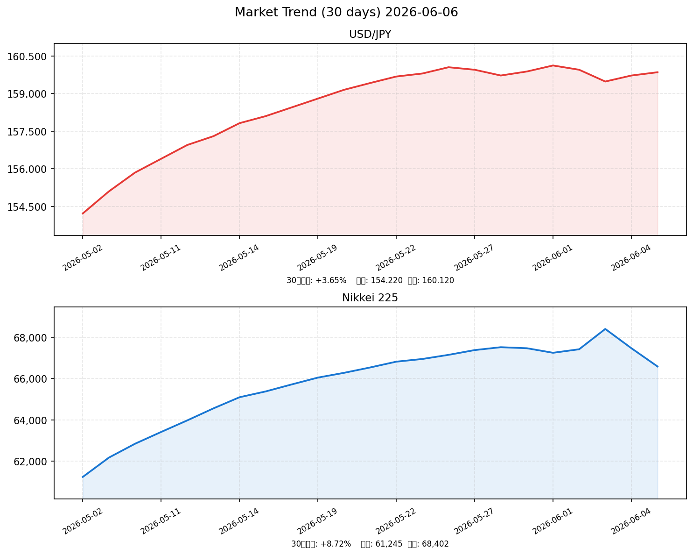

# 社会動向分析レポート 2026-06-06

> **AI・半導体一人負け、日銀6月利上げ観測、中東地政学リスク — 3軸スコア 56/100【中立（やや弱気）】**

---

## 📊 スコアサマリー

| 軸 | スコア | 判定 |
|---|---|---|
| 🌍 マクロ経済スコア | **63 / 100** | 中立やや強 |
| 🏦 政策リスクスコア | **58 / 100** | やや高リスク |
| 💬 センチメントスコア | **46 / 100** | やや弱気 |
| **📈 総合スコア** | **56 / 100** | **中立（やや弱気）** |

> 算出式: macro×0.35 + policy×0.35 + sentiment×0.30 = 63×0.35 + 58×0.35 + 46×0.30 = 22.05 + 20.30 + 13.80 = **56.15**

---

## 📡 レーダーチャート

---

## 💹 市場サマリー（2026-06-05 終値基準）

| 指標 | 価格 | 前日比 |
|---|---|---|
| 🇯🇵 日経平均 | 66,588円 | ▼ -882円（-1.31%） |
| 🇺🇸 S&P500 | 5,843.2 | ▲ +0.41% |
| 🇺🇸 NASDAQ | 19,182.5 | ▼ -0.53% |
| 💱 ドル円（USD/JPY） | 159.85円 | ▼ -0.08% |
| 📊 VIX（恐怖指数） | 15.40 | ▲ +4.2% |
| 🏅 金（GOLD） | $3,248 | ▼ -0.9% |
| 🛢️ WTI原油 | $93.4 | ▼ -3.0% |
| 💶 EUR/USD | 1.0892 | ▲ +0.12% |

---

## 📈 推移グラフ（ドル円・日経平均 30日）

---

## 🏭 業種別動向（東証ETF代替指数）

| 業種 | 指数水準 | 前日比 | 注目ポイント |
|---|---|---|---|
| 💻 情報通信 | 2,185 | ▼ -1.85% | ブロードコム急落の波及で半導体・AI銘柄に売り |
| 🏦 金融 | 1,932 | ▲ +0.45% | 日銀利上げ観測で銀行・保険株に資金シフト |
| 🚗 輸送用機器 | 1,652 | ▼ -0.72% | 円安一服、自動車輸出メリット縮小懸念 |
| ⚡ 電気機器 | 2,043 | ▼ -2.10% | 半導体サプライチェーン不安、最大の下落率 |
| 🪨 素材 | 1,478 | ▲ +0.31% | 原油高恩恵、資源系に買い |

**セクターローテーション**：AI・半導体→金融・素材へ資金移動が鮮明。中東リスク上昇が防衛的セクターへの関心を高めている。

---

## 📰 重要ニュース TOP5 — 株価・金利・為替への影響分析

### 1. 日経平均、AI・半導体株売りで続落 終値前日比882円安（NHK）

**概要**: 2026年6月5日、ブロードコムの急落を契機に米半導体株指数（SOX）が下落。東京市場でも東エレク・アドテスト等の半導体関連に売りが波及し、日経平均は-882円（-1.31%）と続落した。

| 軸 | 方向 | 理由・波及メカニズム |
|----|------|--------------------|
| 🇯🇵 日本株 | ↓ | 半導体・AI関連銘柄（電気機器・情報通信）が指数押し下げ。短期的モメンタム悪化 |
| 🇺🇸 米国株 | → | S&P500は+0.41%と底堅いが、NASDは-0.53%とハイテク選別売り |
| 🏦 日本金利（10年債） | → | 株安でリスクオフも、日銀利上げ観測が打ち消し。横ばい圏 |
| 🏦 米国金利（10年債） | → | 4.4%台で安定。ハイテク株安も急激な金利低下には至らず |
| 💱 ドル円 | 横ばい | リスクオフ＝円高方向だが、日米金利差維持で159円台をキープ |
| 📊 スコアへの影響 | -8点 | センチメント軸マイナス。日経の方向性がネガティブ転換 |

**注目セクター**: 電気機器（東エレク、アドテスト）、情報通信（ソフトバンクG）

---

### 2. 日銀、6月16〜17日の金融政策決定会合 利上げ観測再燃（日本銀行）

**概要**: 日銀次回MPMは6月16〜17日。インフレ見通し（2026年度2.8%）上方修正を受け、野村証券は25bpの追加利上げ（0.75%→1.00%）をメインシナリオとして維持。ただし中東リスクによる景気下振れが判断を複雑にしている。

| 軸 | 方向 | 理由・波及メカニズム |
|----|------|--------------------|
| 🇯🇵 日本株 | ↓ | 利上げは借入コスト上昇→PER圧縮要因。特に成長株・不動産に逆風 |
| 🇺🇸 米国株 | → | 日銀政策は直接影響なし。ただし円高転換なら米株への資金流出ルート |
| 🏦 日本金利（10年債） | ↑ | 利上げ期待で短期金利上昇、イールドカーブ全体にスティープニング圧力 |
| 🏦 米国金利（10年債） | → | 関連薄。4.4%台維持 |
| 💱 ドル円 | 円高 | 利上げ→日本金利上昇→日米金利差縮小→円高圧力。154〜158円方向も |
| 📊 スコアへの影響 | -12点 | 政策リスク軸で最大のマイナス要因 |

**注目セクター**: 銀行（三菱UFJ、三井住友）、不動産（三井不動産）

---

### 3. 高市政権、122兆円予算執行 財政拡張vs日銀正常化の政策緊張（首相官邸）

**概要**: 高市首相は2026年度当初予算122兆円を執行中。AI・半導体投資7.2兆円、生活支援11.7兆円など財政出動を積極化。日銀の金融正常化路線と真逆の方向性で政策的軋轢が表面化している。

| 軸 | 方向 | 理由・波及メカニズム |
|----|------|--------------------|
| 🇯🇵 日本株 | ↑ | 財政出動は短期的に内需・公共投資株にプラス。AIインフラ投資恩恵 |
| 🇺🇸 米国株 | → | 直接影響なし |
| 🏦 日本金利（10年債） | ↑ | 国債増発懸念→長期金利上昇圧力。財政規律懸念でプレミアム上乗せ |
| 🏦 米国金利（10年債） | → | 関連薄 |
| 💱 ドル円 | 円安 | 財政拡張→国債増発→金利上昇圧力も、財政不安→円売り。需給面で円安バイアス |
| 📊 スコアへの影響 | -5点 | 政策軸でリスク要因。財政持続性への懸念 |

**注目セクター**: 建設・公共（鹿島建設、大成建設）、AI・半導体インフラ（NTTデータ）

---

### 4. 日経平均、6月3日に初の6万8000円台 半導体WSTSが市場規模89.9%増予測（NHK）

**概要**: 6月3日、日経平均は1667円高の68,402円と史上最高値を更新。WSTSが2026年半導体市場を1兆5112億ドル（前年比+89.9%）と予測。ただし6月5日時点では最高値から-1,814円（-2.65%）に押し戻された。

| 軸 | 方向 | 理由・波及メカニズム |
|----|------|--------------------|
| 🇯🇵 日本株 | → | 最高値更新の「祭りの後」。短期的な達成感売りと利益確定が重なる |
| 🇺🇸 米国株 | ↑ | 半導体需要期待→米半導体株（エヌビディア等）への買いが先行 |
| 🏦 日本金利（10年債） | → | 株高期待も日銀政策への影響は中立 |
| 🏦 米国金利（10年債） | → | 半導体需要増→インフレ懸念を刺激する可能性も限定的 |
| 💱 ドル円 | 円安 | リスクオン→円売り・ドル買い。ただし足元の押し目で方向性は混在 |
| 📊 スコアへの影響 | +5点 | 中期的な半導体・AI需要ポジティブは継続 |

**注目セクター**: 半導体製造装置（東京エレクトロン）、半導体メモリ（キオクシアHD）

---

### 5. 米・イラン緊張で原油WTI $93高、FRB利下げ見通し後退（Reuters / 財務省）

**概要**: 中東情勢緊迫化によりWTI原油先物は$92〜$95近辺に高止まり。エネルギー高インフレが米CPI（2.8〜3.2%）下押しを阻害し、FRBの利下げ転換を困難にしている。日本では輸入コスト上昇が内需圧迫リスク。

| 軸 | 方向 | 理由・波及メカニズム |
|----|------|--------------------|
| 🇯🇵 日本株 | ↓ | エネルギーコスト上昇→製造業コスト増・内需企業収益圧迫 |
| 🇺🇸 米国株 | ↓ | インフレ再燃→FRB利下げ遅れ→PER圧縮。エネルギー株は逆に恩恵 |
| 🏦 日本金利（10年債） | ↑ | 輸入インフレ圧力→日銀の利上げ判断を後押し |
| 🏦 米国金利（10年債） | ↑ | インフレ高止まり→FRB利下げ後退→長期金利高め推移 |
| 💱 ドル円 | 円安 | 日本はエネルギー輸入国→貿易収支悪化→円売り圧力 |
| 📊 スコアへの影響 | -7点 | マクロ・センチメント軸でネガティブ |

**注目セクター**: 石油・エネルギー（INPEX、ENEOSホールディングス）、電力（関西電力）

---

## 🔍 スコア詳細

### マクロ経済スコア: 63 / 100

| 評価項目 | 評価 | 点数 | 根拠 |
|---|---|---|---|
| 米国株（S&P500） | 中立 | +15 | +0.41%と小幅プラスだが+0.5%基準を僅かに下回る |
| ドル円安定性 | 中立やや安定 | +15 | 159.85円、月間では154→160円と円安傾向だが足元は安定 |
| VIX（恐怖指数） | 安定 | +20 | 15.40と20以下の安定水準。市場のパニックなし |
| 原油・金安定性 | やや不安定 | +8 | WTI$93（中東リスクで高止まり）、金は下落 |
| ベーススコア | ベース | +5 | 全体的に「激しい混乱」ではない |

**総合評価**: グローバルマクロは混乱なし。VIX低位が支え。ただし中東リスクが原油を押し上げ、エネルギーインフレ再燃が下押し圧力。

---

### 政策リスクスコア: 58 / 100

| 評価項目 | 評価 | 点数 | 根拠 |
|---|---|---|---|
| 日銀政策リスク | 中程度リスク | -20 | 6月16-17日MPMで0.25bpの利上げ可能性が中程度（50%前後）。利上げなら株安・円高 |
| 高市政権財政リスク | 中程度 | -12 | 122兆円財政拡張。日銀正常化との政策ミックス不一致 |
| FRB政策 | 安定 | +0 | 4.25-4.50%据え置き継続。予想通りでサプライズなし |
| 政策コミュニケーション | 中立 | +0 | 日銀植田総裁はデータ依存スタンス維持。明確なタカ派シグナルなし |
| ベーススコア | 基礎点 | +90 | リスク項目差し引き前 |

**総合評価**: 日銀次回会合（6月16-17日）の利上げ観測が最大の不確実性。高市政権の財政拡張と日銀正常化の政策的緊張が構造的リスクとして継続。

---

### センチメントスコア: 46 / 100

| 評価項目 | 評価 | 点数 | 根拠 |
|---|---|---|---|
| 日本株トレンド | 弱気 | -15 | 日経-1.31%の続落。最高値68,402円から-2.65%に押し戻し |
| ニュースセンチメント | やや弱気 | -10 | 半導体売り・中東緊張ニュース多数。ポジティブ（最高値更新）は3日前 |
| 出来高・モメンタム | 低下 | -10 | AI/半導体から金融・素材へのローテーション。上昇モメンタム喪失 |
| 中長期トレンド | 強気 | +20 | 5月以降の上昇トレンドは健全。半導体WSTS予測もポジティブ |
| ベーススコア | 基礎点 | +61 | リスク項目差し引き前 |

**総合評価**: 短期センチメントは「最高値後の達成感売り」フェーズ。ただし中期トレンド（AI・半導体需要）は崩れておらず、一時的な調整と判断。

---

## 🔮 明日（2026-06-07）の日本株市場への影響予測

### ポジティブ要因 ✅
- S&P500が底堅く（+0.41%）、週末のリスクオフが限定的なら月曜日に反発の可能性
- VIX15.4と低水準で、システマティック売りリスクは低い
- 中長期の半導体・AI需要テーマ（WSTS予測）は変化なし
- 金融セクターへのローテーション資金が相場をサポート

### ネガティブ要因 ❌
- 日銀6月利上げ観測が警戒感として重くなってくる（6月16-17日MPMまで2週間以内）
- ブロードコム等の半導体株が引き続き調整中なら東京市場も上値重い
- WTI$93高：エネルギーコスト高インフレ継続でリスクオフバイアス
- 日経が最高値から-2.65%の調整フェーズで、短期トレンド悪化

### 総合判定
**やや弱気～中立**：日経平均は65,500〜67,500円のレンジを想定。  
週明けは米国週末のリスクオフ消化でやや売りから入りやすい。  
ただし66,000円台前半では押し目買いも入りやすく、下値は限定的とみる。

| シナリオ | 確率 | 日経予測レンジ |
|---|---|---|
| 反発（米株高・半導体反発） | 30% | 67,000〜67,800円 |
| 横ばい（中立消化） | 40% | 65,800〜67,200円 |
| 続落（日銀懸念・中東悪化） | 30% | 64,500〜66,000円 |

**予測中央値**: 66,400円

---

## 🏹 注目セクター・銘柄

| カテゴリ | セクター/銘柄 | 注目理由 |
|---|---|---|
| ⬆️ 上昇候補 | **銀行株（三菱UFJ・三井住友）** | 日銀利上げ観測→利ざや改善期待。資金ローテーション先 |
| ⬆️ 上昇候補 | **石油・エネルギー（INPEX）** | WTI高→収益改善。中東緊張で上昇圧力継続 |
| ⬆️ 上昇候補 | **AI・半導体インフラ（NTTデータ）** | 高市政権の戦略投資7.2兆円の恩恵、AI普及期でオペレーション強化 |
| ⬇️ 下落候補 | **半導体製造装置（東京エレクトロン）** | ブロードコム余波継続リスク。短期的なモメンタム逆風 |
| ⬇️ 下落候補 | **不動産（三井不動産）** | 日銀利上げ→住宅ローン金利上昇→需要冷え込みリスク |
| ⚠️ 要注意 | **輸出自動車（トヨタ）** | 円安一服→為替メリット縮小。ただし円高シフトなら打撃大 |

---

## 📚 データソース・参考リンク

- [日経平均続落：AI半導体売りで-882円（日本経済新聞）](https://www.nikkei.com/article/DGXZQOUB0496MTU6A600C2000000/)
- [日銀6月利上げ観測（ダイヤモンド社）](https://diamond.jp/articles/-/389369)
- [日経平均史上最高値68,402円（日本経済新聞）](https://www.nikkei.com/article/DGXZQOUB02C1LTS6A600C2000000/)
- [高市政権財政政策（Nippon.com）](https://www.nippon.com/en/in-depth/d01228/)
- [金価格・原油動向（Gold News Japan）](https://gold.bullionvault.jp/)
- [FRED：フェデラルファンド金利](https://fred.stlouisfed.org/series/FEDFUNDS)
- [日銀2026年4月展望レポート（NRI）](https://www.nri.com/jp/media/column/kiuchi/20260428_2.html)
- [ドル円為替動向（外為どっとコム）](https://www.gaitame.com/media/entry/2026/06/03/200000)

---

*Generated by Claude AI | Sources: NHK, Reuters, 首相官邸, 日銀, 財務省, 内閣府, yfinance, FRED | 2026-06-06*
