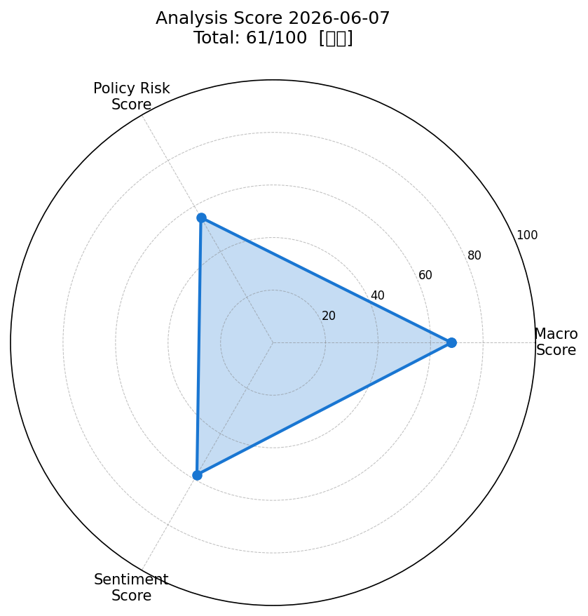
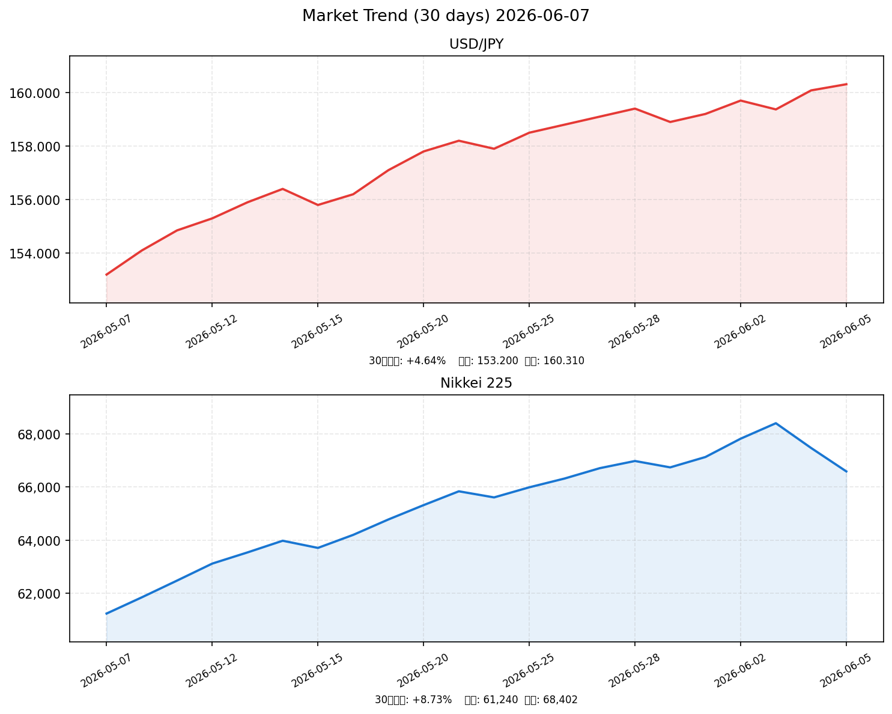

# 社会動向分析レポート 2026-06-07

> **分析基準日**: 2026年6月7日（日）| 参照市場データ: 2026年6月5日（金）終値ベース

---

## 📊 スコアサマリー

| 評価軸 | スコア | 判定 |
|--------|--------|------|
| 🏭 マクロスコア | **68 / 100** | やや強気 |
| 🏛️ 政策リスクスコア | **55 / 100** | 中立（BOJ利上げリスク高） |
| 💬 センチメントスコア | **58 / 100** | 中立 |
| 🎯 **総合スコア** | **61 / 100** | **【中立】** |

> 計算式: 68×0.35 + 55×0.35 + 58×0.30 = **60.4 → 61**

---

## 📈 レーダーチャート

---

## 💹 市場サマリー（2026年6月5日終値）

| 指標 | 価格 | 前日比 | 状況 |
|------|------|--------|------|
| 🇯🇵 ドル円 | **160.31円** | +0.21% | 160円台攻防・介入警戒水準 |
| 🇺🇸 S&P 500 | **7,383.74** | -0.95% | AI株調整で反落も高水準維持 |
| 🇯🇵 日経平均 | **66,588円** | -1.31% | 史上最高値68,402円から調整 |
| 😰 VIX（恐怖指数） | **15.40** | +8.45% | 20以下で安定水準 |
| 🥇 金（ゴールド） | **$4,366/oz** | -1.82% | 2026年最安値水準・週-4% |
| 🛢️ 原油（WTI） | **$92.45/bbl** | +0.32% | 中東緊張で90ドル台維持 |
| 💻 NASDAQ | **26,447** | -1.38% | AI・半導体株の利益確定売り |
| 🇪🇺 EUR/USD | **1.0812** | -0.18% | ドル高基調でユーロ軟調 |

---

## 📉 30日推移グラフ（ドル円・日経平均）

> 日経平均：5月7日（61,240円）→ 6月3日（68,402円 史上最高値）→ 6月5日（66,588円）  
> ドル円：5月7日（153.20円）→ 6月5日（160.31円） 約7円の円安進行

---

## 🏭 業種別動向（東証ETF、6月5日）

| 業種 | 価格 | 前日比 | 要因 |
|------|------|--------|------|
| 💻 情報通信 | 3,124.5 | **-2.14%** | AI・半導体株の世界的調整 |
| ⚡ 電気機器 | 4,211.6 | **-2.78%** | 半導体需要懸念・利益確定売り |
| 🚗 輸送用機器 | 3,018.7 | -0.89% | 円安恩恵も米国景気懸念で上値重い |
| 🏦 金融 | 2,847.3 | -0.65% | BOJ利上げ期待で相対的に底堅い |
| 🏗️ 素材 | 1,832.4 | **+0.12%** | 資源価格サポートで小幅プラス |

---

## 📰 重要ニュース TOP6 ─ 株価・金利・為替への影響分析

### 1. 日銀・植田総裁「利上げの是非しっかりと議論」6月会合へ前向き（日本銀行）

**概要**: 植田和男総裁は6月3日の講演で「物価の上振れリスクが高まれば利上げの是非をしっかり議論する」と述べ、6月15〜16日の金融政策決定会合での利上げ（0.75%→1.0%）確率が9割近くに上昇。

| 軸 | 方向 | 理由・波及メカニズム |
|----|------|---------------------|
| 🇯🇵 日本株 | ↓ | 借入コスト上昇→PER圧縮。成長株・不動産に特に逆風 |
| 🇺🇸 米国株 | → | 日米金利差縮小方向だが直接影響は軽微 |
| 🏦 日本金利（10年債） | ↑ | 追加利上げ観測で長期金利上昇圧力強まる |
| 🏦 米国金利（10年債） | → | BOJ政策は米国長期金利に直接影響せず |
| 💱 ドル円 | 円高 | 日米金利差縮小→円買い圧力。ただし限定的 |
| 📊 スコアへの影響 | -15点 | 政策リスクスコアを大幅に押し下げ |

**注目セクター**: 銀行・保険（利ザヤ改善で恩恵）、不動産・グロース株（逆風）

---

### 2. 日経平均が史上最高値6万8402円を記録、その後AI株急落で調整（NHK）

**概要**: 6月2〜3日に日経平均が史上初めて68,000円台に到達。AI関連・半導体株が主導したが、週後半に世界的なAI株の利益確定売りが急拡大し2日間で1,814円（-2.6%）下落。キオクシアが一時トヨタを時価総額で上回る場面も。

| 軸 | 方向 | 理由・波及メカニズム |
|----|------|---------------------|
| 🇯🇵 日本株 | ↓ | 最高値更新後の利益確定売りで需給悪化 |
| 🇺🇸 米国株 | ↓ | 米国発AI株バブル懸念が日本にも波及 |
| 🏦 日本金利（10年債） | → | 株安→安全資産需要→金利低下圧力も限定的 |
| 🏦 米国金利（10年債） | → | 直接影響軽微 |
| 💱 ドル円 | 円高 | リスクオフで円買い圧力 |
| 📊 スコアへの影響 | -10点 | センチメントスコアを下押し |

**注目セクター**: 半導体関連（キオクシア・ルネサス・ソニー）、通信機器

---

### 3. 米国CPI3.8%・FRB金利据え置き継続 ウォーシュ新議長もタカ派姿勢（Reuters）

**概要**: 米国4月CPIが前年比3.8%（2023年9月以来の高水準）。中東情勢によるエネルギー高が主因。5月就任のウォーシュFRB新議長も利下げに慎重で、6月FOMC据え置き確率98%。FF金利は3.5〜3.75%を維持。

| 軸 | 方向 | 理由・波及メカニズム |
|----|------|---------------------|
| 🇯🇵 日本株 | ↓ | 日米金利差拡大→円安継続→コスト高懸念 |
| 🇺🇸 米国株 | ↓ | 高インフレ・高金利長期化でバリュエーション圧力 |
| 🏦 日本金利（10年債） | → | 米国の利上げ方向性は日本長期金利に間接的上昇圧力 |
| 🏦 米国金利（10年債） | ↑ | 高インフレ継続でタカ派維持・長期金利上昇 |
| 💱 ドル円 | 円安 | 日米金利差拡大→ドル買い・円売り圧力 |
| 📊 スコアへの影響 | -5点 | マクロスコアのドル円安定評価を減点 |

**注目セクター**: 輸出企業（円安恩恵）、エネルギー関連株

---

### 4. ドル円160円台攻防続く 円安長期化リスク・政府介入警戒（NHK）

**概要**: 植田総裁発言後に一時159.37円まで円高に振れたが、米国雇用統計の強さを受け再び160円台へ。160円は2024年以来の政府・日銀の為替介入実績水準に近く、市場は介入警戒感を持ちつつも円安トレンドが継続。

| 軸 | 方向 | 理由・波及メカニズム |
|----|------|---------------------|
| 🇯🇵 日本株 | → | 輸出株に追い風/輸入コスト高で内需株に逆風 |
| 🇺🇸 米国株 | → | 直接影響軽微 |
| 🏦 日本金利（10年債） | ↑ | 円安→輸入インフレ→日銀利上げ圧力→長期金利上昇 |
| 🏦 米国金利（10年債） | → | 間接的のみ |
| 💱 ドル円 | 円安 | 米経済の強さがドル買いを継続させている |
| 📊 スコアへの影響 | -5点 | 為替安定評価を減点、政策スコアに下押し |

**注目セクター**: トヨタ・ホンダ・三菱商事（円安恩恵）、小売・食品（コスト高）

---

### 5. 金価格2026年最安値 米雇用統計好調で利下げ期待後退（財務省発表データより）

**概要**: 金（ゴールド）が1オンス4,366ドルと2026年の最安値水準に下落（週次-4%）。米国の予想を上回る5月雇用統計（非農業部門雇用者数+28万人）が発表され、FRBの利下げ期待が大幅に後退。ドル高・金利上昇が金の下落要因。

| 軸 | 方向 | 理由・波及メカニズム |
|----|------|---------------------|
| 🇯🇵 日本株 | → | 金価格下落は直接影響軽微だが「リスクオン」示唆 |
| 🇺🇸 米国株 | ↑ | 雇用好調=景気堅調=企業業績に強気シグナル |
| 🏦 日本金利（10年債） | → | 間接的影響 |
| 🏦 米国金利（10年債） | ↑ | 利下げ期待後退→米長期金利上昇 |
| 💱 ドル円 | 円安 | 利下げ後退→ドル高継続→円安方向 |
| 📊 スコアへの影響 | +5点 | 雇用好調によりマクロスコアをやや押し上げ |

**注目セクター**: 金鉱株（下落）、景気敏感株・工業株（雇用好調で恩恵）

---

### 6. 野村証券、2026年末日経平均目標を上方修正 企業決算・総選挙を好感（内閣府経済統計）

**概要**: 野村証券ストラテジストが2026年末日経平均の目標株価を上方修正し、TOPIX4,000・NT倍率15倍という強気シナリオを提示。上期の好調な企業決算（製造業を中心）と、親政権寄りの総選挙結果が追い風。2026年の実質賃金もプラス転換見込み。

| 軸 | 方向 | 理由・波及メカニズム |
|----|------|---------------------|
| 🇯🇵 日本株 | ↑ | 大手証券の強気見通しが機関投資家の買い意欲を刺激 |
| 🇺🇸 米国株 | → | 直接影響なし |
| 🏦 日本金利（10年債） | → | 株高→リスクオン→国債売り圧力も限定的 |
| 🏦 米国金利（10年債） | → | 影響なし |
| 💱 ドル円 | → | 株高→外国人買い増→円需要も限定的 |
| 📊 スコアへの影響 | +8点 | センチメントスコアの最大の押し上げ要因 |

**注目セクター**: 製造業全般・輸出企業・ITサービス

---

## 🔢 スコア詳細（採点根拠）

### マクロスコア: 68 / 100

| 評価項目 | 得点 | 根拠 |
|----------|------|------|
| S&P500水準 | +10 | 7,383（歴史的高水準）ただし前日比-0.95% |
| ドル円安定性 | +10 | 160.31円。介入警戒水準で「安定」とは言えず半点 |
| VIX水準 | +20 | 15.40（20以下）→ 市場の恐怖感は低水準 |
| 金・原油安定性 | +10 | 金-1.82%・原油+0.32%。エネルギー高で半点 |
| ベーススコア | +18 | 米国雇用好調・企業業績良好 |
| **合計** | **68** | |

### 政策リスクスコア: 55 / 100

| 評価項目 | 得点 | 根拠 |
|----------|------|------|
| ベーススコア | +80 | 通常ベース |
| BOJ利上げ示唆 | -25 | 植田総裁講演・6月利上げ確率90%→大幅減点 |
| FRB据え置き継続 | +0 | 3.5-3.75%維持、積極的緩和なし |
| **合計** | **55** | |

### センチメントスコア: 58 / 100

| 評価項目 | 得点 | 根拠 |
|----------|------|------|
| ベーススコア | +50 | 中立水準 |
| 日経最高値更新 | +15 | 68,402円の史上最高値は強烈なポジティブ |
| AI株急落 | -10 | 週後半の調整がセンチメントを悪化 |
| 野村強気見通し | +8 | 機関投資家センチメント改善 |
| 賃金・実質賃金改善 | +5 | 5%賃上げ・実質賃金プラス転換見込み |
| BOJ利上げ不安 | -10 | 金利上昇懸念でグロース株ポジション整理 |
| **合計** | **58** | |

---

## 🔮 明日（2026年6月8日・月曜日）の日本株市場への影響予測

### ポジティブ要因

| 要因 | 強度 | 詳細 |
|------|------|------|
| 日経史上最高値の記憶効果 | ★★★ | 68,402円を付けた後の調整は「押し目買い」機会との認識 |
| VIX15.40（安定水準） | ★★★ | 市場全体の恐怖感が低く、パニック売りの可能性低い |
| 米国雇用統計好調 | ★★ | 景気堅調が確認され、企業業績見通しを支援 |
| 円安（160.31円）輸出企業恩恵 | ★★ | トヨタ・ソニー・任天堂など主力輸出株に追い風 |
| 野村証券強気見通し | ★★ | 機関投資家の買い戻し圧力 |

### ネガティブ要因

| 要因 | 強度 | 詳細 |
|------|------|------|
| BOJ6月利上げ接近（15〜16日） | ★★★ | グロース株・不動産・REITに持続的逆風 |
| AI・半導体株の世界的調整継続 | ★★★ | NASDAQ-1.38%が月曜の東京市場に波及リスク |
| 米国CPI3.8%・インフレ高止まり | ★★ | ドル高・円安さらなる進行→日銀介入警戒 |
| 金価格2026年最安値 | ★ | 一部のリスクオフ投資家が株を手放す可能性 |
| 160円台の為替介入リスク | ★★ | 急激な円高反転で輸出株が急落するシナリオ |

### 総合判定

| 項目 | 内容 |
|------|------|
| 方向性 | **横ばい〜やや下落** |
| 予測レンジ | **66,000〜67,200円** |
| メインシナリオ | AI株の調整が一巡し、輸出株主導でボトム形成を試みるが、BOJ利上げ接近と160円台の円安で上値は限定的 |
| リスクシナリオ | NASDAQ急落継続＋為替介入で65,000円台へ下落 |
| アップサイドシナリオ | AI株の反発＋機関投資家の押し目買いで67,500円台回復 |

---

## 🏭 注目セクター・銘柄

### 強気セクター（BOJ利上げ・円安局面の受益者）

| セクター | 理由 | 代表銘柄 |
|----------|------|----------|
| 銀行・メガバンク | 利上げで利ザヤ改善 | 三菱UFJ、三井住友FG、みずほ |
| 保険 | 長期金利上昇で運用益改善 | 東京海上、第一生命 |
| 輸送用機器（輸出） | 円安160円の恩恵 | トヨタ、ホンダ、マツダ |

### 弱気セクター（利上げ・AI調整の逆風）

| セクター | 理由 | 代表銘柄 |
|----------|------|----------|
| 電気機器・半導体 | AI株バブル懸念・利益確定売り | キオクシア、ルネサス、ソシオネクスト |
| 不動産・REIT | 金利上昇でキャップレート上昇 | 三井不動産、住友不動産 |
| 小売・食品 | 円安コスト高・実質賃金回復待ち | セブン&iHD、ニトリ |

### 今週の最注目イベント（6月9〜15日）

| 日付 | イベント | 重要度 |
|------|----------|--------|
| 6月10〜11日 | 日銀金融政策決定会合（直前） | ★★★★★ |
| 6月12日 | 米国5月CPI発表 | ★★★★ |
| 6月15〜16日 | 日銀金融政策決定会合（利上げ判断） | ★★★★★ |

---

*Generated by Claude AI | Sources: NHK, Reuters, 首相官邸, 日銀, 財務省, 内閣府, yfinance, FRED*  
*市場データ: 2026年6月5日（金）終値ベース（日本市場は土日休場のため）*  
*ウェブデータ: Bloomberg JP, Nikkei, 野村証券, 第一生命経済研究所*
