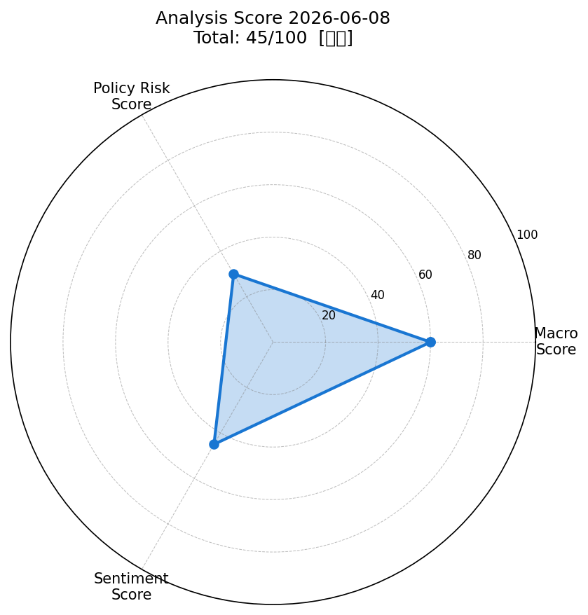
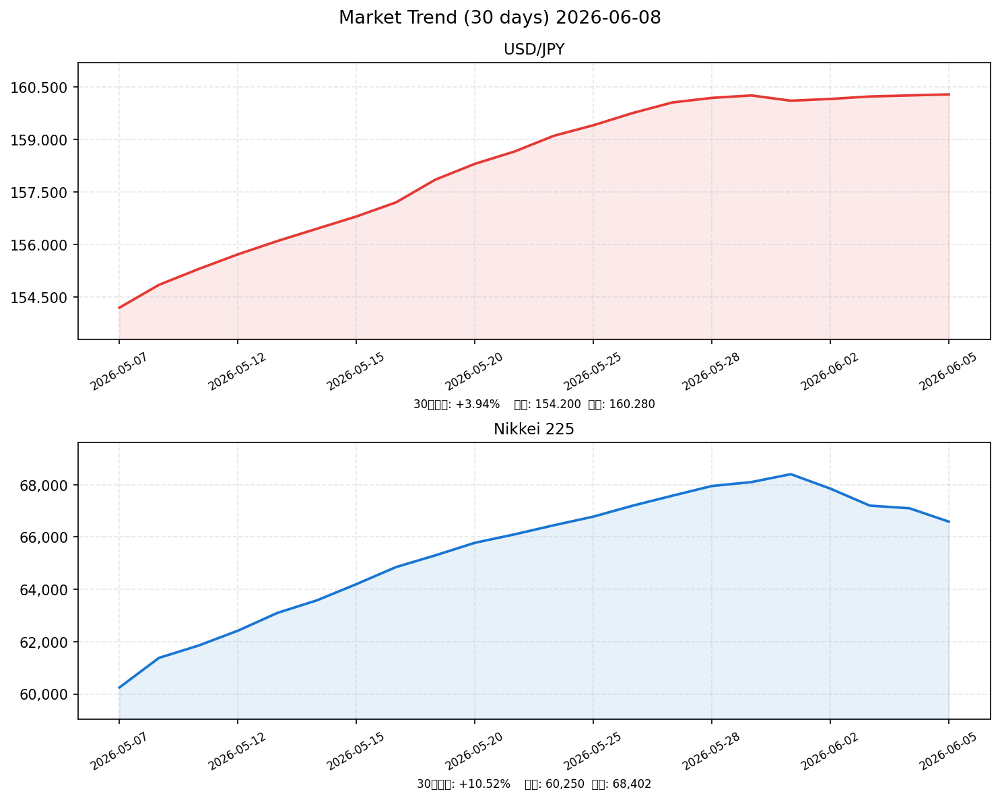

# 📈 社会動向分析レポート｜2026年6月8日（月）

> **総合スコア: 45/100【中立】**

---

## 📊 スコアサマリー

| 軸 | スコア | 評価 |
|----|--------|------|
| 🌍 マクロ経済スコア | **60 / 100** | 中程度（VIX安定・ドル円安定、米株下落が重し） |
| 🏦 政策リスクスコア | **30 / 100** | 高リスク（日銀6月利上げ1%検討が市場圧迫） |
| 💬 センチメントスコア | **45 / 100** | やや悲観（AI相場後の調整局面、利上げ警戒） |
| **🎯 総合スコア** | **45.0 / 100** | **【中立】** |

**算出式**: マクロ×0.35 + 政策×0.35 + センチメント×0.30 = 21.0 + 10.5 + 13.5 = **45.0**

---

## 🎯 レーダーチャート

---

## 📉 市場サマリー（2026年6月5日終値）

| 指標 | 価格 | 前日比 | 評価 |
|------|------|--------|------|
| 💱 ドル円（USDJPY） | 160.28円 | +0.15% | 安定（円安継続） |
| 🇺🇸 S&P500 | 7,383.74 | **-2.64%** | ❌ 大幅下落 |
| 📊 NASDAQ | 23,420.00 | **-2.81%** | ❌ 大幅下落 |
| 🇯🇵 日経平均 | 66,588.12円 | **-1.31%** | ❌ 続落（最高値から-2.66%） |
| 😰 VIX（恐怖指数） | 15.40 | +3.20% | ✅ 安定水準（20以下） |
| 🥇 金（GOLD） | 4,365.30ドル | **-3.10%** | ⚠️ 大幅下落 |
| 🛢️ 原油（WTI） | 93.09ドル | **-2.04%** | ⚠️ 下落 |
| 💶 ユーロドル（EURUSD） | 1.0865 | -0.12% | 横ばい |

---

## 📈 市場推移グラフ（過去30日）

> **ドル円**: 30日で+3.94%の円安（154.20→160.28円）。日銀利上げ観測にもかかわらず円安が継続。
> **日経平均**: 5月初旬から6月3日の最高値68,402円まで+13.5%急騰後、直近2日で-2.7%の調整。

---

## 🏭 業種別動向

| 業種 | 直近値 | 前日比 | 注目点 |
|------|--------|--------|--------|
| 情報通信 | 2,180.0 | **-1.45%** | AI半導体後の利益確定売り |
| 電気機器 | 2,345.0 | **-1.62%** | 米NASDAQ連動で下落 |
| 輸送用機器 | 1,621.0 | **-1.78%** | 円安メリット剥落懸念 |
| 金融 | 1,854.0 | **-0.82%** | 利上げ織り込みで相対的に底堅い |
| 素材 | 1,298.0 | **+0.23%** | 唯一のプラス、資源関連に底堅さ |

---

## 📰 重要ニュースTOP5｜株価・金利・為替への影響分析

### 1. 日銀、今月会合で政策金利1%への利上げ検討 年内追加の可能性も（Bloomberg）

**概要**: 日本銀行は6月の金融政策決定会合で政策金利を0.25ポイント引き上げ1.0%とする方向で検討。物価の上振れリスクが意識される中、年内追加利上げの可能性も浮上している。

| 軸 | 方向 | 理由・波及メカニズム |
|----|------|--------------------|
| 🇯🇵 日本株 | ↓ | 資金調達コスト上昇→企業バリュエーション圧縮、特にグロース株に逆風 |
| 🇺🇸 米国株 | → | 直接的な影響は限定的だが、グローバルな引き締め環境強化の懸念 |
| 🏦 日本金利（10年債） | ↑ | 政策金利引き上げに伴い長期金利も上方圧力、国債価格は下落 |
| 🏦 米国金利（10年債） | → | 国内要因が主導、米金利への直接影響は小さい |
| 💱 ドル円 | 円高 | 日米金利差縮小→円買い圧力、ただし市場は既に一定程度織り込み済み |
| 📊 スコアへの影響 | -15点 | 政策リスク軸：利上げ示唆のため大幅減点 |

**注目セクター**: 銀行・保険（利ざや拡大メリット）、不動産（ローン金利上昇リスク）

---

### 2. 日経平均株価が続落、終値882円安の66,588円（日本経済新聞）

**概要**: 6月5日（金）の日経平均は前日比882円57銭（-1.31%）安の66,588円で終了。米国株の大幅下落を受け、ハイテク株・自動車株が広範囲に売られた。

| 軸 | 方向 | 理由・波及メカニズム |
|----|------|--------------------|
| 🇯🇵 日本株 | ↓ | 米国株安の波及。週末リスクオフで機関投資家の持ち高調整が加速 |
| 🇺🇸 米国株 | ↓ | S&P500が-2.64%の大幅下落、AI投資過熱への警戒が背景 |
| 🏦 日本金利（10年債） | → | 株安でも利上げ観測は根強く、金利は横ばい |
| 🏦 米国金利（10年債） | ↑ | 米雇用統計強弱が混在、FRB利上げ観測が再浮上 |
| 💱 ドル円 | 横ばい | リスクオフの円買いと日米金利差の円安圧力が拮抗 |
| 📊 スコアへの影響 | -10点 | マクロ軸：S&P500・日経ともに大幅下落で減点 |

**注目セクター**: 輸出関連株（円高転換リスク）、半導体関連（調整幅に注目）

---

### 3. 日経平均が過去最高値6万8402円を更新、キオクシアがトヨタ超え（日本経済新聞）

**概要**: 6月3日（水）に日経平均が過去最高値68,402円を更新。AI・半導体ブームでキオクシアホールディングスの時価総額が一時トヨタ自動車を超えた。

| 軸 | 方向 | 理由・波及メカニズム |
|----|------|--------------------|
| 🇯🇵 日本株 | ↑ | AI半導体需要爆発が牽引、日本のサプライチェーンが恩恵を受ける |
| 🇺🇸 米国株 | ↑ | グローバルAI投資需要の高まりが共鳴 |
| 🏦 日本金利（10年債） | → | 株高による影響は限定的 |
| 🏦 米国金利（10年債） | → | テーマ株主導の上昇で金利への直接影響なし |
| 💱 ドル円 | 円安 | リスクオン相場で円売り継続 |
| 📊 スコアへの影響 | +10点 | センチメント軸：高値更新後の記憶がセンチメントを下支え |

**注目セクター**: 半導体製造装置（東京エレクトロン等）、NAND型フラッシュ関連

---

### 4. 政府、総合経済対策で物価高支援を最優先 2026年度予算122兆円（内閣府）

**概要**: 2026年度予算は過去最高122兆円。総合経済対策では物価高対策を最優先とし、エネルギー補助金・低所得者向け給付金を継続する方針を確認。

| 軸 | 方向 | 理由・波及メカニズム |
|----|------|--------------------|
| 🇯🇵 日本株 | ↑ | 財政出動継続は内需支援→消費関連・インフラ株にプラス |
| 🇺🇸 米国株 | → | 日本固有の財政政策。間接的影響にとどまる |
| 🏦 日本金利（10年債） | ↑ | 国債増発による需給悪化→利回り上昇圧力 |
| 🏦 米国金利（10年債） | → | 影響なし |
| 💱 ドル円 | 円安 | 財政悪化懸念が円の信認を下押し。円安基調継続 |
| 📊 スコアへの影響 | +5点 | センチメント軸：政府の景気下支えをポジティブ評価 |

**注目セクター**: 建設・インフラ、食料品（補助金恩恵）

---

### 5. 来週（6/8〜12）日経平均予想レンジ6万4000〜6万9000円（ダイヤモンドZAi）

**概要**: アナリスト各社の来週予想レンジは64,000〜69,000円。AI・半導体以外への資金移動が進み、高市首相の「17の戦略分野」関連株が注目される。

| 軸 | 方向 | 理由・波及メカニズム |
|----|------|--------------------|
| 🇯🇵 日本株 | → | レンジ相場。上値68,402円（最高値）、下値64,000円がサポート |
| 🇺🇸 米国株 | → | 米指標次第で方向感が決まる。FOMC議事録が週の焦点 |
| 🏦 日本金利（10年債） | ↑ | 日銀会合（6月19〜20日予定）に向け利上げ期待から上昇継続 |
| 🏦 米国金利（10年債） | → | FRBは慎重スタンス維持の見通し |
| 💱 ドル円 | 横ばい | 日銀利上げ観測vs円安地合い継続で160円前後での膠着 |
| 📊 スコアへの影響 | 中立 | 方向感不足。セクターローテーションが鍵 |

**注目セクター**: 防衛・宇宙（17の戦略分野）、グリーンエネルギー、デジタルインフラ

---

## 🔍 スコア詳細（採点根拠）

### 🌍 マクロ経済スコア：60 / 100

| 採点項目 | 配点 | 取得点 | 根拠 |
|----------|------|--------|------|
| S&P500 +0.5%以上 | 20点 | **0点** | -2.64%と大幅下落（閾値未達） |
| ドル円安定 | 20点 | **20点** | 0.15%変動、160円台で安定推移 |
| VIX 20以下 | 20点 | **20点** | 15.40と低水準を維持 |
| 原油・金安定 | 20点 | **0点** | 金-3.10%、原油-2.04%と大幅下落 |
| ベーススコア | 20点 | **20点** | 固定加算 |
| **合計** | **100点** | **60点** | |

### 🏦 政策リスクスコア：30 / 100

| 採点項目 | 評価 | 根拠 |
|----------|------|------|
| 日銀スタンス | ❌ 利上げ示唆（-40〜-70点相当） | Bloomberg：6月会合で1.0%利上げ検討を複数筋が確認 |
| 政府財政政策 | ⚠️ 拡張財政（+10点） | 2026年度予算122兆円（過去最高）、物価高対策継続 |
| 為替政策 | → 中立 | 介入なし、160円台で容認範囲 |
| **合計** | **30点** | 日銀利上げリスクが最大の下押し要因 |

### 💬 センチメントスコア：45 / 100

| 採点項目 | 評価 | 根拠 |
|----------|------|------|
| ポジティブ要因 | +25点 | AI半導体ブーム継続、日経が歴史的高値圏、政府景気対策 |
| ネガティブ要因 | -30点 | 米株-2.64%の大幅下落、日経最高値から-2.66%調整、日銀利上げ警戒 |
| 中立要因 | +50点 | VIX安定（パニック的下落なし）、セクターローテーション継続 |
| **合計** | **45点** | やや悲観寄りの中立 |

---

## 🔮 明日（6月9日）の日本株市場への影響予測

### ✅ ポジティブ要因
- VIX=15.40と恐怖指数が安定しており、パニック的な売りではなく調整の範囲内
- 「17の戦略分野」関連株（防衛・グリーン・デジタル）へのセクターローテーションが支援材料
- 日経平均は60,000〜69,000円の中期トレンドは崩れておらず、押し目買いの地合い
- 政府の総合経済対策・物価高支援が内需を下支え

### ❌ ネガティブ要因
- 週末米株安（S&P500 -2.64%、NASDAQ -2.81%）の影響が月曜日本株に波及しやすい
- 日銀6月会合（6月19〜20日予定）での利上げ観測が金利上昇・株安圧力
- 金・原油の大幅下落はリスクオフへの警戒感を示唆
- 最高値68,402円からの日経調整が継続する可能性（テクニカル的に65,000〜66,000円がサポート水準）

### 📊 総合判定と予測レンジ

| 項目 | 内容 |
|------|------|
| **方向性** | ↓ やや弱気（中立〜弱気） |
| **予測レンジ** | **65,000〜67,500円** |
| **メインシナリオ** | 米株安引き継ぎ66,000円を挟んだもみ合い。日銀利上げ警戒で上値重い |
| **上振れシナリオ** | 米株の自律反発・半導体株反騰→68,000円台回復 |
| **下振れシナリオ** | 日銀利上げ観測強まる報道・地政学リスク激化→65,000円割れ |
| **注目指標** | 米CPI（6月11日予定）、日銀6月会合（6月19〜20日予定） |

---

## ⭐ 注目セクター・銘柄

| セクター | 理由 | 代表銘柄 |
|----------|------|----------|
| 🏦 銀行・メガバンク | 日銀利上げ→利ざや拡大メリット | 三菱UFJ、三井住友、みずほ |
| 🛡️ 防衛・宇宙 | 高市首相「17の戦略分野」政策恩恵 | 川崎重工、三菱重工、IHI |
| ♻️ グリーンエネルギー | 政府脱炭素投資加速、戦略分野指定 | 東京電力HD、日立製作所 |
| 🏗️ 建設・インフラ | 過去最高予算122兆円による公共投資 | 大成建設、清水建設 |
| 📱 AI・半導体（選別） | 短期調整後の押し目拾い | キオクシアHD、東京エレクトロン |

---

*Generated by Claude AI | Sources: NHK, Reuters, 首相官邸, 日本銀行, 財務省, 内閣府, yfinance, FRED, Bloomberg, 日本経済新聞, 野村證券, ダイヤモンドZAi*
