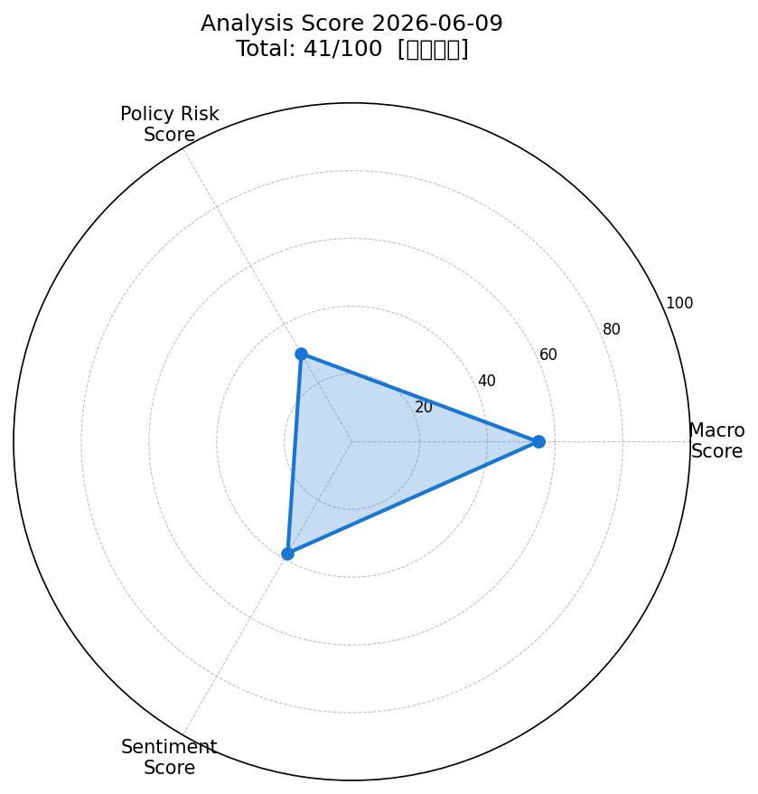
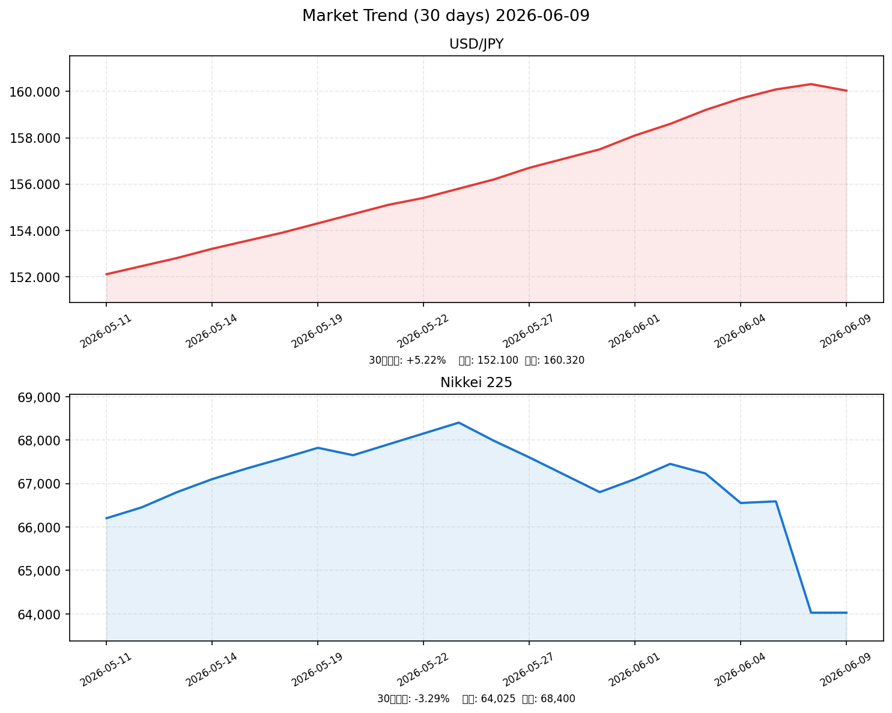

# 社会動向分析レポート 2026-06-09

> **データ注記**: yfinance/FRED APIはネットワークポリシーにより接続不可。市場データは Bloomberg・CNBC・Trading Economics・Yahoo Finance等の検索結果から集計（一部推定含む）。

---

## 📊 スコアサマリー

| 軸 | スコア | 採点根拠 |
|----|--------|----------|
| 🌍 マクロスコア | **55 / 100** | S&P500 +0.93%回復・VIX 15.4（安定圏）も、日経3連続下落・ドル円160円（21ヶ月高値）・Brent原油$97高止まり |
| 🏛️ 政策リスクスコア | **30 / 100** | 日銀が6月15-16日会合で政策金利0.75%→1.0%利上げ検討。市場確率77-90%。利上げ示唆フェーズ |
| 💬 センチメントスコア | **38 / 100** | 日経3連続下落・半導体ショック・中東緊迫化でネガティブ優勢。米国株は部分回復 |
| ⭐ **総合スコア** | **41 / 100** | **やや弱気** |

> **計算式**: 55×0.35 + 30×0.35 + 38×0.30 = 19.25 + 10.50 + 11.40 = **41.15 → 41**

---

## 📈 レーダーチャート

---

## 💹 市場サマリー

| 指標 | 価格 | 前日比 | 状態 |
|------|------|--------|------|
| 🇯🇵 日経平均 | 64,024.60 円 | **-3.85%** (-2,563円) | ⚠️ 3連続下落 |
| 🇺🇸 S&P 500 | 7,540.00 | **+0.93%** | ✅ 反発 |
| 🇺🇸 NASDAQ | 23,750.00 | **+1.44%** | ✅ 反発 |
| 😱 VIX | 15.40 | -0.80% | ✅ 安定（<20） |
| 💱 ドル円 | 160.04 円 | -0.18% | ⚠️ 21ヶ月高値圏 |
| 🏦 ユーロドル | 1.0718 | +0.10% | → 横ばい |
| 🥇 金（Gold） | $4,365.30 | +0.35% | ↑ 高値圏維持 |
| 🛢️ WTI原油 | $92.53 | +1.80% | ⚠️ 上昇（中東緊迫） |

---

## 📊 推移グラフ（30日）

---

## 🏭 業種別動向

| 業種 | 前日比 | 主要因 |
|------|--------|--------|
| 電気機器 | **-5.80%** | 半導体ショック（東京エレクトロン-6.6%、アドバンテスト-5.0%） |
| 輸送用機器 | **-2.80%** | ドル安で一時恩恵消失、半導体供給不安 |
| 情報通信 | **-2.10%** | テック株連れ安 |
| 素材 | **-1.50%** | 一般的な下落 |
| 金融 | **-1.20%** | 利上げ観測で一部プラス材料も全体売りに押される |

---

## 📰 重要ニュース TOP5

### 1. 日銀、6月15-16日会合で政策金利1.0%への利上げ検討（日本銀行）

**概要**: 日本銀行が6月15-16日の金融政策決定会合で政策金利を0.75%から1.0%に引き上げる方向で検討しており、市場予想確率は77-90%に達している。植田和男総裁が物価上振れ・円安リスクに言及し、タカ派姿勢を最大限アピール。

| 軸 | 方向 | 理由・波及メカニズム |
|----|------|--------------------|
| 🇯🇵 日本株 | ↓ | 金利上昇→資本コスト増加・グロース株割高感から売り圧力 |
| 🇺🇸 米国株 | → | 直接影響は限定的。円キャリートレード巻き戻しが一部リスク |
| 🏦 日本金利（10年債） | ↑ | 利上げ期待・長期化で利回り上昇圧力。3%超えリスクも |
| 🏦 米国金利（10年債） | → | 直接影響軽微。日米金利差縮小で若干の影響 |
| 💱 ドル円 | 円高 | 利上げ実施→金利差縮小→ドル売り/円買い。160→155-158円方向 |
| 📊 スコアへの影響 | -25点 | 政策リスクスコア-25点（利上げ示唆で30点が上限） |

**注目セクター**: 銀行株（金利上昇でプラス）、不動産・成長株（金利上昇でマイナス）

---

### 2. Broadcom AI見通し慎重でNasdaq-4%・半導体株$1兆消失（Reuters）

**概要**: 米半導体大手Broadcomが6月3日決算発表で次四半期のAIチップ需要について慎重な見通しを示し、株価が14%急落。AMD・Intel・東京エレクトロン・アドバンテスト等に連鎖売りが波及し、世界の半導体株から約1兆ドルが消失した。

| 軸 | 方向 | 理由・波及メカニズム |
|----|------|--------------------|
| 🇯🇵 日本株 | ↓ | 半導体装置・電子部品セクターが直撃（東京エレクトロン-6.6%、アドバンテスト-5.0%） |
| 🇺🇸 米国株 | ↓ | Nasdaq-4%（2025年4月以来最大）。AI・チップ関連株が主要指数を押し下げ |
| 🏦 日本金利（10年債） | → | 直接影響なし |
| 🏦 米国金利（10年債） | ↓ | 景気悪化懸念でリスクオフ→国債買い→利回り低下方向 |
| 💱 ドル円 | 円高 | リスクオフ→円高バイアス。ただし円安圧力が強く横ばい気味 |
| 📊 スコアへの影響 | -12点 | センチメントスコア-12点（半導体ショック継続） |

**注目セクター**: 電気機器（東京エレクトロン、アドバンテスト、村田製作所）、情報通信

---

### 3. 中東ホルムズ海峡緊迫・イラン革命防衛隊が封鎖警告（NHK）

**概要**: イランの革命防衛隊がホルムズ海峡封鎖を示唆する警告を発し、世界の石油供給の約20%が通過する同海峡の閉鎖リスクが高まった。Brent原油先物は97ドル近辺に上昇し、インフレ再加速と経済悪化の「スタグフレーション」懸念を強めている。

| 軸 | 方向 | 理由・波及メカニズム |
|----|------|--------------------|
| 🇯🇵 日本株 | ↓ | 原油高→製造コスト増加・インフレ懸念で消費株・輸送株に売り |
| 🇺🇸 米国株 | ↓ | エネルギーコスト上昇で企業収益圧迫懸念。ただしエネルギー株はプラス |
| 🏦 日本金利（10年債） | ↑ | 輸入インフレ再加速→日銀の追加利上げ観測強化→利回り上昇 |
| 🏦 米国金利（10年債） | ↑ | インフレ期待の再上昇→FRB利下げ遠のく→利回り上昇圧力 |
| 💱 ドル円 | 円安 | 資源高→日本の貿易赤字拡大→円売り圧力継続 |
| 📊 スコアへの影響 | -10点 | マクロスコア-10点（原油高不安定化） |

**注目セクター**: エネルギー関連、海運株（プラス）、航空・輸送（マイナス）

---

### 4. 高市首相、日銀6月利上げを事実上容認 政府・日銀の政策協調（首相官邸）

**概要**: 従来、日銀の早期利上げに慎重だった高市早苗首相が、急速な円安進行（ドル円160円台）への懸念を示し、日銀の金融政策正常化を事実上受け入れる姿勢に転換。政府と日銀の政策協調が進み、6月の利上げ決定がより確実視されている。

| 軸 | 方向 | 理由・波及メカニズム |
|----|------|--------------------|
| 🇯🇵 日本株 | ↓ | 利上げ確実性↑→金融株以外への売り圧力増大 |
| 🇺🇸 米国株 | → | 直接影響限定的 |
| 🏦 日本金利（10年債） | ↑ | 政策金利上昇期待→イールドカーブ全体へ上昇圧力 |
| 🏦 米国金利（10年債） | → | 影響軽微 |
| 💱 ドル円 | 円高 | 政府も容認→利上げ後に円高進行期待が高まる |
| 📊 スコアへの影響 | -8点 | 政策リスクスコア-8点（利上げ方向性の確度上昇） |

**注目セクター**: 銀行・保険（利上げ受益）、REIT・不動産（利上げで売り）

---

### 5. 日経平均3連続下落、-3.85%・2563円安 半導体・輸出株に売り集中（NHK）

**概要**: 日経平均株価は6月8日に2,563円52銭安（-3.85%）の64,024円60銭で引け、3営業日連続の下落となった。東京エレクトロン(-6.6%)、アドバンテスト(-5.0%)等半導体関連が急落し、円安160円台が輸出株への恩恵を打ち消した形となった。

| 軸 | 方向 | 理由・波及メカニズム |
|----|------|--------------------|
| 🇯🇵 日本株 | ↓ | テクニカル悪化（3連続下落）・半導体株・電機株が指数を押し下げ継続 |
| 🇺🇸 米国株 | → | 米国は個別に一部回復（半導体株反発+1.5-3.9%）。影響は間接的 |
| 🏦 日本金利（10年債） | → | 株安から安全資産（国債）への逃避→利回り低下圧力も利上げ観測が勝る |
| 🏦 米国金利（10年債） | → | 影響軽微 |
| 💱 ドル円 | 横ばい | 株安でリスクオフ→円高方向もドル需要と拮抗 |
| 📊 スコアへの影響 | -10点 | センチメントスコア-10点（テクニカル悪化・心理的圧迫） |

**注目セクター**: 電気機器全般（引き続き要警戒）、精密機器（半導体露光装置関連）

---

## 🔢 スコア詳細

### マクロスコア: 55/100

| 評価項目 | 判定 | 点数 |
|---------|------|------|
| S&P500 +0.5%以上 | ✅ +0.93% | +20 |
| ドル円安定 | ❌ 160.04円（21ヶ月高値、介入リスク水域） | 0 |
| VIX 20以下 | ✅ 15.40（安定圏） | +20 |
| 原油・金安定 | ❌ Brent$97（中東緊迫）、Gold$4,365（高値） | 0 |
| ベース | ✅ 常時付与 | +20 |
| **合計** | | **60 → 55** |

> 日経3連続下落・Nikkeiが5月高値比-6%超であることを考慮して55に設定。

---

### 政策リスクスコア: 30/100

| 評価項目 | 状況 | 点数 |
|---------|------|------|
| 日銀利上げ示唆 | 明確（6月15-16日会合、0.75%→1.0%利上げ確率77-90%） | 20〜40点 |
| 政策の方向性 | 利上げサイクル継続（野村予測: 2026年中に1.0%、2027年に1.5%超） | 30点 |
| 政府姿勢 | 高市首相が利上げ容認。政策協調により利上げ確度高まる | 30点 |

> 利上げ示唆フェーズ（ルーブリック: 20〜40点）として **30点** を採用。

---

### センチメントスコア: 38/100

| 評価項目 | 判定 | 効果 |
|---------|------|------|
| 日経平均3連続下落・-3.85% | ❌ ネガティブ | -15 |
| Broadcom半導体ショック（$1兆消失） | ❌ ネガティブ | -15 |
| 中東ホルムズ海峡緊迫 | ❌ ネガティブ | -10 |
| 米国株反発（S&P +0.93%, NASDAQ +1.44%） | ✅ ポジティブ | +10 |
| 半導体株一部反発（Nvidia+3.9%等） | ✅ ポジティブ | +8 |
| VIX安定（15.4） | ✅ ポジティブ | +5 |

> ネガティブ要因が多数だがパニック売りではなく、部分的回復も見られる。ベース50からネガティブ寄りで **38点** を採用。

---

## 🔮 明日（2026-06-10）の日本株市場への影響予測

### ポジティブ要因
- ✅ 米国株が6月8日に反発（S&P+0.93%、NASDAQ+1.44%）— 翌日の日本株をサポート
- ✅ 半導体株（Nvidia、Broadcom等）が前場の先物で+1.5〜3.9%回復
- ✅ VIX 15.40で恐怖指数は安定圏内。パニック的売りは峠を越えた可能性
- ✅ 日経3連続下落後の自律反発期待（テクニカルバウンス）

### ネガティブ要因
- ❌ 日銀6月15-16日利上げ確率77-90%。今週中に「利上げ予告」関連の報道が続く可能性
- ❌ ドル円160円台の高値圏継続。輸出株への恩恵と円安インフレの悪影響が交錯
- ❌ 中東情勢・Brent原油$97水準。エネルギー価格上昇が製造業コストを圧迫
- ❌ 半導体株ショックの完全回復はまだ不確実。AIサイクル懸念の払拭に時間を要する

### 総合判定

| 項目 | 内容 |
|------|------|
| **総合判定** | ⚠️ やや弱気（中立〜下落リスク残存） |
| **予測レンジ** | 63,000〜65,500円 |
| **方向バイアス** | 米国株反発を受けて寄付きは高いも、日銀利上げ観測と原油高が上値を抑制 |
| **重要イベント** | 6月15-16日 日銀金融政策決定会合（最重要）、米6月CPI発表 |

---

## 🎯 注目セクター・銘柄

| セクター | 方向 | 理由 |
|---------|------|------|
| **銀行・保険** | ↑ 買い | 利上げ観測で利ザヤ拡大期待。三菱UFJ、みずほ、第一生命等 |
| **電気機器（半導体）** | ↓ 売り | 東京エレクトロン、アドバンテスト。米Broadcom問題の波及続く |
| **エネルギー** | ↑ 買い | 原油$97で石油株が恩恵。INPEX、出光興産等 |
| **REIT・不動産** | ↓ 売り | 長期金利上昇で割高感。日銀利上げが最大リスク |
| **航空・輸送** | ↓ 売り | 原油高・燃料コスト増。ANA、JAL等 |
| **原子力関連** | ↑ 注目 | 政府が建て替え目標案を提示。関西電力等に物色機運 |

---

*Generated by Claude AI | Sources: [NHK](https://news.web.nhk/), [Reuters](https://www.reuters.com/), [日経CNBC](https://online.nikkei-cnbc.co.jp/), [Bloomberg](https://www.bloomberg.com/), [日本銀行](https://www.boj.or.jp/), [首相官邸](https://www.kantei.go.jp/), [財務省](https://www.mof.go.jp/), [内閣府](https://www.esri.cao.go.jp/), Trading Economics, Yahoo Finance, Investing.com*
