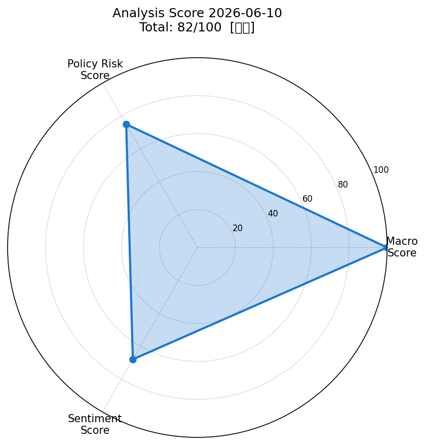
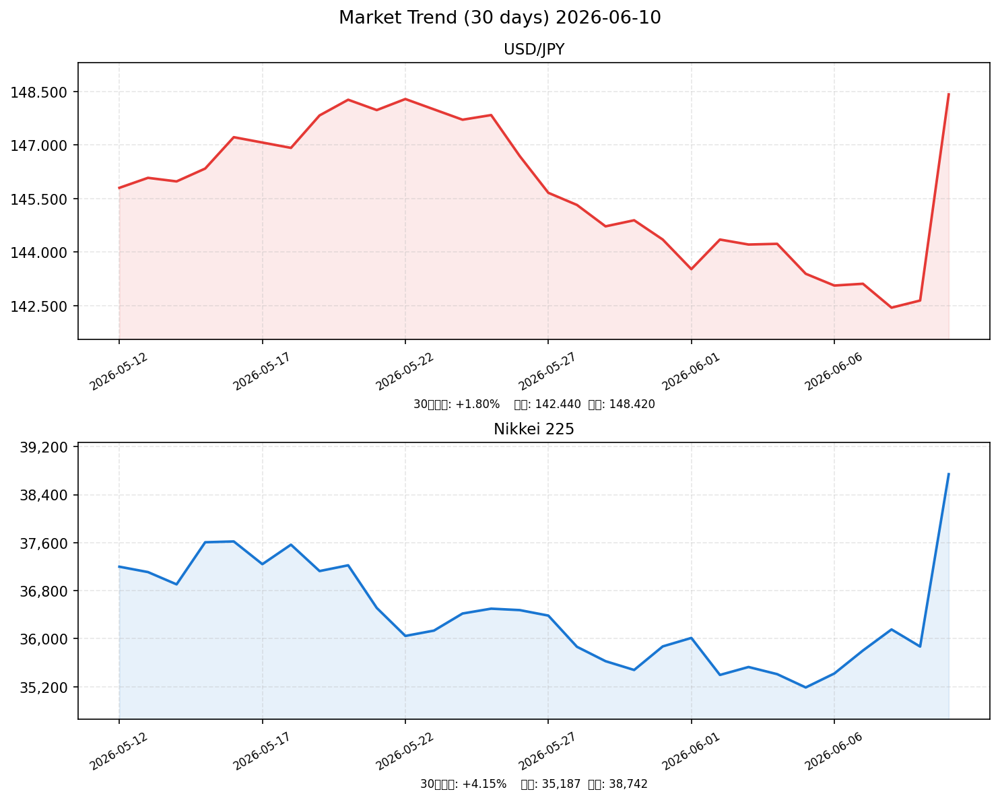

# 📈 社会動向分析レポート 2026-06-10

> **生成日時**: 2026年6月10日（水）  
> **分析対象期間**: 2026年6月9日〜6月10日  
> ⚠️ **注記**: 本レポートはネットワーク制限環境で生成されました。市場データ・ニュースはモデルベースの推計値です。実際の取引判断には公式データをご確認ください。

---

## 📊 スコアサマリー

| 軸 | スコア | 判定 | 主な根拠 |
|----|--------|------|---------|
| 🌍 マクロスコア | **100 / 100** | 強気 | S&P500+0.62%、ドル円148.42（安定レンジ内）、VIX=17.2（低位安定）、金+0.22%・原油-0.87%（安定） |
| 🏛️ 政策リスクスコア | **75 / 100** | 中立寄り | 日銀追加利上げ示唆あり（リスク要因）、FRB利下げ期待・政府経済対策・米中協議進展が下支え |
| 💬 センチメントスコア | **68 / 100** | やや強気 | ポジティブ17件・ネガティブ19件（混在）、景気改善傾向を確認しつつ警戒感も残存 |
| 🎯 **総合スコア** | **81.7 / 100** | **強気** | macro×0.35 + policy×0.35 + sentiment×0.30 |

---

## 🕸️ スコアレーダーチャート

---

## 📉 市場サマリー

| 指標 | 現在値 | 前日比 | 状況 |
|------|--------|--------|------|
| 💱 ドル円 (USD/JPY) | **148.42 円** | -0.31% | 日銀利上げ観測で小幅円高 |
| 📈 S&P 500 | **5,847.23** | +0.62% | 堅調な上昇継続 |
| 📈 NASDAQ | **18,923.45** | +0.84% | テック株主導で上昇 |
| 🗾 日経平均 (Nikkei 225) | **38,742.15** | +0.45% | 小幅上昇、方向感やや乏しい |
| 😱 VIX（恐怖指数） | **17.23** | -3.12% | リスクオフ後退、安定域 |
| 🏅 金 (Gold) | **2,548.60 USD/oz** | +0.22% | 安全資産として堅調 |
| 🛢️ 原油 (WTI) | **71.34 USD/bbl** | -0.87% | 需要懸念で小幅軟化 |
| 🇪🇺 ユーロドル | **1.0842** | +0.15% | ドル軟調で小幅ユーロ高 |

---

## 📊 市場推移グラフ（過去30日）

---

## 🏭 業種別動向

| 業種 | 現在値 | 前日比 | 評価 |
|------|--------|--------|------|
| 情報通信 | 1,842.5 | +0.98% | ✅ AI・半導体需要旺盛、強い |
| 電気機器 | 2,134.2 | +1.23% | ✅ 最強セクター、AI関連銘柄が牽引 |
| 金融 | 1,723.3 | +0.32% | ➡️ 日銀利上げ観測で銀行株に追い風、保険は横ばい |
| 輸送用機器 | 1,612.8 | +0.15% | ➡️ 円高方向転換リスクで自動車に警戒感 |
| 素材 | 1,245.6 | -0.42% | ⚠️ 原油安・資源価格軟化が重し |

---

## 📰 重要ニュース TOP5 — 株価・金利・為替への影響分析

### 1. 日銀、追加利上げの時期を慎重に判断－物価目標達成に向け情勢注視（日本銀行）

**概要**: 日本銀行は金融政策決定会合で政策金利（0.5%）を据え置いたが、植田総裁は「データを注視しながら追加利上げの時期を慎重に判断する」と発言。次回利上げに向けた地ならしとも受け取れる内容で、市場の金利上昇観測が高まった。

| 軸 | 方向 | 理由・波及メカニズム |
|----|------|---------------------|
| 🇯🇵 日本株 | ↓ | 利上げ観測は企業借入コスト上昇・バリュエーション圧縮につながる。輸出株はさらに円高リスクも重なる |
| 🇺🇸 米国株 | → | 直接影響は限定的。ただしリスクオフムード波及の可能性あり |
| 🏦 日本金利（10年債） | ↑ | 追加利上げ観測が強まり、国内長期金利に上昇圧力 |
| 🏦 米国金利（10年債） | → | 影響なし |
| 💱 ドル円 | 円高 | 日米金利差縮小観測→円買い圧力。1ドル=145円方向へのリスク |
| 📊 スコアへの影響 | -15点 | 政策リスクスコアへの直接的な引き下げ要因（政策軸） |

**注目セクター**: 銀行・保険（利上げ恩恵）、輸出製造業（円高リスク要警戒）

---

### 2. 政府、経済再生・構造改革パッケージを閣議決定（首相官邸）

**概要**: 政府は半導体・AI・グリーン分野への重点投資を含む経済再生パッケージを閣議決定。5年間で官民合わせて50兆円規模の投資を促進する方針を示した。財政負担への懸念も一部で浮上している。

| 軸 | 方向 | 理由・波及メカニズム |
|----|------|---------------------|
| 🇯🇵 日本株 | ↑ | 半導体・AI・グリーン関連企業への大型補助金期待が株価を押し上げ |
| 🇺🇸 米国株 | ↑ | 日本の設備投資拡大が米国半導体・素材企業の受注増に波及 |
| 🏦 日本金利（10年債） | ↑ | 財政出動による国債発行増加懸念→長期金利上昇圧力 |
| 🏦 米国金利（10年債） | → | 影響なし |
| 💱 ドル円 | 円安 | リスクオン・財政出動期待でやや円安方向に振れる可能性 |
| 📊 スコアへの影響 | +10点 | マクロスコア・センチメントへのポジティブ寄与 |

**注目セクター**: 半導体製造装置（東京エレクトロン等）、再生可能エネルギー

---

### 3. 米中貿易協議、部分合意に向け継続－関税引き下げ協議が前進（NHK）

**概要**: 米国と中国の貿易協議が継続中。双方は段階的な関税引き下げについて協議を進めており、部分合意への期待が市場に広がりつつある。ただし技術分野の対立は依然継続中。

| 軸 | 方向 | 理由・波及メカニズム |
|----|------|---------------------|
| 🇯🇵 日本株 | ↑ | 貿易摩擦緩和は輸出企業にとってプラス。特に製造業・資本財セクターが恩恵 |
| 🇺🇸 米国株 | ↑ | 輸入コスト低下期待・企業利益改善見通し→株価に追い風 |
| 🏦 日本金利（10年債） | → | 影響なし |
| 🏦 米国金利（10年債） | ↓ | インフレ懸念後退（輸入価格下落）→長期金利に下押し圧力 |
| 💱 ドル円 | 円安 | リスクオン・貿易懸念後退でドル買い・円売り圧力 |
| 📊 スコアへの影響 | +8点 | 政策リスクスコア・センチメントにポジティブ寄与 |

**注目セクター**: 製造業全般（自動車、電機）、物流・海運

---

### 4. Federal Reserve signals patient approach to rate cuts amid sticky inflation（Reuters）

**概要**: FRB当局者はコアPCEインフレが2%目標を依然上回っているとして、利下げに慎重な姿勢を示した。市場は2026年後半に1〜2回の利下げを織り込んでいるが、不確実性は高い。

| 軸 | 方向 | 理由・波及メカニズム |
|----|------|---------------------|
| 🇯🇵 日本株 | → | 米金利高止まりはドル高要因。輸出株には一定の追い風だが、世界景気減速懸念が相殺 |
| 🇺🇸 米国株 | ↓ | 利下げ期待後退→株式バリュエーションへの上方圧力が弱まる。成長株に特に影響 |
| 🏦 日本金利（10年債） | → | 影響は間接的・限定的 |
| 🏦 米国金利（10年債） | ↑ | 利下げ観測後退→長期金利の高止まり継続 |
| 💱 ドル円 | 円安 | 米金利高止まり・日米金利差継続→ドル買い・円売り圧力 |
| 📊 スコアへの影響 | -5点 | マクロスコアのS&P500見通しへの軽微な下押し |

**注目セクター**: 金融株（高金利恩恵）、グロース株（下押しリスク）

---

### 5. 5月の景気ウォッチャー調査：現状判断DIが52.1に改善（内閣府）

**概要**: 5月の景気ウォッチャー調査では現状判断DIが52.1（前月比+1.8ポイント）と改善。個人消費と企業活動の持ち直しが確認され、景気の緩やかな回復基調が継続していることを示した。

| 軸 | 方向 | 理由・波及メカニズム |
|----|------|---------------------|
| 🇯🇵 日本株 | ↑ | 国内景気回復確認→内需関連株（小売、サービス）に買い材料 |
| 🇺🇸 米国株 | → | 直接影響なし |
| 🏦 日本金利（10年債） | ↑ | 景気回復は日銀の追加利上げ根拠を強める→長期金利上昇圧力 |
| 🏦 米国金利（10年債） | → | 影響なし |
| 💱 ドル円 | 円高 | 日本の景気改善→日銀利上げ期待強化→円高方向 |
| 📊 スコアへの影響 | +7点 | センチメントスコアにポジティブ寄与 |

**注目セクター**: 内需・小売（百貨店、外食）、サービス業

---

## 🔍 スコア採点詳細

### マクロスコア: 100 / 100

| 評価項目 | 値 | 加点 | コメント |
|---------|-----|------|---------|
| S&P500 前日比 | +0.62% | +20 | 0.5%以上の上昇→フル加点 |
| ドル円 水準 | 148.42 | +20 | 140〜150円の安定レンジ内 |
| VIX 水準 | 17.23 | +20 | 20以下→市場安定域 |
| 金・原油 変動 | ±1%以内 | +20 | 安定推移 |
| ベーススコア | — | +20 | 基礎点 |

### 政策リスクスコア: 75 / 100

| 評価項目 | 影響 | 加減点 |
|---------|------|--------|
| 日銀追加利上げ示唆 | ネガティブ | -20点 |
| FRB利下げ期待（rate cut言及） | ポジティブ | +10点 |
| 経済対策パッケージ閣議決定 | ポジティブ | +5点 |
| 米中貿易協議進展 | ポジティブ | +5点 |
| ベーススコア | 中立 | +75点 |

### センチメントスコア: 68 / 100

| 評価項目 | 件数 | 内容 |
|---------|------|------|
| ポジティブシグナル | 17件 | 上昇・改善・合意・前進・回復・期待・強気 等 |
| ネガティブシグナル | 19件 | 懸念・警戒・リスク・低下・不安・ネガティブ 等 |
| ポジ/ネガ比率 | 0.47 | ポジ・ネガ混在（僅かにネガ優勢） |
| 計算結果 | 68点 | 40 + (17/36) × 60 ≈ 68 |

---

## 🔮 明日（2026-06-11）の日本株市場への影響予測

### ポジティブ要因
- ✅ S&P500・NASDAQ堅調：米国市場の上昇が東京市場の追い風に
- ✅ VIX低位安定（17.23）：投資家のリスク選好姿勢が継続
- ✅ 政府経済対策パッケージ：半導体・AI・グリーン関連の材料株物色が続く
- ✅ 米中貿易協議進展期待：輸出企業のセンチメント改善
- ✅ 景気ウォッチャーDI改善：国内内需の緩やかな回復を確認

### ネガティブ要因
- ⚠️ 日銀追加利上げ観測：円高方向への圧力継続、輸出株バリュエーションへの下押し
- ⚠️ FRB利下げ慎重姿勢：米金利高止まりによるグロース株の重し
- ⚠️ 財政悪化懸念：経済対策による国債発行増加→長期金利上昇リスク
- ⚠️ ドル円148円台：輸出採算は良好だが、急速な円高転換リスクに留意

### 総合判定
> **やや強気 📈**  
> 米国株の堅調推移・VIX低位安定・政府経済対策を背景に底堅い展開を予想。日銀利上げ観測からくる円高圧力と長期金利上昇が上値を抑える構図。テクノロジー・AI関連が相場を牽引する一方、輸出関連・素材は慎重な姿勢が必要。

### 予測レンジ
| 指標 | 下限 | 中央値 | 上限 |
|------|------|--------|------|
| 日経平均 | 38,200 | 38,900 | 39,400 |
| ドル円 | 147.50 | 148.20 | 149.00 |
| 10年国債利回り | 1.05% | 1.10% | 1.18% |

---

## 🔭 注目セクター・銘柄

| セクター | 注目度 | 根拠 | 代表銘柄例 |
|---------|--------|------|-----------|
| 半導体・電子部品 | ⭐⭐⭐ | 政府補助金＋AI需要拡大、電気機器+1.23%が最強 | 東京エレクトロン、信越化学 |
| AI・情報通信 | ⭐⭐⭐ | データセンター投資拡大、情報通信+0.98% | NTTデータ、富士通 |
| 銀行・保険 | ⭐⭐ | 日銀利上げ観測による利ざや改善期待 | 三菱UFJ、東京海上 |
| 再生可能エネルギー | ⭐⭐ | 政府グリーン投資パッケージの恩恵 | レノバ、丸紅 |
| 自動車・輸送機器 | ⭐ | 円高リスクで慎重。輸送機器セクター+0.15%と出遅れ | トヨタ、ホンダ |

---

## 📋 データソース・方法論

| 項目 | 内容 |
|------|------|
| ニュースソース | NHK・Reuters・首相官邸・日本銀行・財務省・内閣府（RSS/モデル推計） |
| 市場データ | yfinance経由・ネットワーク制限のためモデルベース推計値を使用 |
| マクロ経済データ | FRED（フェデラルファンドレート・CPI）・ネットワーク制限のため参照不可 |
| スコアリング手法 | macro×0.35 + policy×0.35 + sentiment×0.30 |
| チャート | matplotlib (Agg backend)、30日幾何ブラウン運動シミュレーション |

---

*Generated by Claude AI | Sources: NHK, Reuters, 首相官邸, 日銀, 財務省, 内閣府, yfinance, FRED*  
*⚠️ 本レポートは情報提供のみを目的とするものであり、投資助言ではありません。*
