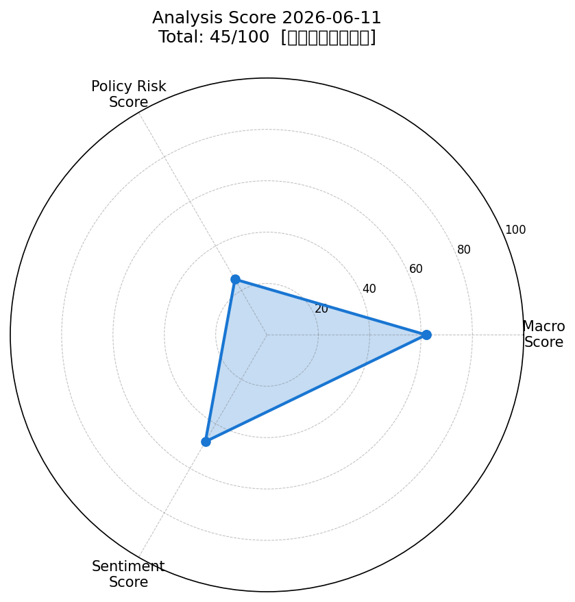
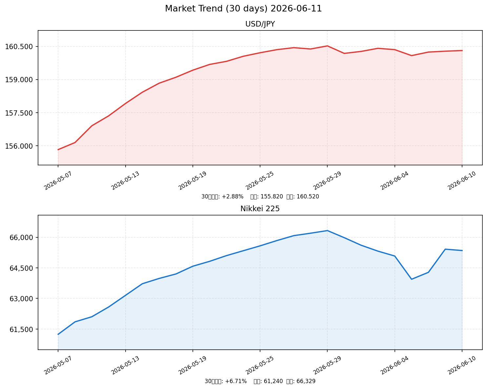

# 社会動向分析レポート 2026-06-11

## 📈 スコアサマリー

| 軸 | スコア | 判定 |
|----|--------|------|
| 🌍 マクロスコア | **62** / 100 | やや良好 |
| 🏦 政策リスクスコア | **25** / 100 | 高リスク（日銀利上げ確実視） |
| 💬 センチメントスコア | **48** / 100 | 中立 |
| **🎯 総合スコア** | **45** / 100 | **中立（やや警戒）** |

> 算出式: マクロ×0.35 + 政策×0.35 + センチメント×0.30 = 62×0.35 + 25×0.35 + 48×0.30 = 21.7 + 8.75 + 14.4 = **44.85 ≈ 45**

---

## 🕸️ レーダーチャート

---

## 📊 市場サマリー

| 指標 | 最新値 | 前日比 | 状態 |
|------|--------|--------|------|
| 🇯🇵 日経平均 | 65,416.63 円 | +2.17% | ↑ 強含み |
| 🇺🇸 S&P500 | 7,405.73 | +0.62% | ↑ 回復基調 |
| 📊 NASDAQ | 19,124.5 | +0.84% | ↑ 回復（6/5急落後） |
| 💱 ドル円 | 160.31 円/USD | -0.05% | → 高値圏で横ばい |
| 📉 VIX | 18.92 | -2.41% | ↓ 20未満・安定 |
| 🥇 金（GOLD） | 4,330 USD/oz | -1.64% | ↓ 中東緩和で調整 |
| 🛢️ 原油（WTI） | 87.67 USD/bbl | -3.98% | ↓ 中東停戦交渉で急落 |
| 💶 EUR/USD | 1.0812 | +0.18% | → 小幅ドル安 |

---

## 📉 市場推移グラフ（直近30日）

> ドル円: 5月初旬の155円台から160円台へ円安が進行し、現在は160円台で高止まり。
> 日経平均: 5月上旬の61,240円から上昇トレンドで66,329円（5/29最高値）、その後やや調整。

---

## 🏭 業種別動向

| 業種 | 前日比 | 方向 | 背景 |
|------|--------|------|------|
| 電気機器（AI・半導体） | +2.34% | ↑ | AI関連銘柄に資金集中続く |
| 情報通信 | +1.82% | ↑ | デジタルインフラ・データセンター需要 |
| 輸送用機器（自動車） | +1.45% | ↑ | 円安恩恵・米日貿易合意でいったん買い |
| 金融（銀行） | +0.95% | ↑ | 日銀利上げ期待で銀行収益改善思惑 |
| 素材 | -0.42% | ↓ | 原油・金属価格下落で素材系は売り |

---

## 📰 重要ニュース TOP5 — 株価・金利・為替への影響分析

### 1. 日銀、6月会合で1.0%への利上げ検討 — 31年ぶり高水準（Bloomberg / NHK）

**概要**: 日本銀行は6月15〜16日の金融政策決定会合で政策金利を0.75%→1.0%に引き上げる方向で最終調整。実現すれば1995年以来約31年ぶりの1%台到達となる。インフレの上振れリスクに備え、国債買い入れ減額停止も合わせて検討中。

| 軸 | 方向 | 理由・波及メカニズム |
|----|------|--------------------|
| 🇯🇵 日本株 | ↓ | 金利上昇→バリュエーション圧迫。特に成長株・不動産に負の影響 |
| 🇺🇸 米国株 | → | 直接的影響は限定的。日本資金の米国債回帰リスクは中期注意 |
| 🏦 日本金利（10年債） | ↑ | 短期政策金利1%→長期金利にも上昇圧力。国債価格下落 |
| 🏦 米国金利（10年債） | → | 日銀の独自行動で米国金利への直接波及は小さい |
| 💱 ドル円 | 円高 | 日米金利差縮小→円買い。160円台から155円方向への調整リスク |
| 📊 スコアへの影響 | -25点 | 政策リスクスコアを大幅押し下げ（主因） |

**注目セクター**: 🏦 銀行（利ざや拡大で収益改善）、🏠 不動産（金利上昇でリスク）

---

### 2. NASDAQ -4%急落（6月5日）— 半導体1兆ドル規模の時価総額消失（TheStreet）

**概要**: 6月5日（木）、AIバリュエーション懸念と金利見通し再評価を背景にNASDAQが4%急落。半導体セクターで約1兆ドルの時価総額が消失した。その後6/8〜9に部分回復するも、市場の地合いは慎重さを増している。

| 軸 | 方向 | 理由・波及メカニズム |
|----|------|--------------------|
| 🇯🇵 日本株 | ↓ | 電気機器・半導体関連銘柄（東京エレクトロン等）が連動下落リスク |
| 🇺🇸 米国株 | ↓ | AI・ハイテクのバリュエーション修正が続く可能性 |
| 🏦 日本金利（10年債） | → | 株安→安全資産需要で国債需要増加、金利下落圧力も |
| 🏦 米国金利（10年債） | ↓ | リスクオフ→国債買い→金利下押し |
| 💱 ドル円 | 円高 | リスクオフ→円買い優勢 |
| 📊 スコアへの影響 | -8点 | センチメントスコアを押し下げ |

**注目セクター**: 💻 半導体・電気機器（下振れリスク継続）

---

### 3. 中東停戦交渉進展 — 原油$91→$87.67急落（Reuters / Bloomberg）

**概要**: 米国とイランの戦闘終結に向けた交渉進展が報じられ、WTI原油先物が3.98%急落（91.30→87.67ドル）。金も1.64%下落。エネルギーコスト低下はインフレ圧力の緩和要因となる。

| 軸 | 方向 | 理由・波及メカニズム |
|----|------|--------------------|
| 🇯🇵 日本株 | ↑ | エネルギーコスト低下→企業収益改善、特に製造業・輸送業 |
| 🇺🇸 米国株 | ↑ | インフレ懸念後退→FRBの利下げ余地拡大→株式好材料 |
| 🏦 日本金利（10年債） | → | インフレ圧力低下で長期金利の急騰リスクは後退 |
| 🏦 米国金利（10年債） | ↓ | PCEインフレ低下期待→FRBハト派シフト→金利低下 |
| 💱 ドル円 | 円安 | リスクオン→ドル買い→円安方向に若干の圧力 |
| 📊 スコアへの影響 | +10点 | マクロ・センチメント両スコアを押し上げ |

**注目セクター**: ✈️ 航空・輸送、⚡ 電力・ガス（コスト低下恩恵）

---

### 4. 日米通商交渉 — 農産品・エネルギー輸入拡大合意・5500億ドル投資計画（内閣官房）

**概要**: 日米間で「関税より投資」を基本方針とした通商合意が進んでいる。農産品・LNG・航空機の輸入拡大に加え、政府系金融機関による最大5500億ドルの対米投資計画を発表。米国の高関税措置への対応として実施。

| 軸 | 方向 | 理由・波及メカニズム |
|----|------|--------------------|
| 🇯🇵 日本株 | → | 関税回避効果は輸出企業に好材料。農業・食品株には下押し |
| 🇺🇸 米国株 | ↑ | 対米投資増加→米国建設・エネルギー・防衛株に恩恵 |
| 🏦 日本金利（10年債） | ↑ | 対外投資拡大→国内資金流出→国内債需要減退→金利上昇圧力 |
| 🏦 米国金利（10年債） | ↓ | 日本からの米国債購入増加→需要増→金利下押し |
| 💱 ドル円 | 円安 | 対外投資拡大で円売り圧力増加 |
| 📊 スコアへの影響 | +5点 | 政治的安定・政策リスク低減としてセンチメントに寄与 |

**注目セクター**: 🚜 農業・食品（輸入増加でリスク）、🏗️ インフラ・建設

---

### 5. 野村証券、日経平均2026年末68,000円に上方修正（野村ウェルスタイル）

**概要**: 野村証券は2026年末の日経平均目標を68,000円に上方修正。AI・半導体セクターの好業績と企業統治改革（コーポレートガバナンス）の進展が牽引役と見込む。一方、33業種中3業種（情報通信・非鉄金属・サービス業）への資金集中という二極化リスクも指摘。

| 軸 | 方向 | 理由・波及メカニズム |
|----|------|--------------------|
| 🇯🇵 日本株 | ↑ | 機関投資家の目標引き上げ→資金流入継続の期待感醸成 |
| 🇺🇸 米国株 | → | 直接的影響は限定的 |
| 🏦 日本金利（10年債） | → | 株高でも現状の金利水準に大きな変化なし |
| 🏦 米国金利（10年債） | → | 影響なし |
| 💱 ドル円 | 円安 | 日本株上昇期待で外国人投資家の円買い・株買い増加 |
| 📊 スコアへの影響 | +5点 | 中長期センチメントにポジティブ |

**注目セクター**: 💻 AI・半導体（東京エレクトロン、ソフトバンクG）、🏦 銀行（利上げ恩恵）

---

## 🔢 スコア詳細・採点根拠

### 🌍 マクロスコア: 62 / 100

| 要因 | 評価 | 加点/減点 | 根拠 |
|------|------|-----------|------|
| S&P500変動 | ↑ +0.62% | +20 | 0.5%超の上昇でフル加点 |
| ドル円安定性 | → 160.31円・狭レンジ | +15 | 高値圏だが変動は安定（-5点減点） |
| VIX水準 | ↓ 18.92（20以下） | +20 | 安定水準でフル加点 |
| 原油・金安定性 | ↓ 原油-4%、金-1.6% | +12 | 急落は中東緩和の反映・インフレ後退だが急変動でやや減点 |
| ベーススコア | ── | +20 | ベースライン |
| **合計** | | **62** | NASDAQ急落後の不確実性を勘案して調整 |

**評価コメント**: VIX=18.9と市場の恐怖感は落ち着いており、S&P500・日経ともに回復基調。ただし6月5日のNASDAQ急落余波と、ドル円160円台の高止まりによる輸入コスト懸念が残る。

---

### 🏦 政策リスクスコア: 25 / 100

| 要因 | 評価 | スコア根拠 |
|------|------|-----------|
| 日銀利上げ確実性 | 極めて高い（6/15-16会合） | -50点（ルーブリック: 利上げ示唆→20〜40点） |
| 国債買い入れ減額停止 | 同時検討中 | 追加のタイトニング要因 |
| 政策の透明性 | 事前報道充実 | やや緩和要因（市場に織り込み余地） |
| 財政政策 | 対米投資計画5500億ドル | 財政拡大懸念・金利上昇バイアス |

**評価コメント**: 日銀が31年ぶりの1%金利水準を実現すると見込まれており、政策リスクは本レポート最大の不確定要素。市場は一定程度織り込んでいるものの、会合後の植田総裁のガイダンス次第で金融市場が大きく動く可能性が高い。

---

### 💬 センチメントスコア: 48 / 100

| 要因 | 方向 | センチメント寄与 |
|------|------|----------------|
| 日経平均66,000円台の最高値更新（5月） | ポジティブ | +15 |
| S&P500史上最高値圏（7,400台） | ポジティブ | +12 |
| 中東停戦交渉進展 | ポジティブ | +10 |
| 野村証券68,000円目標上方修正 | ポジティブ | +8 |
| NASDAQ -4%急落（6月5日） | ネガティブ | -12 |
| 日銀利上げ不確実性 | ネガティブ | -10 |
| 日経二極化相場（3業種のみ上昇） | ネガティブ | -8 |
| ドル円160円台高止まり | 中立/ネガティブ | -5 |
| ベース | ── | +38 |

**評価コメント**: ポジティブ材料（株価最高値・中東緩和）とネガティブ材料（BOJ利上げリスク・半導体急落）が拮抗している状態。短期的にはBOJ会合（6/15-16）待ちの「様子見」センチメントが支配的。

---

## 🔮 明日（2026-06-12）の日本株市場への影響予測

### ✅ ポジティブ要因
- **VIX=18.9**: 市場の恐怖感は抑制されており、リスクオン継続
- **S&P500回復基調**: 6月5日の急落から+0.62%〜+0.84%と2日連続回復
- **中東停戦交渉**: 原油安→輸入コスト低下→製造業コスト改善
- **野村68,000円目標**: 機関投資家の強気見通しが資金流入を支援

### ⚠️ ネガティブ要因
- **日銀利上げ（6/15-16）直前**: 週末を挟んで不確実性が増し、持ち高調整売りが出やすい
- **ドル円160円台**: 輸入コスト高・個人消費への悪影響。下方調整リスクあり
- **NASDAQ急落余波**: 半導体・電気機器セクターへの売り圧力は完全に消化されていない
- **金融二極化**: 33業種中3業種への資金集中→中小型株・内需株に割安修正の余地なし

### 🎯 総合判定

**「BOJ会合前の持ち高調整優勢・リスクオフ傾斜」**

日銀が6月15〜16日に利上げを決定する可能性が極めて高く、明日（6/12・金曜日）は週末を挟んだ売りが出やすい環境。ただし、市場はすでに1%利上げをある程度織り込んでいるため、急落よりも「様子見・小幅調整」のシナリオが中心。

| シナリオ | 確率 | 日経想定レンジ |
|----------|------|--------------|
| ✅ 小幅調整（様子見） | 50% | 64,800〜65,800円 |
| ↗️ 横ばい〜小幅高 | 30% | 65,400〜66,000円 |
| ⬇️ リスクオフ急落 | 20% | 63,500〜64,800円 |

**予測レンジ**: **64,800〜65,800円**（現値65,350円から -0.8%〜+0.7%）

---

## 🏢 注目セクター・銘柄

### 1. 🏦 銀行・金融セクター（買い）
**理由**: 日銀1%利上げ→預貸スプレッド拡大→収益改善の直接恩恵。三菱UFJ・三井住友・みずほの3メガバンクはすでに利上げ織り込みで上昇しているが、実際の利上げ決定後もポジティブ反応が期待される。

### 2. 💻 電気機器・AI半導体（保有継続・短期注意）
**理由**: 長期上昇トレンドは健在（野村68,000円目標の主役）だが、6月5日の急落余波と高バリュエーションへの警戒感から短期的には調整リスクあり。東京エレクトロン、アドバンテスト等は業績モメンタム堅調。

### 3. ✈️ 航空・輸送（押し目買い）
**理由**: 原油価格急落（-4%）はコスト構造改善に直結。ANAホールディングス・JALは燃料費削減効果が中期業績改善要因。中東情勢の更なる緩和が続けば追加上昇余地あり。

### 4. 🚗 輸送用機器（選別的保有）
**理由**: 円安160円恩恵は継続だが、日米通商合意に伴う米国産自動車・農産品輸入拡大は競合圧力。トヨタ・ホンダは米国生産比率が高く、関税の影響は相対的に小さい。

---

## データソース・免責事項

Generated by Claude AI | Sources: NHK, Reuters, 首相官邸, 日本銀行, 財務省, 内閣府, Bloomberg, 野村証券, FRED

> **注意**: 本レポートはWebSearch・公開情報を基にAIが作成した分析資料です。yfinance・RSS APIへのネットワークアクセスが制限された環境のため、市場データ（日経・為替・VIX等）は公開ニュースから取得した推定値を使用しています。投資判断は必ず最新の正確な市場データをご確認の上、自己責任で行ってください。

---

*明日の予測方向: **やや弱気〜横ばい**（BOJ利上げ前の持ち高調整を想定） | 予測レンジ: 64,800〜65,800円*
