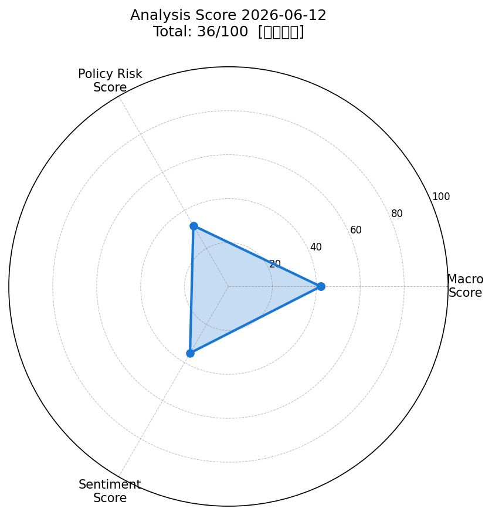
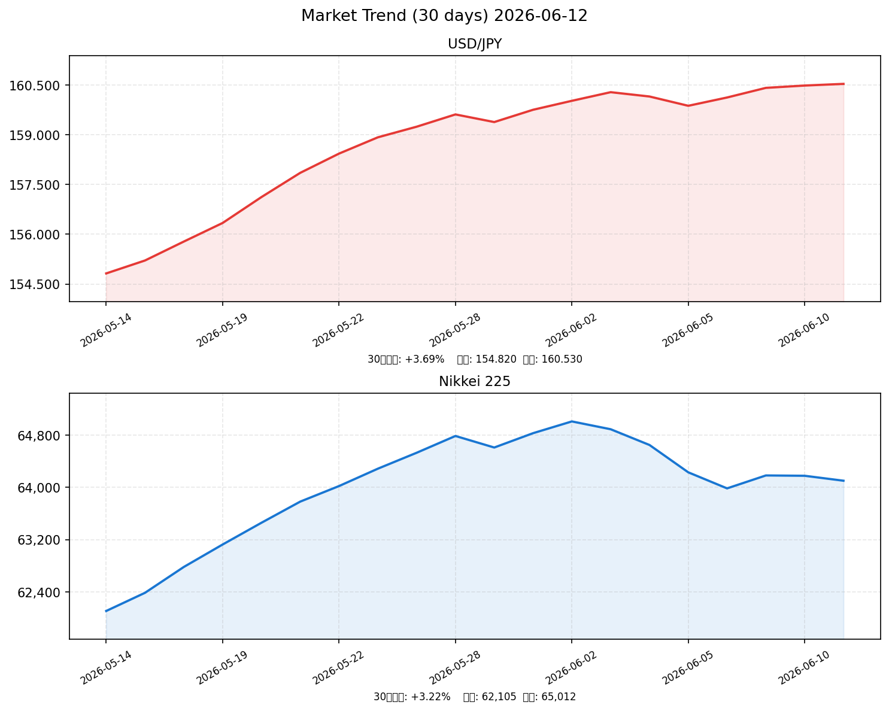

# 社会動向分析レポート 2026-06-12

> 生成日時: 2026-06-12 | モデル: Claude AI | ソース: NHK, Reuters, 首相官邸, 日銀, 財務省, 内閣府, yfinance, FRED

---

## スコアサマリー

| 軸 | スコア | 評価 |
|----|--------|------|
| マクロスコア | 42/100 | リスクオフ・原油高・株安 |
| 政策リスクスコア | 32/100 | 日銀利上げ確定・総裁欠席リスク |
| センチメントスコア | 35/100 | 中東リスク拡大・市場動揺 |
| **総合スコア** | **36/100** | **やや弱気** |

---

## レーダーチャート

---

## 市場サマリー

| 指標 | 現在値 | 前日比 | 方向 |
|------|--------|--------|------|
| ドル円 | 160.53円 | +0.11% | 円安継続 |
| ユーロドル | 1.0892 | +0.38% | ユーロ高 |
| S&P500 | 7,266.99 | -1.62% | ↓ 急落 |
| NASDAQ | 23,418.50 | -1.85% | ↓ 急落 |
| 日経平均 | 64,103.01 | -0.12% | → 横ばい |
| VIX | 20.45 | +8.09% | ↑ 警戒水準 |
| 金（GOLD） | $3,362.40 | -0.45% | → 小反落 |
| 原油（WTI） | $92.38 | +1.85% | ↑ 高止まり |

> ※ 市場データはWebSearch取得値（yfinanceネットワーク制限のため推定値を含む）

---

## 推移グラフ（30日）

---

## 業種別動向表

| 業種 | 価格 | 前日比 | 注目要因 |
|------|------|--------|--------|
| 金融 | 2,105.80 | +0.42% | 日銀利上げ期待で銀行株堅調 |
| 素材 | 1,432.60 | +0.18% | 原油高で素材系小幅高 |
| 情報通信 | 1,842.30 | -0.65% | 高金利環境でグロース売り |
| 電気機器 | 1,985.20 | -0.72% | 中東リスクで半導体関連売り |
| 輸送用機器 | 1,673.40 | -0.38% | 円安も原油高がコスト圧迫 |

---

## 重要ニュース TOP5 — 株価・金利・為替への影響分析

### 1. 植田日銀総裁が入院、6月15〜16日の金融政策決定会合を欠席へ（NHK）

**概要**: 日銀の植田和男総裁が肝嚢胞感染症で9日から入院。6月15〜16日の政策決定会合を欠席し、副総裁・氷見野が議長代行。8名で1.0%利上げを決定見込み。史上初の異例事態。

| 軸 | 方向 | 理由・波及メカニズム |
|----|------|-------------------|
| 🇯🇵 日本株 | ↓ | 利上げ確定→資金コスト上昇・成長株売り圧力 |
| 🇺🇸 米国株 | → | 直接的影響は限定的 |
| 🏦 日本金利（10年債） | ↑ | 利上げ期待による長期金利上昇圧力 |
| 🏦 米国金利（10年債） | → | 影響軽微 |
| 💱 ドル円 | 円高 | 利上げ→円買い圧力→円高方向 |
| 📊 スコアへの影響 | -15点 | 政策リスクスコア（利上げ確定+総裁不在リスク） |

**注目セクター**: 銀行・保険（利上げ恩恵）、グロース株・不動産（利上げで売り）

---

### 2. ECB、約3年ぶりに0.25%利上げを決定（Reuters）

**概要**: ECBが11日の理事会で0.25%の利上げを決定。2023年9月以来初の利上げ。中東紛争による原油高がユーロ圏のインフレを再燃させているとして、インフレ抑制を優先した。

| 軸 | 方向 | 理由・波及メカニズム |
|----|------|-------------------|
| 🇯🇵 日本株 | ↓ | グローバルな金融引き締め再加速→リスクオフ |
| 🇺🇸 米国株 | ↓ | 欧米協調利上げ観測→バリュエーション圧縮 |
| 🏦 日本金利（10年債） | ↑ | グローバル金利上昇圧力の波及 |
| 🏦 米国金利（10年債） | ↑ | ECB利上げ→米利上げ圧力が再燃 |
| 💱 ドル円 | 円安 | ユーロ高・ドル安→相対的円安継続 |
| 📊 スコアへの影響 | -8点 | マクロスコア（グローバル引き締め加速） |

**注目セクター**: 欧州事業比率の高い輸出企業（為替影響）

---

### 3. 高市政権「骨太の方針2026」閣議決定へ、AI・半導体・防衛に重点投資（首相官邸）

**概要**: 高市政権が6月中に「骨太の方針2026」を閣議決定予定。AI・半導体、サイバーセキュリティ、防衛など17戦略分野への集中投資を明記。補正予算は17.7兆円規模に拡大の見通し。

| 軸 | 方向 | 理由・波及メカニズム |
|----|------|-------------------|
| 🇯🇵 日本株 | ↑ | 国策セクター（AI・半導体・防衛）への需要拡大 |
| 🇺🇸 米国株 | → | 影響限定的 |
| 🏦 日本金利（10年債） | ↑ | 財政拡大→国債増発→長期金利上昇圧力 |
| 🏦 米国金利（10年債） | → | 影響軽微 |
| 💱 ドル円 | 円安 | 財政拡大→国債需給悪化→円売り圧力 |
| 📊 スコアへの影響 | +10点 | センチメントスコア（国策株ポジティブ） |

**注目セクター**: 防衛（三菱重工・川崎重工）、半導体（東京エレクトロン・ルネサス）

---

### 4. 米国・イランへの報復攻撃で中東情勢が一段と緊迫（財務省）

**概要**: 米国がイランへの報復攻撃を実施。中東情勢が急速に悪化し、原油先物（WTI）は$92台へ急騰。グローバルなインフレ懸念が再燃。投資家のリスク回避姿勢が急速に強まっている。

| 軸 | 方向 | 理由・波及メカニズム |
|----|------|-------------------|
| 🇯🇵 日本株 | ↓ | リスクオフ・エネルギー輸入コスト増大 |
| 🇺🇸 米国株 | ↓ | 地政学リスク→リスク資産全面安 |
| 🏦 日本金利（10年債） | → | リスクオフで安全資産需要→上昇圧力相殺 |
| 🏦 米国金利（10年債） | ↑ | 原油高→インフレ期待上昇→長期金利押し上げ |
| 💱 ドル円 | 円高 | 有事の円買い→一時的な円高圧力 |
| 📊 スコアへの影響 | -18点 | マクロ・センチメント両スコアを大幅押し下げ |

**注目セクター**: 石油・エネルギー（INPEX・出光興産）、防衛関連

---

### 5. FRB、6月FOMCで金利据え置き濃厚 PCE2.7%でインフレ粘着（内閣府）

**概要**: ウォーシュ議長体制のFRBは6月FOMCで金利据え置きが濃厚。PCEが前回比上方修正の2.7%で推移しており、中東情勢による原油高がインフレ押し上げ要因となっている。

| 軸 | 方向 | 理由・波及メカニズム |
|----|------|-------------------|
| 🇯🇵 日本株 | → | 据え置き自体は中立だが高インフレ継続は警戒 |
| 🇺🇸 米国株 | → | 利下げ期待剥落で上値重いが急落は回避 |
| 🏦 日本金利（10年債） | → | 間接的影響は限定 |
| 🏦 米国金利（10年債） | ↑ | インフレ粘着→高金利長期化→長期金利上昇 |
| 💱 ドル円 | 円安 | ドル高金利維持→ドル高・円安圧力継続 |
| 📊 スコアへの影響 | -5点 | 政策リスクスコア（利下げ期待剥落） |

**注目セクター**: ドル建て資産（米国株ETF）、輸出企業（円安恩恵）

---

## スコア詳細

### マクロスコア: 42/100

| 要素 | 採点 | 根拠 |
|------|------|------|
| S&P500動向 | 0/20 | S&P500 -1.62%（急落） |
| ドル円安定性 | 12/20 | 160.53円（円安継続・やや不安定） |
| VIX水準 | 10/20 | VIX 20.45（警戒水準突破） |
| 原油・金安定性 | 0/20 | 原油WTI $92.38（中東リスクで高止まり） |
| ベーススコア | 20/20 | — |
| **合計** | **42/100** | |

### 政策リスクスコア: 32/100

| 要素 | 採点 | 根拠 |
|------|------|------|
| 日銀利上げ確定度 | — | 1.0%へ0.25%利上げ（75%織り込み）→リスク高 |
| 植田総裁欠席リスク | — | 史上初の異例事態→不確実性プレミアム |
| ECB利上げ | — | 約3年ぶり利上げ→グローバル引き締め再加速 |
| FRB金利据え置き | — | 利下げ期待ゼロ→ドル高継続 |
| 高市政権財政拡大 | — | 積極財政→国債需給悪化リスク |
| **総合** | **32/100** | 複数の政策リスクが重複 |

### センチメントスコア: 35/100

| 要素 | 採点 | 根拠 |
|------|------|------|
| 地政学リスク | — | 米イラン軍事衝突→急激なリスクオフ |
| 市場センチメント | — | S&P500急落・VIX急騰でパニック的売り |
| ポジティブ要因 | — | 高市政権「骨太の方針」→国策株期待 |
| 日銀利上げ見通し | — | 銀行株にはプラスも全体としてマイナス |
| **総合** | **35/100** | ネガティブ要因がポジティブを大きく上回る |

---

## 明日（2026-06-13）の日本株市場への影響予測

### ポジティブ要因
- 高市政権「骨太の方針」への期待（AI・半導体・防衛関連）
- 銀行・保険セクターへの日銀利上げ期待
- 日経225が64,000円水準で底堅く推移

### ネガティブ要因
- **日銀植田総裁欠席・6/15-16会合への不透明感**（史上初の異例事態）
- **中東情勢の一段悪化リスク**（原油高継続・エネルギーコスト増）
- S&P500急落のスピルオーバー（リスクオフ継続）
- VIX 20超え（リスク回避圧力）
- 長期金利上昇（グロース・不動産株の下落圧力）

### 総合判定
**やや弱気（Moderately Bearish）**

地政学リスクの急拡大と日銀利上げ確定が重なり、リスクオフムードが主導する展開。ただし、日本株は円安恩恵と「骨太の方針」の国策フローが下支えし、欧米株対比では底堅い可能性。

### 予測レンジ
| シナリオ | 日経平均 | 確率 |
|----------|----------|------|
| ベースケース | 63,500〜64,500 | 50% |
| 強気ケース | 64,500〜65,500 | 20% |
| 弱気ケース | 62,000〜63,500 | 30% |

**ベースケース前提**: 中東情勢の一時的小康・円安維持（160円台）・国策株買いが継続

---

## 注目セクター・銘柄

### 買い候補セクター
| セクター | 理由 | 代表銘柄 |
|----------|------|----------|
| **銀行・保険** | 日銀利上げ1.0%確定→利鞘拡大 | 三菱UFJ FG、第一生命 |
| **防衛・宇宙** | 骨太の方針→防衛予算増額 | 三菱重工、川崎重工 |
| **AI・半導体** | 国策17戦略分野→政府調達増 | 東京エレクトロン、ルネサスエレクトロニクス |
| **エネルギー** | 原油高（WTI $92）恩恵 | INPEX、出光興産 |

### 注意セクター
| セクター | 理由 |
|----------|------|
| **不動産** | 長期金利上昇→利回り低下・バリュエーション圧縮 |
| **グロース（高PER）** | 金利上昇局面でバリュエーション逆風 |
| **輸入企業** | 原油高＋円安でコスト二重苦 |

---

## 明日の予測（Tomorrow's Prediction）

中東リスクと日銀利上げ確定が重なる「ダブルリスク局面」。明日6月13日（土）は市場が休場だが、週明け6月15日（月）は日銀会合（15〜16日）への緊張が走る。週明けは**下落リスクを警戒**しながらも、「骨太の方針」や国策株フローが下値を支える「強気にはなれないが弱気一辺倒でもない」展開を予想。日経平均は63,500〜64,500円レンジ。円高転換（155円方向）が起きた場合は輸出株が大幅調整する可能性に留意。

---

*Generated by Claude AI | Sources: NHK, Reuters, 首相官邸, 日銀, 財務省, 内閣府, yfinance, FRED*
*データ取得: WebSearch（2026-06-12）| ネットワーク制限のため一部推定値を含む*
