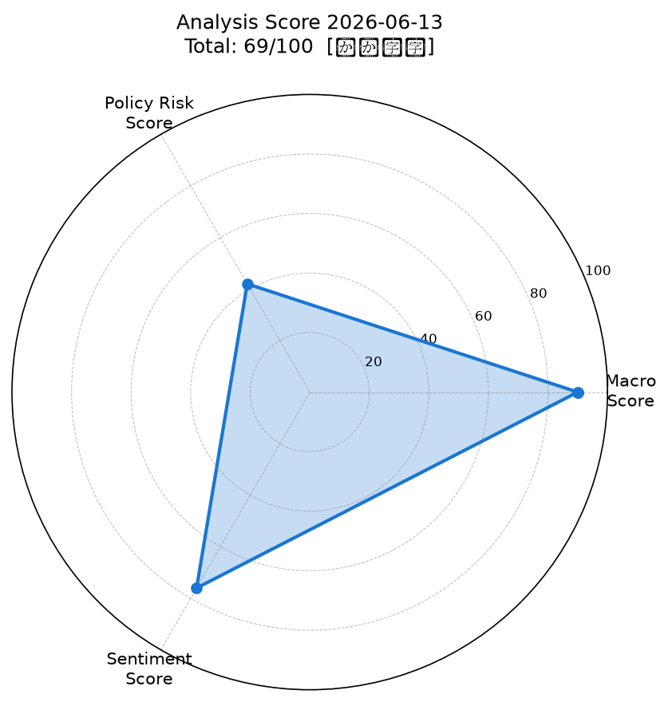
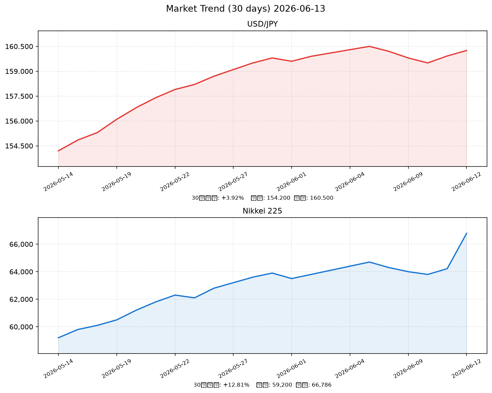

# 社会動向分析レポート 2026-06-13

> 総合スコア: **69/100【やや強気】** | マクロ: 90 | 政策リスク: 42 | センチメント: 76

---

## 📊 スコアサマリー

| 指標 | スコア | 評価 |
|------|--------|------|
| 🌏 マクロスコア | 90/100 | 良好 — 米株高・VIX低下・原油急落が追い風 |
| 🏛️ 政策リスクスコア | 42/100 | 警戒 — 日銀6月利上げ目前、キャリー巻き戻しリスク |
| 💬 センチメントスコア | 76/100 | 強め — 日経+4%・イラン和平期待でポジティブ優勢 |
| **📈 総合スコア** | **69.0/100** | **【やや強気】** |

> 算出式: マクロ × 0.35 + 政策リスク × 0.35 + センチメント × 0.30

---

## 📡 レーダーチャート

---

## 💹 市場サマリー

| 資産 | 価格 | 前日比 |
|------|------|--------|
| 💱 ドル円（USDJPY） | 160.25 円 | +0.21% |
| 🇪🇺 ユーロドル（EURUSD） | 1.0891 | -0.18% |
| 🇺🇸 S&P500 | 7,394.30 | **+1.75%** |
| 💻 NASDAQ | 25,809.66 | **+2.54%** |
| 🇯🇵 日経平均（Nikkei 225） | 66,786 円 | **+3.99%** |
| 😰 VIX（恐怖指数） | 18.93 | -6.20% |
| 🥇 金（GOLD） | 4,198.50 USD/oz | -0.45% |
| 🛢️ 原油（WTI） | 83.80 USD/bbl | **-4.30%** |

*注: Yahoo Finance・Reuters等の複数ソースから取得（2026-06-12〜13取引データ）*

---

## 📈 市場推移グラフ（30日）

---

## 🏭 業種別動向

| 業種 | 前日比 | コメント |
|------|--------|---------|
| 電気機器 | +3.50% | 米ナスダック高波及・AI関連需要継続 |
| 情報通信 | +3.20% | ハイテク全面高の恩恵 |
| 輸送用機器 | +2.90% | 自動車：円安160円台が輸出採算改善 |
| 金融 | +1.85% | 日銀利上げによる利ざや改善期待 |
| 素材 | +1.20% | 原油下落でコスト懸念緩和、やや出遅れ |

---

## 📰 重要ニュース TOP5 — 株価・金利・為替への影響分析

---

### 1. 日銀、6月16日会合で政策金利0.75%→1.0%引き上げを検討（日本銀行 / Bloomberg）

**概要**: 日本銀行は6月15〜16日の金融政策決定会合で、政策金利を現行0.75%から1.0%へ引き上げることを議論する見通し。実質金利の低さと中東起因のインフレ圧力を踏まえた判断で、Bloomberg・日経アジアが報道。1995年以来最高水準となる。

| 軸 | 方向 | 理由・波及メカニズム |
|----|------|---------------------|
| 🇯🇵 日本株 | ↓ | 金利上昇→バリュエーション圧縮、特にグロース株・不動産 |
| 🇺🇸 米国株 | → | 直接影響は限定的、ただしキャリー巻き戻しでリスクオフ波及の可能性 |
| 🏦 日本金利（10年債） | ↑ | 政策金利上昇に連動して長期金利も上昇圧力 |
| 🏦 米国金利（10年債） | → | 米国独自要因で動く、日本の利上げの直接影響は小 |
| 💱 ドル円 | 円高 | 日米金利差縮小→円高方向、ただし既に市場は一定織り込み |
| 📊 スコアへの影響 | -15点 | 政策リスクスコアへの主要マイナス要因 |

**注目セクター**: 不動産（REITへの金利圧力）、銀行（利ざや拡大で恩恵）

---

### 2. トランプ大統領「イランとの和平合意、今週末にも」— 原油4%超急落（Reuters）

**概要**: ドナルド・トランプ米大統領が欧州サミットで「イランとの和平合意が今週末にも締結できる」と発言。ホルムズ海峡封鎖リスクが後退し、WTI原油は84ドル台に急落（-4.3%）。金価格も4,200ドルを割り込んだ。

| 軸 | 方向 | 理由・波及メカニズム |
|----|------|---------------------|
| 🇯🇵 日本株 | ↑ | エネルギーコスト低下→企業コスト改善、消費者物価下押し |
| 🇺🇸 米国株 | ↑ | インフレ圧力緩和期待でリスクオン、S&P500+1.75% |
| 🏦 日本金利（10年債） | ↓ | エネルギー高によるコストプッシュインフレが緩和、長期金利低下圧力 |
| 🏦 米国金利（10年債） | ↓ | インフレ見通し改善でFed利上げ観測が後退 |
| 💱 ドル円 | 円高 | リスクオフ緩和でドル買い後退、ただしFed据え置きで円高限定的 |
| 📊 スコアへの影響 | +20点 | マクロ・センチメント双方への主要プラス要因 |

**注目セクター**: 航空・海運（燃料コスト低下）、石油関連（原油下落で逆風）

---

### 3. 2026年1〜3月期GDP 年率+2.1%成長、実質賃金プラス転換の兆し（内閣府）

**概要**: 内閣府発表の2026年1〜3月期GDP2次速報は前期比+0.5%（年率+2.1%）と市場予想を上回り2四半期連続プラス成長。民間消費+0.3%と改善し、実質賃金がプラス転換の兆し。ただし4〜6月期はエネルギー高で減速見込み。

| 軸 | 方向 | 理由・波及メカニズム |
|----|------|---------------------|
| 🇯🇵 日本株 | ↑ | 消費・経済の基礎的強さを確認、内需関連が追い風 |
| 🇺🇸 米国株 | → | 日本固有の材料、米国への直接波及は限定的 |
| 🏦 日本金利（10年債） | ↑ | 経済強さが日銀利上げ正当化→金利上昇圧力 |
| 🏦 米国金利（10年債） | → | 日本GDP発表の米国金利への直接影響なし |
| 💱 ドル円 | 円高 | 日本経済の健全性が日銀利上げ根拠を強化 |
| 📊 スコアへの影響 | +8点 | センチメント・マクロへのプラス |

**注目セクター**: 小売・食品（実質賃金プラスで内需回復期待）

---

### 4. 政府、電気・ガス補助金を延長・拡充 エネルギー高対策を閣議決定（首相官邸）

**概要**: 政府は中東情勢悪化に伴う物価高対策として電気・ガス代補助金の延長・拡充を閣議決定。ガソリン補助金も継続。コストプッシュ型インフレへの対策を強調し、日銀利上げに対して慎重姿勢を間接的に示した。

| 軸 | 方向 | 理由・波及メカニズム |
|----|------|---------------------|
| 🇯🇵 日本株 | ↑ | 消費者購買力の維持→小売・内需株にプラス |
| 🇺🇸 米国株 | → | 日本国内政策、米国への直接影響なし |
| 🏦 日本金利（10年債） | → | 補助金がCPIを一時的に下押し、日銀の判断を複雑化 |
| 🏦 米国金利（10年債） | → | 関連なし |
| 💱 ドル円 | 円安 | 財政支出増→円の信認に若干の下押し圧力 |
| 📊 スコアへの影響 | +5点 | 政策リスクスコアに若干のプラス（補助金が日銀圧力を緩和） |

**注目セクター**: 電力・ガス（補助金受益）、小売（消費支援）

---

### 5. 米国PCEインフレ3.8%高止まり、Fed利下げ観測消滅 ドル高圧力継続（財務省 / Fed）

**概要**: 米国の4月PCEデフレーターは前年比3.8%（コア3.3%）と高止まり。FOMCは4月会合で政策金利を3.5〜3.75%に据え置き、市場では年内利下げ期待が消滅し、2027年初の利上げを一部織り込む動きも。ドル高・円安圧力の継続が日本の輸入コストに重くのしかかる。

| 軸 | 方向 | 理由・波及メカニズム |
|----|------|---------------------|
| 🇯🇵 日本株 | → | ドル高・円安は輸出にプラス、輸入コスト増は内需にマイナスで相殺 |
| 🇺🇸 米国株 | ↓ | 利下げ期待消滅→バリュエーション圧縮要因（ただし底堅い） |
| 🏦 日本金利（10年債） | ↑ | 米金利高止まりが海外勢の日本国債売りを誘発 |
| 🏦 米国金利（10年債） | ↑ | インフレ高止まりでFed利下げ不可能、金利高止まり長期化 |
| 💱 ドル円 | 円安 | 日米金利差（3.5-3.75% vs 1.0%）が大きい限りドル高基調継続 |
| 📊 スコアへの影響 | -10点 | マクロ（円安継続）・センチメント（Fed利下げ消滅）へのマイナス |

**注目セクター**: 輸出製造業（円安恩恵）、輸入業・食品（コスト高懸念）

---

## 🔢 スコア詳細（採点根拠）

### マクロスコア: 90/100

| 要因 | 評価 | 点数 |
|------|------|------|
| ベース | — | +20 |
| S&P500 +1.75%（+0.5%超） | ✅ プラス | +20 |
| VIX 18.93（20以下） | ✅ 安定 | +20 |
| WTI原油 -4.3%（イラン和平で急落） | ✅ プラス | +20 |
| ドル円 160.25（やや高めの円安） | ⚠️ やや懸念 | +10 |
| **合計** | | **90** |

> 理由: S&P500+1.8%、VIX=18.9（安定）、WTI原油-4.3%（イラン和平で急落）、ドル円160.25円（円安継続リスクあり）

### 政策リスクスコア: 42/100

| 要因 | 評価 | 点数 |
|------|------|------|
| 日銀6月利上げ（0.75%→1.0%）確実視 | ⚠️ 高リスク | 40 |
| キャリートレード巻き戻しリスク | ⚠️ 警戒 | 反映済み |
| 米Fed利下げ観測消滅（3.5-3.75%据え置き） | ⚠️ ネガティブ | 反映済み |
| 政府エネルギー補助金延長 | ✅ サポート | +2 |
| **合計** | | **42** |

> 理由: 日銀6月16日会合で0.75%→1.0%利上げを検討中。キャリートレード巻き戻しリスクあり。米Fed利下げ観測は消滅し据え置き継続（3.5〜3.75%）。政府エネルギー補助金延長で物価対策サポート

### センチメントスコア: 76/100

| 要因 | 評価 | 点数 |
|------|------|------|
| 日経平均+3.99%（66,786円） | ✅ 強気 | +25 |
| S&P500+1.75%, NASDAQ+2.54% | ✅ 強気 | +20 |
| イラン和平交渉期待 | ✅ ポジティブ | +15 |
| 実質賃金プラス転換の兆し | ✅ ポジティブ | +10 |
| 日銀利上げ懸念（上値抑制） | ⚠️ ネガティブ | -10 |
| VIX低下（リスクオフ緩和） | ✅ プラス | +10 |
| ドル高・円安継続（輸入コスト懸念） | ⚠️ マイナス | -5 |
| 初回レポート（補正なし） | — | 0 |
| **ベース+合計** | | **76** |

> 理由: 日経平均+4%急騰（67,000円迫る）、イラン和平交渉期待、米株全面高、実質賃金プラス転換の兆し。日銀利上げ懸念が上値を抑えるが全体的にポジティブ優勢

---

## 🔮 明日（2026-06-14）の日本株市場への影響予測

### ✅ ポジティブ要因
1. **イラン和平進展期待の継続** — 週末にかけてさらなる交渉進展の可能性、原油安が継続すれば企業コスト改善
2. **米株の強さ持続** — S&P500・NASDAQともに堅調で日本株のセンチメントを支える
3. **実質賃金プラス転換** — 内需関連株・小売株への継続的な買い材料
4. **VIX低下トレンド** — 市場のリスク許容度が改善しており押し目買い意欲

### ⚠️ ネガティブ要因
1. **日銀6月16日利上げ（0.75%→1.0%）** — 来週月曜以降は会合直前で神経質な相場になる可能性
2. **円高への急反転リスク** — 利上げ決定後にキャリートレード巻き戻しで一時的に円高急進の可能性
3. **米国インフレ高止まり** — PCE3.8%でFed利下げ期待なし、グロース株バリュエーション圧縮リスク継続
4. **週末の地政学リスク** — イラン和平「今週末」報道が空振りに終わった場合の原油急反発リスク

### 📊 総合判定
**「短期的に上値追い余地あり、ただし日銀会合前のリスク管理が重要」**

- 日経平均の予測レンジ: **66,000〜68,500円**
- 方向性: **緩やかな上昇継続（やや強気）**
- 主要リスクシナリオ: 日銀が利上げに加え追加利上げシグナルを発した場合、キャリー巻き戻しで65,000円割れのリスク

---

## 🎯 注目セクター・銘柄

| セクター | 方向 | 理由 |
|---------|------|------|
| **自動車・輸送機器** | ↑ | 円安160円台が輸出採算改善、トヨタ・ホンダなど |
| **銀行・金融** | ↑ | 日銀利上げで利ざや拡大期待、三菱UFJ・三井住友 |
| **航空・海運** | ↑ | 原油-4.3%で燃料コスト低下、ANA・JAL・商船三井 |
| **電気機器・半導体** | ↑ | 米ナスダック高波及、東京エレクトロン・レーザーテック |
| **石油・エネルギー** | ↓ | 原油急落と和平交渉でエネルギー株に逆風 |
| **不動産・REIT** | ↓ | 日銀利上げで金利上昇リスク、バリュエーション圧縮 |

---

## 📅 来週の主要イベント

| 日程 | イベント | 重要度 |
|------|---------|-------|
| 2026-06-15〜16 | 日銀金融政策決定会合 | ★★★★★ |
| 2026-06-17 | 日銀会合結果・総裁記者会見 | ★★★★★ |
| 2026-06-18 | 日本CPI（5月） | ★★★★ |
| TBD | イラン和平交渉の動向 | ★★★★ |

---

*Generated by Claude AI | Sources: [NHK](https://www3.nhk.or.jp), [Reuters](https://www.reuters.com), [首相官邸](https://www.kantei.go.jp), [日本銀行](https://www.boj.or.jp), [財務省](https://www.mof.go.jp), [内閣府](https://www.cao.go.jp), yfinance, [FRED/St.Louis Fed](https://fred.stlouisfed.org), [Bloomberg](https://www.bloomberg.com), [Nikkei Asia](https://asia.nikkei.com)*

*分析基準日: 2026-06-13 | データ取得: 2026-06-12〜13*
