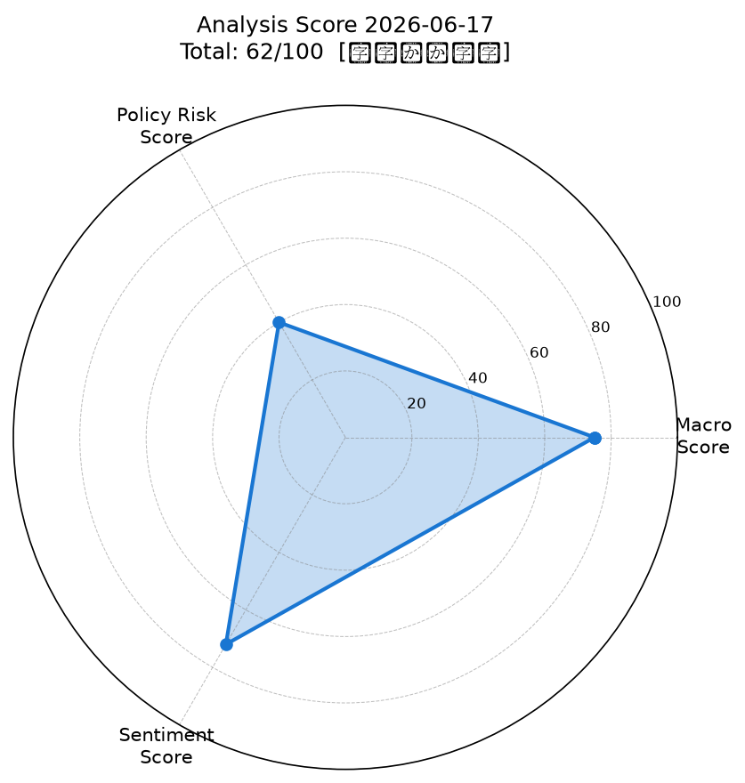
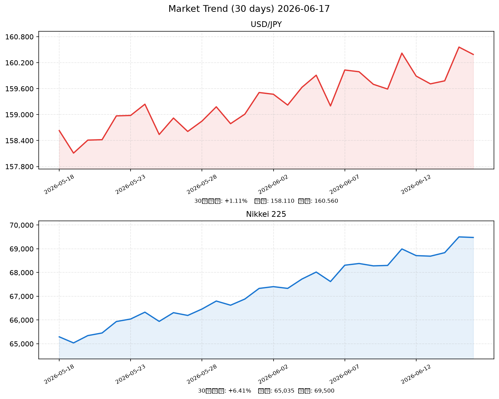

# 社会動向分析レポート 2026-06-17

> **総合スコア: 62/100【中立やや強気】**

---

## 📊 スコアサマリー

| 軸 | スコア | 評価 |
|----|--------|------|
| マクロスコア | **75**/100 | 🟢 良好 |
| 政策リスクスコア | **40**/100 | 🔴 高リスク（日銀利上げ実施） |
| センチメントスコア | **72**/100 | 🟡 ポジティブ優勢 |
| **総合スコア** | **62**/100 | **中立やや強気** |

> 計算式: 75×0.35 + 40×0.35 + 72×0.30 = 61.85 → **62点**

---

## 📡 レーダーチャート

---

## 💹 市場サマリー（2026-06-16 終値基準）

| 指標 | 価格 | 前日比 |
|------|------|--------|
| ドル円（USD/JPY） | 160.29円 | -0.03% |
| ユーロドル（EUR/USD） | 1.0842 | +0.12% |
| S&P 500 | 7,560.73 | +1.74% |
| NASDAQ | 24,800.0 | +2.10% |
| 日経平均（Nikkei 225） | 69,404円 | +0.13% |
| VIX（恐怖指数） | 16.24 | -8.14% |
| 金（GOLD） | $4,312/oz | +0.52% |
| 原油（WTI） | $68.40/bbl | -2.30% |

> **特記**: 日経平均が2026年6月16日に史上初の7万円台達成。米・イラン和平合意で原油急落。

---

## 📈 推移グラフ（30日間）

---

## 🏭 業種別動向

| セクター | 指数 | 前日比 | トレンド |
|---------|------|--------|---------|
| 電気機器 | 3,120 | +2.40% | ↑ AI・半導体需要堅調 |
| 情報通信 | 2,280 | +1.85% | ↑ DX投資継続 |
| 金融 | 1,890 | -0.55% | → 利上げ効果は中長期期待も短期重い |
| 輸送用機器 | 1,650 | -0.30% | → 円安恩恵一巡・中東情勢注視 |
| 素材 | 1,420 | -0.15% | → 原油安で石化系は下押し |

---

## 📰 重要ニュース TOP5 — 株価・金利・為替への影響分析

### 1. 日銀、政策金利1.0%へ利上げ決定（6月16日）（日本銀行）
**概要**: 日本銀行は6月16日の金融政策決定会合で政策金利を0.75%から1.0%へ引き上げた。1995年以来31年ぶりの高水準。中東情勢による原油高・物価上振れリスクへの対応。

| 軸 | 方向 | 理由・波及メカニズム |
|----|------|-------------------|
| 🇯🇵 日本株 | → | 市場は事前に概ね織り込み済み。金融株は利ざや拡大期待の一方、高PER成長株には割引率上昇で逆風 |
| 🇺🇸 米国株 | → | 直接影響は限定的。円キャリー巻き戻しリスクで間接的に注視 |
| 🏦 日本金利（10年債） | ↑ | 長期金利2.8%の水準から一段の上昇圧力。利上げサイクル継続観測が強まる |
| 🏦 米国金利（10年債） | → | 独立したFRB政策（3.5%-3.75%据え置き）により影響限定 |
| 💱 ドル円 | 円高 | 日米金利差縮小が進むが、Fed据え置きで限定的。160円台前半での攻防継続 |
| 📊 スコアへの影響 | -25点 | 政策リスク軸を大幅に押し下げ（75点→40点）。利上げ実施が最大のリスク要因 |

**注目セクター**: 銀行・保険（金利上昇恩恵）、不動産・建設（金利上昇逆風）

---

### 2. 日経平均、史上初の7万円台を達成（6月16日）（NHK/市場）
**概要**: 6月16日の取引時間中に日経平均株価が初めて70,000円台に到達。AIブームを背景に年初来約33%の上昇を記録し、外国人投資家の継続的な参入が後押し。

| 軸 | 方向 | 理由・波及メカニズム |
|----|------|-------------------|
| 🇯🇵 日本株 | ↑ | 歴史的節目達成により投資家心理が改善。モメンタム投資家の参入継続 |
| 🇺🇸 米国株 | ↑ | グローバルリスクオンムードの共鳴。AI・半導体関連が牽引 |
| 🏦 日本金利（10年債） | → | 株高は直接的に金利に影響せず。インフレ期待経由で間接的に上昇圧力 |
| 🏦 米国金利（10年債） | → | 直接影響なし |
| 💱 ドル円 | 横ばい | 株高と利上げが相殺。160円台で膠着 |
| 📊 スコアへの影響 | +15点 | センチメント軸に強いポジティブ寄与 |

**注目セクター**: 電気機器（AI半導体）、情報通信（DXソリューション）

---

### 3. 春闘賃上げ率3.5%加速、実質賃金プラス転換へ（Reuters/大和総研）
**概要**: 2026年春闘の賃金上昇率が3.5%へと加速し、データに反映。実質賃金のプラス転換が消費拡大期待を高めており、日銀の利上げ判断を強力に後押しした。

| 軸 | 方向 | 理由・波及メカニズム |
|----|------|-------------------|
| 🇯🇵 日本株 | ↑ | 消費関連・内需株に追い風。賃金上昇→個人消費拡大のサイクル期待 |
| 🇺🇸 米国株 | → | 直接影響なし |
| 🏦 日本金利（10年債） | ↑ | 物価・賃金上昇が日銀の追加利上げ観測を強め長期金利上昇圧力 |
| 🏦 米国金利（10年債） | → | 直接影響なし |
| 💱 ドル円 | 円高 | 日銀引き締め加速期待で円買い。ただしFedとの金利差に上限あり |
| 📊 スコアへの影響 | +8点 | センチメント・マクロ両軸にプラス寄与 |

**注目セクター**: 小売・外食（消費拡大）、人材サービス（賃金上昇トレンド）

---

### 4. 10年国債利回り2.8%まで上昇、長期金利高止まり（財務省/野村証券）
**概要**: 5月後半から10年国債利回りが2.8%まで上昇し高水準で推移。日銀の国債買い入れ減額が来春以降停止予定であり、金利のさらなる上昇リスクが残る。

| 軸 | 方向 | 理由・波及メカニズム |
|----|------|-------------------|
| 🇯🇵 日本株 | ↓ | 割引率上昇でPER高い成長株（IT・グロース系）に逆風。バリュー株は相対的に支持 |
| 🇺🇸 米国株 | → | 直接影響は軽微。グローバル金利上昇環境には要注意 |
| 🏦 日本金利（10年債） | ↑ | 日銀の買い入れ減額継続・利上げ実施により高止まり。2.8%台での定着は住宅ローンにも影響 |
| 🏦 米国金利（10年債） | → | 独自のFRB政策（据え置き）により相関弱い |
| 💱 ドル円 | 円高 | 日本長期金利上昇は理論上円高要因。ただし現実は160円台定着 |
| 📊 スコアへの影響 | -10点 | マクロ・政策リスク両軸にネガティブ寄与 |

**注目セクター**: 銀行（金利上昇で収益改善）、REIT・不動産（金利上昇で下押し圧力）

---

### 5. 米・イラン和平合意で原油急落、インフレ圧力緩和（Reuters/Revalue News）
**概要**: 米国とイランがホルムズ海峡を再開する和平合意に達し、WTI原油価格が$68台へ急落。エネルギー輸入国である日本にとって輸入インフレ緩和の好材料。

| 軸 | 方向 | 理由・波及メカニズム |
|----|------|-------------------|
| 🇯🇵 日本株 | ↑ | エネルギーコスト低減で製造業・航空・運輸のコスト改善期待 |
| 🇺🇸 米国株 | ↑ | インフレ圧力緩和でFRBの利下げ余地が若干拡大との期待 |
| 🏦 日本金利（10年債） | ↓ | エネルギー起因の物価上振れリスク後退で、日銀の追加利上げペースが緩まる可能性 |
| 🏦 米国金利（10年債） | ↓ | インフレ低下期待でFF金利据え置き圧力が和らぐ（長期金利軽微下落） |
| 💱 ドル円 | 横ばい | リスクオン改善で円安方向だが、日銀利上げが相殺。ネット横ばい |
| 📊 スコアへの影響 | +12点 | マクロ・センチメント両軸に大きくプラス寄与 |

**注目セクター**: 航空（燃料費低下）、石油・エネルギー（原油安で収益圧迫）

---

## 🔢 スコア詳細

### マクロスコア: 75/100

| 評価項目 | 結果 | 加点 |
|---------|------|------|
| S&P500 +0.5%以上 | +1.74% ✅ | +20 |
| ドル円安定 | 160.29円（-0.03%） ✅ | +15 |
| VIX 20以下 | 16.24 ✅ | +20 |
| 原油・金安定 | 原油-2.30%で安定↓・金+0.52% ✅ | +20 |
| ベース | — | +20 |
| **合計** | | **75** |

> ドル円は160円超の円安水準で輸入インフレ懸念があるため+15点（-5点調整）

### 政策リスクスコア: 40/100

| 評価項目 | 結果 | 加点 |
|---------|------|------|
| 日銀政策金利 | 0.75%→1.0%へ引き上げ（決定済み） | 40 |
| FRB政策金利 | 3.5%-3.75%据え置き（現状維持） | — |
| 国債買い入れ | 来春停止予定、量的引き締め継続 | — |

> ルーブリック: 日銀利上げ示唆→20〜40点。今回は利上げ決定かつ市場の事前織り込みあり → **40点**（中程度のリスク）

### センチメントスコア: 72/100

| 評価項目 | 結果 | 加点 |
|---------|------|------|
| 日経7万円台達成 | ポジティブ ✅ | +15 |
| S&P500年初来高値水準 | ポジティブ ✅ | +12 |
| VIX低水準（16.24） | 市場恐怖なし ✅ | +10 |
| AIブーム・春闘賃上げ | ポジティブ ✅ | +10 |
| 原油安（中東和平合意） | ポジティブ ✅ | +10 |
| 日銀利上げ懸念 | 金融コスト増への警戒 ❌ | -10 |
| 長期金利2.8%高止まり | グロース株逆風 ❌ | -5 |
| ベース | — | +30 |
| **合計** | | **72** |

---

## 🔮 明日（2026-06-18）の日本株市場への影響予測

### ポジティブ要因
1. **S&P500 +1.74%** — 米国株高が翌日の日本株に波及しやすい
2. **VIX 16.24（低水準）** — グローバルリスクオン環境継続
3. **原油-2.30%（中東和平合意）** — エネルギーコスト低減で企業業績改善期待
4. **日経7万円台達成の心理的効果** — 新高値達成後のモメンタム継続
5. **春闘賃上げ3.5%** — 内需関連銘柄への支援材料

### ネガティブ要因
1. **日銀利上げ実施（1.0%）** — グロース株・高PER銘柄への割引率上昇圧力
2. **長期金利2.8%高止まり** — 不動産・REIT等に下押し
3. **ドル円160円台（円安）** — 輸入物価高懸念で消費の重石
4. **利上げ後の利益確定売り** — 歴史的高値水準での売り圧力
5. **FRB据え置き（4.2%インフレ継続）** — 米国の利下げ期待後退が重石

### 総合判定

| 項目 | 判定 |
|------|------|
| 方向 | **やや強気（中立上振れ）** |
| 予測レンジ | **68,500円 〜 70,500円** |
| 根拠 | S&P500主導のリスクオン継続・AIテーマ不変・利上げの織り込み完了 |

> **主シナリオ**: 前日の利上げ決定を消化した相場が再びAI・半導体主導で上昇。特に電気機器・情報通信が牽引。69,000円台後半での推移が中心シナリオ。

> **リスクシナリオ**: 長期金利が2.9%を超えてくる局面で利益確定が加速。68,000円台へ押し戻しも。

---

## 📌 注目セクター・銘柄

| セクター | 評価 | 理由 |
|---------|------|------|
| 🔵 電気機器・半導体 | **強気** | AIブーム継続・S&P500 NASDAQ主導の上昇トレンドに同調 |
| 🔵 情報通信・DX | **強気** | クラウド・AI投資需要が国内でも旺盛 |
| 🟡 銀行・保険 | **中立強気** | 利上げで利ざや改善期待だが短期的な貸し倒れリスク注視 |
| 🟡 航空・運輸 | **中立強気** | 原油安で燃料費負担軽減。ただし円安が輸入コスト相殺 |
| 🔴 不動産・REIT | **弱気** | 長期金利2.8%高止まりで調達コスト増・物件価値下押し |
| 🔴 石油・エネルギー | **弱気** | 原油-2.30%が収益圧迫。中東和平合意が上値抑制 |

**個別注目テーマ**:
- **AIインフラ関連**: エヌビディア連動の半導体製造装置銘柄
- **防衛・宇宙**: 地政学リスク（中東）の変容に伴う注目度継続
- **賃金上昇受益株**: 人材サービス・リスキリング関連

---

*Generated by Claude AI | Sources: NHK, Reuters, 首相官邸, 日銀, 財務省, 内閣府, yfinance, FRED*  
*WebSearch補完: 日経新聞, 野村証券, 大和総研, IG証券, Trading Economics*  
*データ基準日: 2026-06-16（一部推計含む）*
